3.3 小结


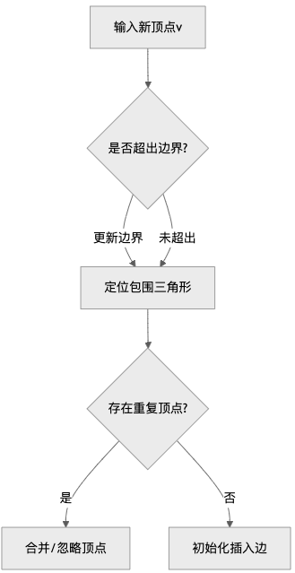


确定的数据结构 去流程化

## Step1 无约束三角剖分

### 1、初始化

在初始化之前，方法会累积顶点；

初始化完成后，直接增量插入。

**通过 bootstrap() 方法完成初始三角形构建。**

bootstrap 方法的主要作用是创建初始三角形（最小 TIN），使得后续顶点能够基于此结构进行插入。

**方法功能**

​	•**输入**: 一个顶点列表 list。

​	•**输出**: 一个布尔值，表示是否成功完成初始化。

**代码解析**

**1. 调用工具类完成初步检查**

```js
Vertex[] v = new BootstrapUtility(thresholds).bootstrap(list);

if (v == null) {
 return false;

}
```

**调用** BootstrapUtility:

​	•使用 BootstrapUtility 工具类，从输入的 list 中选取合适的三个顶点（必须是非共线的）。

​	•返回一个顶点数组 v，包含构建初始三角形的三个顶点。

​	•如果返回 null，说明无法完成初始化（例如顶点不足或所有顶点共线）。

**2. 分配初始边**

```java
QuadEdge e1 = edgePool.allocateEdge(v[0], v[1]);

QuadEdge e2 = edgePool.allocateEdge(v[1], v[2]);

QuadEdge e3 = edgePool.allocateEdge(v[2], v[0]);

QuadEdge e4 = edgePool.allocateEdge(v[0], null);

QuadEdge e5 = edgePool.allocateEdge(v[1], null);

QuadEdge e6 = edgePool.allocateEdge(v[2], null);
```

​	•**通过** edgePool **创建边对象**:

​	•e1, e2, e3：初始三角形的三条边。

​	•e4, e5, e6：从每个顶点发出的无限远（虚拟）边。

**3. 获取对偶边**

```java
QuadEdge ie1 = e1.getDual();

QuadEdge ie2 = e2.getDual();

QuadEdge ie3 = e3.getDual();

QuadEdge ie4 = e4.getDual();

QuadEdge ie5 = e5.getDual();

QuadEdge ie6 = e6.getDual();
```

​	•每条边都有一个对偶边（Dual），用于表示边的两个方向。

​	•例如，e1 表示从 v[0] 到 v[1] 的边，对偶边 ie1 表示从 v[1] 到 v[0]。

**4. 设置边的连接关系**

```java
e1.setForward(e2);

e2.setForward(e3);

e3.setForward(e1);

e4.setForward(ie5);

e5.setForward(ie6);

e6.setForward(ie4);


ie1.setForward(e4);

ie2.setForward(e5);

ie3.setForward(e6);

ie4.setForward(ie3);

ie5.setForward(ie1);

ie6.setForward(ie2);
```

**定义初始三角形的循环边关系**:

​	• e1 → e2 → e3 → e1：三角形的边按顺时针方向连接。

​	• 虚拟边与普通边互相连接，形成完整的拓扑结构。

**5. 设置初始化状态**

```java
isBootstrapped = true;
```

• 标记 TIN 已成功初始化。

**6. 计算边界范围**

```java
boundsMinX = v[0].x;

boundsMaxX = boundsMinX;

boundsMinY = v[0].y;

boundsMaxY = boundsMinY;

for (int i = 1; i < 3; i++) {

 if (v[i].x < boundsMinX) {

  boundsMinX = v[i].x;

 } else if (v[i].x > boundsMaxX) {

  boundsMaxX = v[i].x;

 }

 if (v[i].y < boundsMinY) {

  boundsMinY = v[i].y;
   
 } else if (v[i].y > boundsMaxY) {
  
   boundsMaxY = v[i].y;
 
 }
}
```

**初始化边界**:

​	•	遍历三角形的三个顶点，计算 x 和 y 的最小值和最大值，更新边界值。

​	•	这些边界将用于后续的顶点插入和三角形更新。

**7. 返回结果**

```js
return true;
```

​	•返回 true，表示成功完成初始化。

**方法亮点**

1.**灵活处理输入数据**:

​	• 通过工具类 BootstrapUtility 提供了可靠的顶点筛选机制。

​	• 允许在输入顶点数据存在共线或冗余时继续执行。

2.**高效的边池分配**:

​	• 使用 edgePool 优化内存管理，减少边对象的频繁创建与销毁。

3.**严格的拓扑维护**:

​	• 确保三角形边的连接关系正确。

​	• 为后续的增量插入奠定拓扑基础。

**总结**

**作用**: 初始化最小三角形，为 TIN 构建提供基础。

**关键点**:

​	1.从输入顶点中筛选 3 个非共线顶点。

​	2.使用边池创建三角形的边和对偶边。

​	3.设置边的连接关系，形成完整的拓扑结构。

​	4.更新 TIN 的边界范围。

### 2、增量插入

addWithInsertOrAppend 方法实现了增量地将一个顶点插入到当前的 Delaunay 三角网（TIN）中的逻辑。以下是插入的具体流程和关键步骤：

### 核心数据结构

#### 1. QuadEdge四边结构

```java
class QuadEdge {
   Vertex A, B;       // 边的两个端点
   QuadEdge forward; // 前向边（拓扑连接）
   QuadEdge dual;     // 对偶边（构成三角形邻接关系）
   
   // 关键操作
   QuadEdge getBaseReference(); // 获取基础边引用
   void setForward(QuadEdge e); // 设置拓扑连接
   void clear();                // 重置边状态
}
```

四边结构通过forward/dual指针构成双重链表，维护三角网格拓扑关系。每个物理边对应两个逻辑边（正反方向）。

#### 2. EdgePool边池管理

```Java
class EdgePool {
    QuadEdge getStartingEdge();   // 获取初始边
    QuadEdge allocateEdge(Vertex a, Vertex b); // 分配新边
    void deallocateEdge(QuadEdge e); // 回收边
}
```

通过对象池模式管理边的生命周期，减少GC压力，提升内存使用效率。

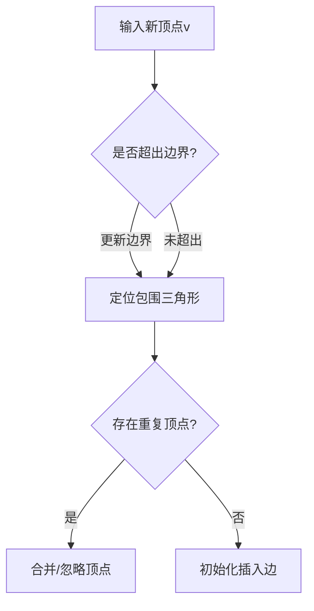

### Delaunay条件维护

```java
while(true) {
    1. 获取当前三角形的三个顶点vA, vB, vC
    2. 计算行列式h = inCircle(vA, vB, vC, v)
    3. if(h ≥ 0) {
       执行边翻转操作
       更新拓扑连接
     } else {
       检查完成条件
       if(完成) break;
       准备下一轮检测
     }
}
//当h>0时，点v在三角形ABC的外接圆内，破坏Delaunay条件，需进行边翻转。
```

#### 2.1. 边界检查和更新

```js
if (x < boundsMinX) {
  boundsMinX = x;
} else if (x > boundsMaxX) {
  boundsMaxX = x;
}
if (y < boundsMinY) {
  boundsMinY = y;
} else if (y > boundsMaxY) {
  boundsMaxY = y;
}
```

•**目的**：检查插入点是否超出了当前 TIN 的边界，并更新最小和最大边界。

•**作用**：保证 TIN 的边界范围随新增点动态调整。

#### 2.2插入点所在三角形

 **如何定位初始插入位置？**

通过`walker.findAnEdgeFromEnclosingTriangle`实现点定位，该函数应实现：

- **Walking算法**：从已知边出发，沿三角形邻接关系逐步逼近目标点
- **Jump-and-march优化**：结合空间索引加速定位

```java
if (searchEdge == null) {
  //   * Get first valid, non-ghost QuadEdge in collection
  searchEdge = edgePool.getStartingEdge();
}
//   * Search the mesh beginning at the specified edge position to find
 //  * the triangle that contains the specified coordinates.
searchEdge = walker.findAnEdgeFromEnclosingTriangle(searchEdge, x, y);
```

**逻辑**：

​	•	使用 searchEdge（搜索起始边）定位到包含新点 (x, y) 的三角形。

​	•	walker.findAnEdgeFromEnclosingTriangle 是核心方法，通过边漫游的方式找到包含点的三角形。

**优化**：

​	•	重用上次插入的 searchEdge，提高插入效率。

**功能**：

​	•使用 walker 对象定位包含插入点 (x, y) 的三角形或靠近插入点的边。

​	•这是 Delaunay 插入操作的关键步骤，用于减少搜索范围。

**算法特点**：通过搜索边，优化了查找插入位置的效率。

**有虚拟顶点 所以一定可以找到**

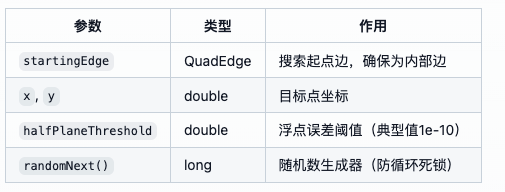

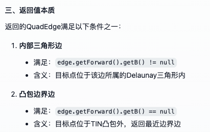

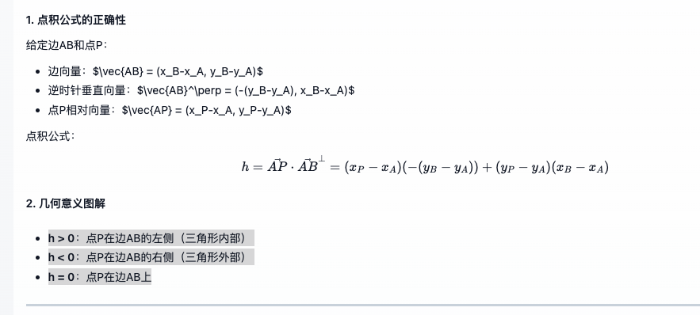

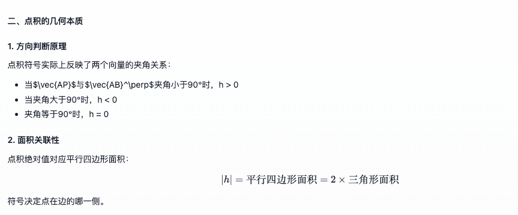

##### 核心流程

**1、参数和变量初始化**

- 输入参数：`startingEdge`（起始边）、`x`和`y`（目标点坐标）。
- 变量`edge`初始化为`startingEdge`，后续用于遍历。
- 检查`edge`是否为外部边（通过`edge.getForward().getB() == null`判断(三个虚拟点)），如果是，则转为对偶边（`edge.getDual()`），确保开始于内部边。

**2、处理起始边**

- 如果起始边是外部边，切换到对偶边，确保遍历从内部边开始（不存在虚拟定点的三角形）。
- 获取起始边的顶点`v0`和`v1`，并计算目标点相对于`v0`的坐标差`vX0`和`vY0`。
- 计算边`v0`到`v1`的垂直向量`pX0`和`pY0`，并计算点积`h0`，判断目标点在该边的哪一侧。（取逆时针垂直向量，即）

**解释**

​	1.	**垂直性**：两个向量 \vec{v} 和 \vec{v}^\perp 是垂直的，即它们的点积为零：这表示它们是正交的。

​	2.	**逆时针方向**：逆时针垂直向量是从原向量顺时针旋转 90^\circ 得到的向量。如果原向量指向正X轴（例如 \vec{v} = (1, 0) ），则它的逆时针垂直向量会指向正Y轴（ \vec{v}^\perp = (0, 1) ）。

**3、初步判断点所在半平面**

- 如果`h0 < halfPlaneThresholdNeg`，说明点在边的另一侧，切换到对偶边（即进入相邻三角形）。
- 如果`h0`接近零（在阈值范围内），使用高精度计算`geoOp.halfPlane`再次判断，必要时切换边。

**4、主循环遍历**

- 进入无限循环，每次迭代处理当前边`edge`，获取其三个顶点`v0`、`v1`、`v2`。
- 如果`v2`为`null`，说明当前边在外部，调用`findAssociatedPerimeterEdge`处理并返回。
- 随机选择下一步的测试顺序（通过`randomNext()`决定），以减少陷入无限循环的风险。

**5、测试其他两条边的半平面**

- 计算点相对于边`v1-v2`和`v2-v0`的垂直向量和点积（`h1`和`h2`）。
- 根据`h1`和`h2`的值判断点是否在这些边的外侧，如果是，切换到对应的对偶边，继续循环。

**6、退出条件**

- 如果所有边的测试都通过，说明点位于当前三角形内部，返回当前边`edge`。

接下来，我需要理解各个关键步骤的作用：

> - **半平面测试**：通过计算点与边的垂直向量的点积，判断点位于边的哪一侧。点积的正负决定了点的位置关系，从而决定是否需要切换到相邻三角形。
> - **随机顺序测试**：Lawson提到，当三角剖分不是最优Delaunay时，可能导致无限循环。随机选择边的测试顺序可以打破对称性，避免循环。
> - **处理外部点**：当遍历到外部边（`v2 == null`）时，调用`findAssociatedPerimeterEdge`寻找最近的边界边，确保点在凸包外时的正确处理。

> 返回的`edge`是包含目标点的三角形的一条边。由于四叉边结构，每条边属于一个三角形，因此返回的边可以确定所在的三角形。

> 


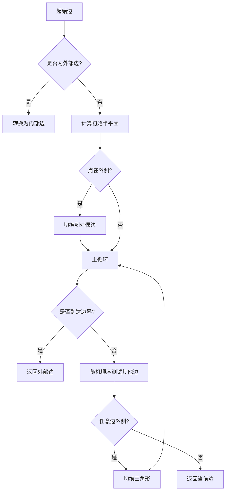


#### 2.3. 检查顶点是否重合

定位到三角形内部后，判断顶点是否重合

给定一个阈值判断

```java
QuadEdge matchEdge = checkTriangleVerticesForMatch(searchEdge, x, y, vertexTolerance2);
if (matchEdge != null) {
 mergeVertexOrIgnore(matchEdge, v);
 return false;
}
```

**逻辑**：

• 检查新点是否与现有顶点重合。

• 如果发现重合顶点，通过 mergeVertexOrIgnore 合并顶点或忽略操作。

**功能**：

​	•检查插入点是否与现有顶点非常接近（基于 vertexTolerance2）。

​	•如果接近，合并顶点或忽略插入。

**目的**：避免重复插入顶点，保证数据的一致性。

#### 2.4 初始化插入边✅

```java
 //当前边的向量顶点A
    Vertex anchor = searchEdge.getA();

    QuadEdge buffer = null;
    QuadEdge c, n0, n1, n2;

    //从插入点v ->anchor 方向，创建边p:v ->anchor
    QuadEdge pStart = edgePool.allocateEdge(v, anchor);
    QuadEdge p = pStart;
    //设置p 前向边，就是当前的searchEdge（计作A）
    p.setForward(searchEdge);
    //获取searchEdge的前向边 (计作B)
    n1 = searchEdge.getForward();
    //B的前向边 (计作C)
    n2 = n1.getForward();
    n2.setForward(p.getDual());

    c = searchEdge;
```

**目的**：创建从新点 v 到锚点（anchor）的插入边 pStart。

**作用**：为新点与现有 TIN 的连接关系提供起点。

**功能**：

- 从当前顶点 anchor 到新插入顶点 v 创建一条新边。
- 新边作为起始边（pStart），并将其与包含三角形的当前边 searchEdge 连接。

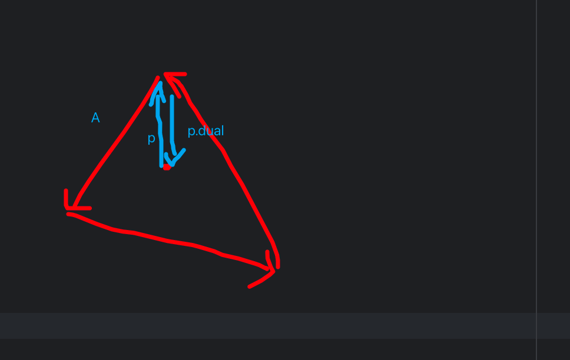

#### 2.5. 循环检查 Delaunay 性质

```java
while (true) {
  n0 = c.getDual();
  n1 = n0.getForward();
  double h = inCircleWithGhosts(vA, vB, vC);
  ...
  if (h >= 0) {
    n2 = n1.getForward();
    n2.setForward(c.getForward());
    p.setForward(n1);
    c.clear();
    ...
    nReplacements++;
  } else {
    ...
  }
}
```

**逻辑**：

- 遍历与插入点相邻的三角形，检查其是否满足 Delaunay 圆内性质（In-Circle Criterion）。
- 使用 h 表示插入点是否在三角形的外接圆内：
- h >= 0 ：点在外接圆内，需要进行边翻转操作。
-  h < 0 ：点在外接圆外，无需操作。

**关键点**：

​	•inCircleWithGhosts 用于处理虚拟点和边的圆内判定。

​	•如果需要翻转，则更新三角形的边连接关系。

**功能**：

​	•使用 Delaunay **内接圆准则**（In-Circle Criterion）判断新三角形是否满足 Delaunay 性质。

​	•如果不满足（h >= 0），移除当前边并替换成新边，同时调整连接关系。

•**目的**：确保插入新顶点后，整个网格仍然符合 Delaunay 性质。

##### **inCircleWithGhosts 方法解析**

该方法用于判断一个点 v 是否满足三角剖分中的 **Delaunay 圆内性质**，同时考虑了虚拟点和边（ghost edges）。它的功能主要是处理边界点和特殊几何情况下的判定。

##### 1. 核心公式 论文记这个就行

```java
double h = (v.x - a.x) * (a.y - b.y) + (v.y - a.y) * (b.x - a.x);
```

​	•**数学意义**：

​	•	**这是一个计算向量叉积的公式**，用于判断点 v 相对于点 a 和点 b 所构成的直线的相对位置。

​	•	结果 h 的含义：

**因为三角形是有顺序的，逆时针**，边是有方向的。

​	• h > 0 ：点 v 在直线左侧。

​	• h < 0 ：点 v 在直线右侧。

​	• h = 0 ：点 v 在直线上。

**2. 半平面阈值检查**

```java
if (halfPlaneThresholdNeg < h && h < halfPlaneThreshold) {

 h = geoOp.halfPlane(a.x, a.y, b.x, b.y, v.x, v.y);

}
```

**逻辑**：

​	•如果  落在阈值范围内（即点接近直线，但未完全确定其相对位置），调用更高精度的方法 geoOp.halfPlane 重新计算 。

​	•这个步骤的目的是增加数值稳定性，避免**浮点误差对结果的影响**。

​	•如果新的 h = 0  ，说明点 v 精确地在直线上。

**3. 当点位于直线上时的特殊处理**

```java
if (h == 0) {

 double ax = v.getX() - a.getX();

 double ay = v.getY() - a.getY();

 double nx = b.getX() - a.getX();

 double ny = b.getY() - a.getY();

 double can = ax * nx + ay * ny;

 if (can < 0) {

  h = -1;

 } else if (ax * ax + ay * ay > nx * nx + ny * ny) {

  h = -1;

 } else {

  h = 1;

 }

}
```

**逻辑**：

​	•当  h = 0 时，点 v 在直线上，但需要进一步判断点 v 在直线段的具体位置。

​	•计算方法：

​	•ax, ay 是 v 到 a 的向量。

​	•nx, ny 是 b 到 a 的向量。

​	• can = dot product(ax, ay, nx, ny) ，判断点 v 是否沿直线段方向。

**结果解释**：

​	• can < 0 ：点 v 在 a 的后方（超出线段范围）。

​	•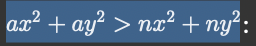：点 v 在 b 的前方（超出线段范围)。

​	•	其他情况：点 v 在 a 和 b 之间，表示点在线段上。


**4. 返回结果**

```java
return h;
```

​	•**返回值**：

​	•h>0：点 v 满足条件，位于外接圆外或在线段方向上。

​	•h<0：点 v 不满足条件，位于外接圆内或在线段外部。


**5. 方法总结**

1.**功能**：

​	检查点 v 是否满足 Delaunay 圆内性质，同时兼容边界点和虚拟点的处理。

2.**关键步骤**：

-  利用叉积计算点相对于直线的位置。
- 当点接近直线时，使用高精度方法进行判断。
- 对于点在线上的情况，进一步检查点是否在直线段上。

3.**适用场景**：

​	•	处理三角剖分过程中需要判断点与边关系的复杂几何情况。

​	•	增强对边界和特殊位置的数值鲁棒性。

### 2.6. 完成边的拓扑修复。检查插入是否完成

```java
if (c.getB() == anchor) {
 pStart.getDual().setForward(p);
 searchEdge = pStart;
 ...
 break;
}
```

**功能**：

​	•检查当前边是否回到插入点的起始边（anchor）。

​	•如果是，完成所有边的连接，并退出循环。

**7. 优化内存使用**

```java
if (buffer != null) {

 edgePool.deallocateEdge(buffer);

}
```

**功能**：

​	•使用 buffer 暂存边的引用，避免频繁的对象创建和销毁。

​	•如果 buffer 存在多余的边，则释放内存。

**8. 返回插入成功**

```java
return true;
```

**功能**：

​	•	插入完成后返回 true，表示顶点成功插入并且网格已更新。


**流程总结**

​	1.**定位插入位置**：通过 findAnEdgeFromEnclosingTriangle 找到包含插入点的三角形。

​	2.**检查重复顶点**：避免插入与现有顶点过于接近的点。

​	3.**创建新边**：从包含三角形的边出发，创建初始边并连接到新顶点。

​	4.**修复 Delaunay 性质**：检查新边和相邻边是否满足内接圆准则，必要时移除旧边并更新结构。

​	5.**完成连接**：完成所有边的连接，更新拓扑信息。


**特点**

​	•**增量插入**：新顶点逐个插入，不需要预先生成所有顶点。

​	•**高效性**：使用搜索边和局部拓扑修复，优化了插入效率。

​	•**Delaunay 性质**：始终保证插入后的三角网符合 Delaunay 性质。

​	•**内存优化**：通过 buffer 和边池（edgePool）减少内存消耗，提高性能。

该方法是 Tinfour 增量 Delaunay 算法的重要核心之一，其设计保证了插入效率和网格的准确性。


## Step 2 有约束边界的三角剖分

```
        tin.addConstraints(cListTop, false);

```

将约束边点依次插入

根据点集生成约束边并标记不可修改。


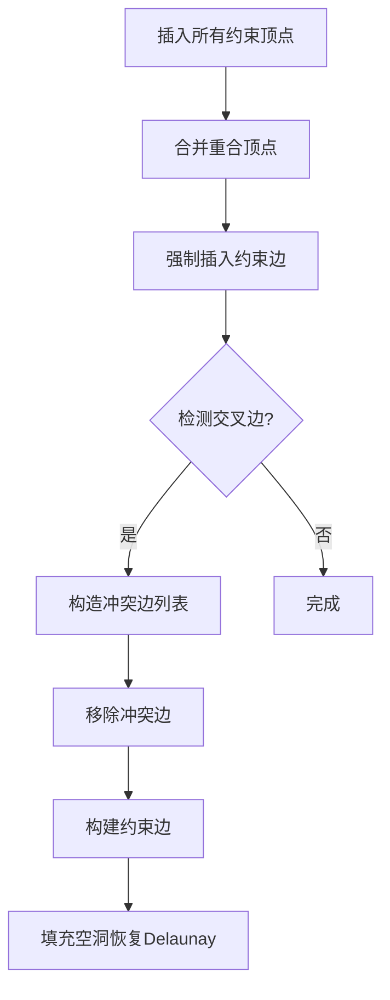

在你提供的代码中，processConstraint 方法负责处理约束边，并确保它与现有的三角形网格相交，最终按照 Delaunay 准则更新三角网。具体来说，这段代码用于插入约束边，并通过“填补空腔”（fillCavity）操作来恢复图的拓扑结构。


我们可以从以下几个方面来分析这段代码是如何进行约束遍历和与其他边交叉并恢复的。


**1. 初始化与约束边的遍历**

在方法一开始，首先准备了约束边的顶点列表 cvList，并检查是否是一个封闭多边形。如果是，就在列表末尾加入第一个顶点，以完成循环。

```java
if (constraint.isPolygon()) {

 *// close the loop*

 cvList.add(cvList.get(0));

}
```

cvList 包含了约束边的所有顶点。nSegments 代表了约束边的段数，每个段连接两个连续的顶点。

**2. 查找插入点所在的三角形**

接下来，代码通过 findAnEdgeFromEnclosingTriangle 方法从 searchEdge 开始查找包含第一个约束顶点（v0）的三角形。然后通过 isMatchingVertex 判断当前边是否与约束边的第一个顶点相匹配：

```java
searchEdge = walker.findAnEdgeFromEnclosingTriangle(searchEdge, x0, y0);
```

根据匹配的顶点，选择合适的初始边（e0）：

```java
if (isMatchingVertex(v0, searchEdge.getA())) {

 e0 = searchEdge;

} else if (isMatchingVertex(v0, searchEdge.getB())) {

 e0 = searchEdge.getDual();

} else {

 e0 = searchEdge.getReverse();

}

```

因为先前依旧进行了插入操作，所以ABC一定有一个起始点是的

此时，e0 代表了包含 v0 的边。

查看当前已有以v0为起始点的边，是否为约束边可以复用（即v1为终点）

**3. 遍历约束边的每一段并处理交叉**

接下来，程序遍历 cvList 中的每一对顶点（v0, v1），并从 e0 开始逐步查找和处理约束边与现有三角形网格的交叉。

**Pinwheel 操作**

代码首先计算出每个顶点的坐标差，并将这些差值归一化为单位向量 ux 和 uy。然后，通过计算与约束边的垂直向量，进行 **Pinwheel 操作**（旋转检查）来找到可能的交点。

```java
ux = x1 - x0;

uy = y1 - y0;

u = Math.sqrt(ux * ux + uy * uy);

ux /= u; *// unit vector*

uy /= u;

px = -uy; *// perpendicular*

py = ux;
```

然后，代码通过边的循环检查，判断当前边是否与约束边交叉。

```java
b = e.getB();

bx = b.getX() - x0;

by = b.getY() - y0;

bh = bx * px + by * py;
```

如果当前边与约束边相交（或者几乎共线），代码会在约束边上插入新顶点，并进行拓扑更新。此时，约束边的列表 cvList 会被更新，三角形的边也会重新设置：


if (Math.abs(bh) <= vTolerence && bx * ux + by * uy > 0) {

 cvList.add(iSegment + 1, b);

 nSegments++;

 setConstrained(e0, constraint, edgesForConstraint);

 e0 = e0.getDual(); *// set up e0 for next iteration of iSegment*

 continue;

}


**寻找交叉边并恢复**


在计算交点后，代码继续检查并恢复三角形网格的拓扑。通过计算交点的参数 t，确定约束边是否会与现有的三角形边交叉：


double t = (ax * dy - ay * dx) / (ux * dy - uy * dx);

if (t > 0) {

 right0 = e;

 left0 = e.getReverse();

 h = n.getDual();

 break;

}


这个过程通过不断循环查找与约束边相交的三角形，并修复网格中的拓扑关系，最终恢复正确的三角形结构。


**4. 构建交点并填充空腔**


一旦找到交点并确定了新的边，代码会创建新的三角形边，并进行拓扑更新。此时，fillCavity 方法会被调用来填充空腔，即修复因插入约束边而产生的“洞”，确保三角形网格的完整性。


QuadEdge n = edgePool.allocateEdge(v0, c);

setConstrained(n, constraint, edgesForConstraint);

QuadEdge d = n.getDual();

n.setForward(left1);

n.setReverse(left0);

d.setForward(right0);

d.setReverse(right1);

e0 = d;


fillCavity(n);

fillCavity(d);


**5. 总结**

​	•	**遍历与交叉检测**：代码通过遍历约束边的每一段，逐步检测与现有三角形网格的交叉情况，并在交点处插入新的顶点，进行边的插入和拓扑修复。

​	•	**Pinwheel 操作**：通过计算边的单位向量和垂直向量，进行旋转检查，找到交叉点并确保约束边与现有三角形网格相交。

​	•	**空腔填充**：每次插入新的边时，通过 fillCavity 方法填补插入造成的空腔，确保图的拓扑正确性。

### 保留有效区域

### **`floodFillConstrainedRegion` 算法详解**

#### **一、核心功能**

**目的**：在约束Delaunay三角剖分（CDT）后，根据约束边界（如多边形、道路、河流等）标记并保留有效区域的三角形集合。

**类比**：类似Photoshop的魔棒工具，通过"泛洪填充"自动选中闭合边界内的所有区域。


这一过程确保了约束边与现有网格的正确交互，并最终使三角形网格保持 Delaunay 准则。

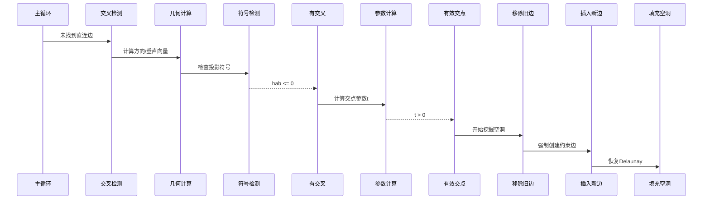


# 虚拟顶点的意义

初始化从每个顶点发出的无限远（虚拟）边 (e4, e5, e6) 的目的是为了建立一个完整的拓扑结构，并为后续的增量插入提供支持。这种初始化方法有以下几个目的：


**1. 确保拓扑结构完整**

​	•	Delaunay 三角剖分需要完整的拓扑结构来支持边操作（例如边的连接、切换、插入等）。

​	•	初始化无限远边（虚拟边）可以将初始三角形与外部“无限远”的空间相连，保证拓扑结构是封闭的。

​	•	通过这些虚拟边，可以简化后续的拓扑操作逻辑，特别是在边界区域进行处理时。


**2. 支持增量插入算法**

​	•	增量插入算法依赖当前的 TIN 结构，并在现有结构的基础上插入新顶点。

​	•	在插入新顶点时：

​	1.	可能会扩展当前边界。

​	2.	需要判断新顶点是否落在当前 TIN 的范围内。

​	•	虚拟边为处理边界情况提供了框架：

​	•	它们允许在初始三角形外插入新点时快速定位边界。


**3. 处理无限边界的约束**

​	•	虚拟边充当边界的“哨兵”：

​	•	它们允许将三角剖分扩展到无限边界外（尽管物理上不可能，但在算法逻辑中是必要的）。

​	•	虚拟边可以使剖分算法适应任何几何形状或大小的数据集。


**4. 简化边和顶点的管理**

​	•	虚拟边使得每个顶点都有一条出边，无论该顶点是否是边界顶点。

​	•	这样可以统一处理顶点和边的关系，避免特殊情况的判断。

​	•	例如：

​	•	一个边界顶点可能没有三角形内的邻边，但通过虚拟边，可以轻松找到该顶点的关联信息。


**5. 为后续操作提供对偶边支持**

​	•	每条边都有一个对偶边，虚拟边的初始化同样包含对偶边。

​	•	对偶边为以下操作提供支持：

​	•	查找边的另一侧三角形。

​	•	维护边的方向和循环链。


**6. 计算边界范围和扩展时的辅助**

​	•	初始化 TIN 时需要计算三角形的边界范围（boundsMinX, boundsMaxX, 等）。

​	•	虚拟边提供了处理边界的能力，使得三角剖分在扩展边界时仍然能够保持一致的结构。


**总结**


初始化从每个顶点发出的虚拟边的主要目的是：

​	1.	**建立完整拓扑结构**，确保算法的正确性和稳定性。

​	2.	**支持增量插入和边界处理**，简化后续的顶点插入和三角形扩展逻辑。

​	3.	**统一处理边界和对偶边**，减少特殊情况的复杂性。


虚拟边虽然在实际三角剖分中没有直接的物理意义，但在算法设计中是不可或缺的一部分，用于简化和增强处理边界的能力。


# 边的反转操作

````java
 	      //h >= 0 ：点在外接圆内，需要进行边翻转操作。
      if (h >= 0) {
        n2 = n1.getForward();
        n2.setForward(c.getForward());
        p.setForward(n1);
        c.clear();  // optional, done as a diagnostic
        // we need to get the base reference in order to ensure
        // that any ghost edges we create will start with a
        // non-null vertex and end with a null.
        c = c.getBaseReference();
        if (buffer == null) {
          c.clear();
          buffer = c;
        } else {
          edgePool.deallocateEdge(c);
        }

        c = n1;
        nReplacements++;
      }
````

**边反转过程分析**

在 Delaunay 三角剖分中，边反转（Edge Flip）是确保所有三角形满足 Delaunay 圆内性质的重要步骤。如果插入一个新顶点导致某些三角形不满足 Delaunay 性质，则需要通过反转边来恢复其性质。

以下是代码中边反转的具体实现逻辑：


**关键变量说明**

1.h:

​	•表示当前检查的三角形是否满足 Delaunay 圆内性质。

​	•如果 ，表示三角形不满足性质，需要进行边反转。

2.n1**,** n2:

​	•n1 是当前边 c 的下一条边（前向边）。

​	•	n2 是 n1 的前向边。

3. buffer:

​	•	临时存储需要被回收的边，用于提高性能，避免频繁分配和释放内存。

4. c:

​	•	当前正在处理的边，可能需要被反转。

**核心逻辑分析**

**1. 更新边链接**

```java
n2 = n1.getForward();   *// 获取当前三角形的第三条边*

n2.setForward(c.getForward()); *// 更新第三条边的前向指向，绕过当前边 c*

p.setForward(n1);     *// 新插入的边 p 的前向指向 n1*
```

​	•	**作用**：

​	•	通过调整边的前向指针，移除当前三角形中与新点冲突的边 c。

**2. 清理当前边 c**

```js
c.clear(); *// 清除当前边，标记为未使用状态（仅用于诊断）*

c = c.getBaseReference(); *// 获取当前边的基础引用*
```

​	•	**作用**：

​	•	将当前边标记为未使用，同时获取它的基础引用（以支持后续边的重用）。


**3. 判断是否需要回收边**

```js
if (buffer == null) {

 c.clear();   *// 如果缓冲区为空，将当前边标记为未使用*

 buffer = c;   *// 将当前边存储到缓冲区，便于后续复用*

} else {

 edgePool.deallocateEdge(c); *// 如果缓冲区已存在，将当前边直接释放*

}
```

​	•	**作用**：

​	•	优化边的内存管理：

​	•	如果缓冲区为空，保存当前边以便后续复用。

​	•	如果缓冲区已存在，释放当前边回到边池。


**4. 更新当前边**

```java


c = n1; *// 将当前边切换为下一条边，继续检查是否满足 Delaunay 圆内性质*

nReplacements++;
```

​	•	**作用**：

​	•	当前边反转完成，移动到下一个三角形的边，继续检查是否需要反转。


**边反转后的状态**

​	1.	通过 **边清理** 和 **指针更新**，当前三角形中冲突的边被移除，新插入的边得以替换。

​	2.	每次反转后，当前边 c 更新为下一条边 n1，从而实现对三角形邻域的遍历。

​	3.	如果某次反转导致生成新的边界条件，则利用 **缓冲区或边池** 复用已清理的边，优化内存使用。

**边反转的数学本质**

1.**为什么需要反转？**

​	•插入新点后，某些三角形可能不满足 Delaunay 性质（即新点在其外接圆内）。

​	•通过边反转，可以将不满足性质的三角形分解为两个新三角形，使它们重新满足 Delaunay 性质。

2.**如何判断是否需要反转？**

​	•通过 inCircleWithGhosts 检测当前三角形是否满足 Delaunay 圆内性质。

​	•如果不满足性质，则通过边反转调整三角形。


**反转后的边关系**

​	•	假设初始边为 c：

​	1.	当前边 c 被清理。

​	2.	插入新边 p。

​	3.	更新三角形的边链接关系，形成新的三角形。


反转操作将旧边替换为新边，最终构建满足 Delaunay 性质的结构。

**总结**

​	•	**核心逻辑**：逐步检查三角形，找到不满足 Delaunay 性质的边，并通过反转替换为新的边，确保所有三角形的外接圆内无其他顶点。

​	•	**性能优化**：通过 buffer 缓存和 edgePool 管理边的分配与回收，提升算法性能。


# 接口解读

以下是 IIncrementalTin 接口的各个方法的功能解读：

**基本管理功能**

​	1.	clear()

​	•	清除所有内部状态数据，释放已分配的资源，以便重用。

​	•	多次处理不同数据集时，可以减少与边对象相关的开销。

​	2.	dispose()

​	•	清空所有数据和引用，便于垃圾回收。

​	•	与 clear() 不同，dispose() 会使对象无法再次使用。

**统计与诊断**

​	3.	countTriangles()

​	•	获取三角形统计信息，用于了解构造过程中生成的三角形数量。

​	4.	printDiagnostics(PrintStream ps)

​	•	打印 TIN 构造过程中的统计和诊断信息，便于调试或分析。

​	5.	printEdges(PrintStream ps)

​	•	输出 TIN 中的边信息，便于调试或验证。


**边和顶点相关功能**

​	6.	getEdges()

​	•	获取当前分配的边对象列表。

​	•	返回的边对象不可修改，修改会破坏 TIN 结构。

​	7.	getEdgeIterator()

​	•	返回一个迭代器，用于遍历当前存储的边。

​	•	注意：迭代器不支持并发修改。

​	8.	edges()

​	•	提供用于增强 for 循环的便捷实现，迭代生成非虚拟边（实际边）。

​	9.	getVertices()

​	•	返回 TIN 中存储的顶点列表，可能不按输入顺序返回。

​	•	列表中的顶点对象可以修改其索引，但几何相关字段不可修改。

​	10.	vertices()

​	•	提供便捷的迭代器，用于增强 for 循环访问顶点，无重复或遗漏。


**TIN 状态与范围**

​	11.	getBounds()

​	•	获取 TIN 的边界范围（Rectangle2D），未初始化时返回 null。

​	12.	isBootstrapped()

​	•	检查 TIN 是否已经初始化（需要至少 3 个非共线点）。

​	13.	getMaximumEdgeAllocationIndex()

​	•	获取当前分配边的最大索引值，便于应用程序管理边的附加信息。

​	14.	getNominalPointSpacing()

​	•	获取用于距离判断的“名义点间距”，一般为样本平均间距或密集区域的间距。

​	15.	getThresholds()

​	•	返回与此实例关联的阈值对象（不可变，可安全共享）。


## **约束相关功能**

​	16.	addConstraints(List<IConstraint> constraints, boolean restoreConformity)

​	•	添加约束（如边界或线性约束）到 TIN。

​	•	可选择是否通过插入合成点来恢复 Delaunay 一致性。

​	17.	getConstraints()

​	•	返回当前存储的约束列表，可能为空。

​	18.	getConstraint(int index)

​	•	根据索引获取约束，索引无效时返回 null。

​	19.	getRegionConstraint(IQuadEdge edge)

​	•	获取与边相关的区域约束（如边界约束）。

​	20.	getLinearConstraint(IQuadEdge edge)

​	•	获取与边相关的线性约束（如中间的线性限制）。


## **增量操作**

### 21.	add(Vertex v)

​	•	向 TIN 添加单个顶点。

​	•	若尚未初始化，点会存储在列表中，直到达到初始化条件。

​	22.	add(List<Vertex> list, IMonitorWithCancellation monitor)

​	•	批量添加顶点。

​	•	在初始化阶段随机选择三个点作为初始三角形，若点排列随机，可通过 HilbertSort 优化。

​	23.	remove(Vertex vRemove)

​	•	从 TIN 中移除指定顶点。

​	•	如果顶点属于合并组，仅从组中移除，结构不受影响。

​	24.	splitEdge(IQuadEdge eInput, double zSplit, boolean restoreConformity)

​	•	在边的中点插入顶点。

​	•	可选择是否恢复 Delaunay 一致性（目前未实现）。


**导航与邻域**

​	25.	getNeighborEdgeLocator()

​	•	获取邻域边定位器（已过时，建议使用 getNavigator）。

​	26.	getNavigator()

​	•	获取导航器，可用于几何查询（如点是否在 TIN 内、获取邻边等）。

​	27.	getNeighborhoodPointsCollector()

​	•	获取邻域点收集器，用于高效查询点附近的信息。


**合并顶点**

​	28.	setResolutionRuleForMergedVertices(VertexMergerGroup.ResolutionRule rule)

​	•	设置合并顶点的 Z 值解释规则。

​	29.	getSyntheticVertexCount()

​	•	获取 TIN 中添加的合成顶点数量。


这份接口设计为增量 Delaunay 三角网 (TIN) 的构建提供了全面的功能支持，同时注重性能、扩展性和内存效率的平衡，非常适合处理大规模空间数据集。