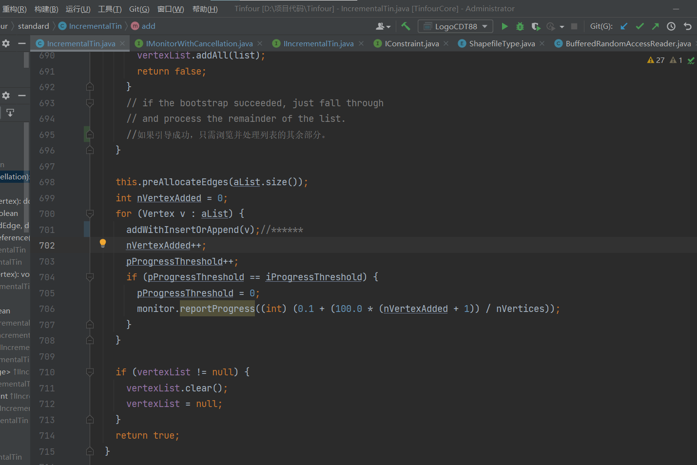

--------------------


```
public static void main(String []args) throws Exception {
    IncrementalTin tin = new IncrementalTin(1.0);
    List<Vertex>vertexList = TestVertices.makeRandomVertices(100, 0);
    tin.add(vertexList, null);
    TinRenderingUtility.drawTin(tin, 500, 500, new File("tin.png"));
}
```

# 问题汇总

## 1、合成点的出现--德劳内细化算法


目前，只有在添加约束时才会引入合成顶点。顶点是需要的，以确保三角剖分保留Delaunay准则。不过，如果你愿意，你可以关闭这个功能。在Incremental Tin类中，对“addConstraints”的调用有两个参数。第二，“恢复一致性”控制是否生成合成点。关详细信息，请参见https://gwlucastrig.github.io/TinfourDocs/javadoc/TinfourCore-2.1.6-javadoc/index.html

为了说明为什么我们可能要添加合成点，我附上一张图片从网络文章[什么是约束Delaunay](https://gwlucastrig.github.io/TinfourDocs/DelaunayIntroCDT/index.html). 添加约束时，它可能引入不符合Delaunay准则的三角形。但我们不需要添加合成顶点，除非我们想要三角剖分来保持Delaunay兼容。

看了你之前的问题，（讨论[#100](https://github.com/gwlucastrig/Tinfour/discussions/100))，我想我可能没有理解你的意思，而且我对术语的使用也不清楚。

目前，仅当应用程序将约束添加到三角测量，并且仅当应用程序指示要恢复结果的Delaunay柔度时，才会添加合成点。您可以通过将restore Configuration选项设置为true来控制是否发生这种情况。

术语“德劳内细化”，至少在我使用它，指的是一种不同的技术。在Delaunay细化中，您有一个带有窄三角形的Delaunay三角网（例如在边界附近出现的三角形），您可以通过在最佳位置插入人工"Steiner点"来改进三角形的形状。我想实现这个功能很久了，但是一直没能实现。我希望它能在2024年初开始工作。


还有一种特殊情况，可能会出现人工点。如果一个应用程序试图将两个靠得太近（或完全重合）的顶点插入到三角网中，增量TIN类将创建一个“合并顶点”来将它们合并到一个点中。如果距离太近，通常只占“显着点间距”的100万分之一。-当一对或一簇点靠得那么近时，数值问题开始降低算法的性能。所以我们把它们当作一个单点

### 解决办法


作者说明 只有添加约束的时候可能产生合成点。由tin中的addConstraints()函数决定


根据作者描述第二个参数控制函数细化与否。设为false以后，无合成点出现。

```
addConstraints(list<>,false)//第二个参数，禁用恢复一致性，即不会生成合成点。

```

## 2、什么是幽灵点

在计算几何和特别是三角剖分中，幽灵点（也称为虚拟点或超级点）是一种辅助性的概念，用于简化某些算法的初始化和边界条件处理。幽灵点不代表实际的数据点，而是用来构造一个包含所有实际数据点的初始大三角形或四边形。

在 Tinfour 库中，实现 Delaunay 三角剖分时可能会使用到幽灵点。该库的一些版本为了初始化三角剖分创建了一个超级三角形，它是一个巨大的三角形，其顶点是幽灵点，足够大以确保包含所有的输入数据点。在算法运行结束后，这个超级三角形以及与之相关联的幽灵点会被移除，留下由数据点形成的真正的 Delaunay 三角网。

这种方法有以下优点：

1. **简化**: 通过使用幽灵点，可以避免处理特殊情况和边界问题，因为所有的数据点都被视为内部点。
2. **有效性**: 初始化步骤变得简单高效，便于算法开始添加实际的数据点并调整三角形结构。

在 Tinfour 的 `IncrementalTin` 类或其他类似组件中，幽灵点可能被隐式地引入和管理。如果你正在使用这个库，通常不需要直接关心幽灵点的处理，因为这是库内部逻辑的一部分。

最终，当所有的数据点已经被插入并且三角剖分完成后，与幽灵点相关的三角形会被从结果中排除，从而生成一个反映输入数据集的纯净 Delaunay 三角剖分。

## 3、在添加完离散点以后，添加内外约束边界，算法流程是怎样的

在 添加离散点后，插入约束边界的过程涉及修改现有的三角剖分以确保所有约束边界都得到恰当的表示。这一过程通常包括以下步骤：

1. 找到约束边界相交的三角形

算法首先确定每个约束边界相交的三角网中已存在的边和三角形。约束边界可能会穿过多个三角形，因此需要对每个三角形进行检查并处理。

2. 切割相交的三角形

当一个约束边界与一个三角形的边相交时，该三角形需要被切割。这涉及到删除原有的三角形，并创建新的三角形，这些三角形符合由约束边界引入的新边。在这个过程中，可能还会为了保持 Delaunay 条件而插入额外的顶点。

3. 调整相邻的三角形

由于约束边界的插入，相邻的三角形可能需要重新调整来适应新的边。这可能涉及翻转边（edge flipping）或重新构造一些三角形以确保整个网络仍然是 Delaunay 的。

4. 创建新的边连接

在约束边界的两端点之间创建新的边，以确保约束得到完全体现。如果约束边界是封闭的，则需要保证形成一个封闭环。

5. 确保约束不可穿越

算法必须确保约束边界是不可穿越的。这意味着没有其他的边可以穿过这个边界。在三角剖分中，这意味着相关的三角形必须正确地边接或排列，以防止任何穿越发生。

6. 更新数据结构

在上述过程中，Tinfour 需要更新其内部数据结构，如边的链表、顶点的位置索引等，以反映通过添加约束边界所做的改变。

7. 清理和优化

最后，可能需要执行清理和优化步骤，移除由于添加约束边界而不再需要的边和顶点，以及可能的局部优化，以确保三角网的质量。

这个过程在几何学和计算上可能非常复杂，需要精确地处理各种特殊情况。Tinfour 库的实现细节涉及大量的数据结构操作和几何计算，它们通常被封装在库的内部类和方法中。对于使用者来说，这些细节被抽象化了，所以只需通过简单的 API 调用即可完成复杂的操作。

请注意，以上描述的步骤是一般性的，并且可能根据具体情况和库的实际实现有所不同。 若要获得 Tinfour 处理约束边界的精确实现细节，最好的资源是库的源代码和相关文档。

## 4 内外边界


# 思考

1、程序中剖分相关的API逻辑通顺 (尽量15天)。

2、地质上的应用？

3、当前使用的程序是否能有改进？算法本身的逻辑优化？性能的优化?

4、应用场景上的问题？

5、遇到的地质问题（比如内边界交叉）结合CDT

# 一、主要研究内容

## 1、内外边界顺序-----------------------------

- **外边界**离散点必须按照**逆时针**
- **内边界**离散点必须按照**顺时针**


添加的内边界点，起初是逆时针，变成了顺时针。


```
经过Qgis的查看，
文件中的外边界是顺时针
文件中的内边界是逆时针

所以使用的是同一个添加边界的方法，进行了顺序颠倒。
addOutBounds(outlinesTopVertices,cListTop);
addOutBounds(innerlinesTopVertices,cListTop);

这样的话添加进的外边界是逆时针，添加进去的内边界是顺时针
符合逻辑
```


## 2、core核心代码目录结构

| Package                                                      | Description                                                  |
| :----------------------------------------------------------- | :----------------------------------------------------------- |
| [org.tinfour.common](https://gwlucastrig.github.io/TinfourDocs/javadoc/TinfourCore-2.1.6-javadoc/org/tinfour/common/package-summary.html) | 提供对Tinfor项目中的多个包通用的类或者接口。                 |
| [org.tinfour.contour](https://gwlucastrig.github.io/TinfourDocs/javadoc/TinfourCore-2.1.6-javadoc/org/tinfour/contour/package-summary.html) | 提供支持Delaunay 三角剖分的轮廓绘制类                        |
| [org.tinfour.edge](https://gwlucastrig.github.io/TinfourDocs/javadoc/TinfourCore-2.1.6-javadoc/org/tinfour/edge/package-summary.html) | 提供具有支持数据管理类的IQuadEdge接口的实现。                |
| [org.tinfour.interpolation](https://gwlucastrig.github.io/TinfourDocs/javadoc/TinfourCore-2.1.6-javadoc/org/tinfour/interpolation/package-summary.html) | 提供用于在TIN上执行插值的接口和支持类                        |
| [org.tinfour.io](https://gwlucastrig.github.io/TinfourDocs/javadoc/TinfourCore-2.1.6-javadoc/org/tinfour/io/package-summary.html) | 与I/O操作相关的实用程序                                      |
| [org.tinfour.semivirtual](https://gwlucastrig.github.io/TinfourDocs/javadoc/TinfourCore-2.1.6-javadoc/org/tinfour/semivirtual/package-summary.html) | 提供类和接口，<br />用于基于Delaunay三角剖分规范创建不规则三角网（TIN），并使用边的半虚拟表示来**减少内存需求**。 |
| [org.tinfour.standard](https://gwlucastrig.github.io/TinfourDocs/javadoc/TinfourCore-2.1.6-javadoc/org/tinfour/standard/package-summary.html) | 提供<br />用于基于Delaunay三角剖分规范创建不规则三角网（TIN）的类和接口。 |
| [org.tinfour.utils](https://gwlucastrig.github.io/TinfourDocs/javadoc/TinfourCore-2.1.6-javadoc/org/tinfour/utils/package-summary.html) | 为使用Tinfour软件包提供高级实用程序和通用实用程序。          |
| [org.tinfour.utils.loaders](https://gwlucastrig.github.io/TinfourDocs/javadoc/TinfourCore-2.1.6-javadoc/org/tinfour/utils/loaders/package-summary.html) | 定义接口并提供用于加载数据的实用程序                         |
| [org.tinfour.utils.rendering](https://gwlucastrig.github.io/TinfourDocs/javadoc/TinfourCore-2.1.6-javadoc/org/tinfour/utils/rendering/package-summary.html) | 提供帮助渲染Tinfour和相关应用程序图形的实用程序。            |
| [org.tinfour.vividsolutions.jts.math](https://gwlucastrig.github.io/TinfourDocs/javadoc/TinfourCore-2.1.6-javadoc/org/tinfour/vividsolutions/jts/math/package-summary.html) | 提供JTS拓扑套件工具的临时包。                                |
| [org.tinfour.voronoi](https://gwlucastrig.github.io/TinfourDocs/javadoc/TinfourCore-2.1.6-javadoc/org/tinfour/voronoi/package-summary.html) | 实现Voronoi图功能的实验包                                    |

## 3、核心 IncrementalTin类

```
 * Provides methods and data elements for building and maintaining a
 * Triangulated Irregular Network (TIN) that is optimal with regard to the
 * Delaunay criterion.
 * 提供用于构建和维护三角不规则网络（TIN）的方法和数据元素，该网络在Delaunay标准方面是最佳的。
 * <p>
 * The Delaunay Triangulation has several desirable properties and is well
 * documented on the Internet. The TIN produced by this class is meets the
 * Delaunay criterion except in cases where round-off errors due to the limits
 * of floating point calculations result in small deviations from the optimum.
 * Delaunay三角剖分具有几个理想的特性，并在互联网上有很好的记录。
 * 此类产生的三角网符合Delaunay标准，除非由于浮点计算的限制而产生的舍入误差导致与最佳值的微小偏差。
 * <p>
 * There are three major classes of algorithms for creating a Delaunay
 * Triangulation: sweep-line algorithms, divide-and-conquer, and incremental
 * construction. In the incremental algorithm used for this implementation,
 * vertices are added to the TIN one-at-a time. If a vertex lies inside the
 * convex hull of an existing TIN, it is inserted. If the vertex lies to the
 * exterior, the bounds of the TIN is extended to include it. Delaunay
 * optimality is maintained at each step.
 * 创建Delaunay三角剖分的算法主要有三类：扫掠线算法、分治算法和增量构造算法。
 * 在用于此实现的增量算法中，顶点一次添加到三角网中一个。
 * 如果顶点位于现有三角网的凸包内部，则会插入该顶点。
 * 如果顶点位于外部，则三角网的边界被扩展到包括它。在每一步都保持Delaunay最优性。
 * <h1>Memory use and performance</h1>
 * 内存使用和性能
 * <p>
 * This class was designed to handle cases where the input set includes a large
 * number of vertices. In particular, terrain elevation data sets collected
 * using laser devices (lidar) that typically include multiple millions of data
 * points. With such large input sets, performance and memory-management are
 * critical issues.
 * 这个类被设计用于处理输入集包含大量顶点的情况。
 * 特别是，使用激光设备（激光雷达）收集的地形高程数据集通常包括数百万个数据点。
 * 对于如此大的输入集，性能和内存管理是关键问题
 * <p>
 * Naturally, memory use and performance varies by hardware, operating system,
 * and Java Virtual Machine (HVM). In 2015, testing lidar data under Windows 7
 * on a computer with a 2.9 GHz Intel i7 processor, 8 gigabytes installed
 * memory, 512 kilobytes of L2 cache memory, and Hotspot JVM, this class
 * routinely delivered a processing rate of 1.1 million vertices per second.
 * Time-complexity for samples smaller than 10 million was nearly linear. Memory
 * use averaged 244 bytes per vertex.
 * 当然，内存的使用和性能因硬件、操作系统和Java虚拟机（HVM）而异。
 * 2015年，在装有2.9 GHz Intel i7处理器、8GB安装内存、512 KB二级缓存和Hotspot JVM的计算机上，在Windows 7下测试激光雷达数据，
 * 该类通常提供每秒110万个顶点的处理率。
 * 小于1000万个样本的时间复杂度几乎是线性的。内存使用平均每个顶点244字节。
 * <h2>Memory Use</h2>内存使用
 * <p>
 * About a third of the memory use by this class when running under Hotspot is
 * due to Java object-related overhead rather than actual data. Software
 * environments such as Java and C# provide automatic garbage collection and
 * memory management. Doing so adds a small amount of memory overhead to each
 * object created. Because the data-size of the objects used to build a TIN
 * (vertices and edges) is also small, this overhead is significant. In a
 * sufficiently large Delaunay Triangulation, the number of edges approaches
 * three per vertex. This implementation uses one object per vertex and two per
 * edge. Although the memory overhead for Java varies for different operating
 * systems and Java Virtual Machines (JVMs), the Hotspot JVM for Windows uses 12
 * bytes per object. Thus for each vertex, it requires (1+3*2)x12 = 84 bytes of
 * overhead.
 * 当这个类在Hotspot下运行时，大约三分之一的内存使用是由于与Java对象相关的开销，而不是实际的数据。
 * Java和C#等软件环境提供自动垃圾收集和内存管理。这样做会为创建的每个对象增加少量内存开销。
 * 因为用于构建三角网（顶点和边）的对象的数据大小也很小，所以这种开销很大。
 * 在足够大的Delaunay三角剖分中，每个顶点的边数接近三条。
 * 此实现每个顶点使用一个对象，每个边使用两个对象。
 * 尽管Java的内存开销因不同的操作系统和Java虚拟机（JVM）而异，但Windows的Hotspot JVM每个对象使用12个字节。
 * 因此，对于每个顶点，它需要（1+3*2）x12=84字节的开销。
 * <h2>Performance</h2>
 * <h3>Managing the performance cost of object construction</h3>
 * 管理对象构建的性能成本
 * Testing indicates that the most time-consuming part of the TIN construction
 * operation is the construction of Java objects. As noted above, this class
 * requires 6 edge-related objects per vertex. Although this overhead is
 * inescapable when processing a single data set, this class does permit a TIN
 * instance to be reused over-and-over again when processing multiple data sets.
 * A call to the clear() method resets the TIN to an empty state, but preserves
 * the edges already allocated so that they may be reused for the next data set.
 * By doing so, the cost of the up-front construction of edge objects can be
 * amortized over the entire data set, this reducing the processing time for a
 * group of multiple input sets. Applications that do so should be able to
 * improve on the run-time performance values quoted above.
 * 测试表明，TIN构建操作中最耗时的部分是Java对象的构建。
 * 如上所述，此类每个顶点需要6个与边相关的对象。
 * 尽管在处理单个数据集时这种开销是不可避免的，但此类确实允许在处理多个数据集时反复使用TIN实例。
 * 对clear（）方法的调用会将TIN重置为空状态，但会保留已分配的边，以便它们可以重新用于下一个数据集。
 * 通过这样做，边缘对象的前期构建成本可以分摊到整个数据集，从而减少了一组多个输入集的处理时间。
 * 这样做的应用程序应该能够改进上面引用的运行时性能值。
 * <h3>Input geometry</h3>
 * 输入集合体
 * The worst case vertex geometry for TIN construction is a data set in which a
 *  * large number of points are collinear and do not form triangles readily.
 *  * Unfortunately, that is exactly the geometry of one of the most obvious
 *  * classes of input: the regular grid. This class supports two different add()
 *  * methods for adding vertices to the TIN. When dealing with a regular grid or
 *  * similar geometries, it is advantageous to use the add() method that takes a
 *  * list as an input rather than the one that accepts single vertices. Having a
 *  * list of vertices gives this class more flexibility in constructing the TIN.
 *  三角网构造的最坏情况下的顶点几何图形是大量点共线且不容易形成三角形的数据集。
 *  不幸的是，这正是最明显的输入类之一的几何体：规则网格。
 *  该类支持两种不同的add（）方法将顶点添加到三角网。
 *  当处理规则网格或类似的几何体时，使用将列表作为输入的add（）方法比使用接受单个顶点的方法更有利。
 *  具有顶点列表使此类在构造三角网时具有更大的灵活性。
 * <p>
 * The process of inserting a vertex within a TIN requires fewer operations than
 * extending the convex hull of that TIN. If a list of vertices is supplied to
 * the initial add routine, the bootstrap process attempts pick the largest
 * starting triangle that it can without excessive processing. Doing so improves
 * performance and stability of the build process.
 * 在三角网中插入顶点的过程比扩展该三角网的凸包所需的操作更少。
 * 如果将顶点列表提供给初始添加例程，则引导进程会尝试在不进行过多处理的情况下选择最大的起始三角形。
 * 这样做可以提高构建过程的性能和稳定性。
 * <h3>Storing the same vertex more than once</h3>
 * 多次存储同一顶点
 * The add() methods detect when the same vertex object is inserted more than
 * once and ignore redundant inputs. For distinct vertex objects at the same or
 * nearly same coordinates, this class maintains a "merged group" of vertices.
 * Rules for disambiguating the values of a merged group my be specified using a
 * call to the setResolutionRuleForMergedVertices() method.
 * add（）方法检测同一顶点对象何时被多次插入，并忽略冗余输入。
 * 对于位于相同或几乎相同坐标的不同顶点对象，此类维护一个顶点的“合并组”。
 * 可以使用对setResolutionRuleForMergedVertices（）方法的调用来指定用于消除合并组的值的歧义的规则。
 * <h3>Sequential spatial autocorrelation</h3>
 * 序列空间自相关
 * <p>
 * Inserting a vertex into a TIN depends on identifying the triangle that
 * contains an insertion vertex (if any). This class uses the Stochastic
 * Lawson's Walk algorithm (SLW) that is most efficient when subsequent vertices
 * tend to be spaced close together. Fortunately, this condition is met by
 * many real-world data collection systems. For example, airborne-lidar systems
 * tend to produce a sequence of samples that are closely spaced in
 * terms of horizontal coordinates because they collect measurements
 * using scanning lasers and storing them in the order they are
 * taken.
 * 将顶点插入三角网取决于识别包含插入顶点（如果有）的三角形。
 * 此类使用随机劳森行走算法（SLW），当后续顶点往往间隔得很近时，该算法最有效。
 * 幸运的是，许多真实世界的数据收集系统都满足了这一条件。
 * 例如，机载激光雷达系统往往会产生一系列在水平坐标方面间隔很近的样本，因为它们使用扫描激光收集测量结果，并按采集顺序存储。
 * <p>
 * Other data sources may not be compliant. Randomly generated data
 * points, in particular, may be problematic. For such data, there may be a
 * performance benefit in using the HilbertSort class to pre-order points before
 * insertion so that sequential spatial autocorrelation is provided by the
 * input data.
 * 其他数据源可能不兼容。特别地，随机生成的数据点可能是有问题的。
 * 对于这样的数据，使用HilbertSort类在插入之前对点进行预排序，从而由输入数据提供顺序的空间自相关，这可能会带来性能优势。
 * <p>
 * One way to judge the degree of sequential spacial autocorrelation in a set of
 * vertices is to view the output of the printDiagnostics() method after
 * building a TIN. Under the entry for the SLW statistics, the "average steps to
 * completion" indicates how many comparisons were needed to locate vertices. If
 * this number is larger than 7 or 8, it may be useful to try using the
 * HilbertSort and see if it improves processing times.
 * 判断一组顶点中序列空间自相关程度的一种方法是在构建三角网后查看printDiagnostics（）方法的输出。
 * 在SLW统计信息的条目下，“平均完成步骤”表示需要进行多少比较才能定位顶点。
 * 如果这个数字大于7或8，那么尝试使用HilbertSort并查看它是否可以缩短处理时间可能会很有用。
 * <h3>Cleaning up when finished</h3>
 * 完成后清理
 * <p>
 * Because of the complex relationships between objects in a TIN, Java garbage
 * collection may require an above-average number of passes to clean up memory
 * when an instance of this class goes out-of-scope. The dispose() method can be
 * used to expedite garbage collection. Once the dispose() method is called on a
 * TIN, it cannot be reused. Do not confuse dispose() with clear().
 * 由于TIN中对象之间的复杂关系，当此类的实例超出范围时，Java垃圾收集可能需要高于平均值的次数来清理内存。
 * dispose（）方法可用于加快垃圾收集。一旦在TIN上调用dispose（）方法，就不能重用它。
 * 不要将dispose（）与clear（）混淆。
   * <h3>Running nude</h3>
 * 裸奔
 * <p>
 * Because of the unusually demanding performance considerations related to the
 * use of this class, object instances are frequently reused and, thus, are
 * subject to change. Consequently, this implementation provides little
 * protection against improper method calls by
 * applications accessing its data. In particular, applications must never
 * modify an object (such as an edge) obtained from instances of this class.
 * Furthermore, they must assume that any addition or removal of vertices to the
 * TIN may change the internal state of any objects previously obtained.
 * 由于与此类的使用相关的异常苛刻的性能考虑，对象实例经常被重用，因此可能会发生更改。
 * 因此，这种实现几乎不能防止应用程序访问其数据时进行不正确的方法调用。
 * 特别是，应用程序决不能修改从此类实例中获得的对象（如边）。此外，他们必须假设向三角网添加或删除顶点可能会改变先前获得的任何对象的内部状态。
 * <p>
 * To better understand the re-use strategy, consider that each time a vertex is
 * added to or removed from a TIN, the set of edges that link vertices changes.
 * Some edges may be removed, others added. Testing with lidar data sets
 * indicates that the present implementation re-uses each edge in the collection
 * a average about 7.5 times while the TIN is being constructed. If the
 * application were to treat edges as immutable, it would have to construct new
 * objects each time a vertex was inserted and many of those edge objects would
 * have to be discarded (and garbage collected) before the entire vertex set was
 * processed. Doing so would substantially degrade the performance of this
 * class.
 * 为了更好地理解重用策略，请考虑每次向三角网添加顶点或从三角网删除顶点时，连接顶点的边集都会发生变化。
 * 一些边缘可能会被删除，另一些则会被添加。用激光雷达数据集进行的测试表明，在构建TIN时，本实施方案平均重复使用集合中的每个边缘约7.5次。
 * 如果应用程序要将边视为不可变的，则每次插入顶点时都必须构造新对象，并且在处理整个顶点集之前，必须丢弃（并垃圾收集）其中许多边对象。这样做会大大降低此类的性能。
 * <h3>Multi-Threading and Concurrency</h3>
 * 多线程和并发
 * The process of creating a Delaunay Triangulation (TIN) using an
 * incremental-insertion technique is inherently serial. Therefore, application
 * code that creates a TIN should not attempt to access the "add" methods
 * for this class in parallel threads. However, this API is designed so
 * that once a TIN is complete, it can be accessed by multiple threads
 * on a read-only basis.
 * Multi-threaded access is particularly useful when performing
 * surface-interpolation operations to construct raster (grid) representations
 * of data.
 * 使用增量插入技术创建Delaunay三角网（TIN）的过程本质上是串行的。
 * 因此，创建TIN的应用程序代码不应试图在并行线程中访问此类的“添加”方法。
 * 然而，此API的设计是为了在TIN完成后，多个线程可以在只读的基础上访问它。
 * 当执行曲面插值操作以构建数据的光栅（栅格）表示时，多线程访问尤其有用。
 * <h1>Methods and References</h1>
 * -----------------------------------方法和文献引用-------------------------------------
 * <p>
 * A good review of point location using a stochastic Lawson's walk is provided
 * by <cite>Soukal, R.; Ma&#769;lkova&#769;, Kolingerova&#769; (2012) "Walking
 * algorithms for point location in TIN models", Computational Geoscience
 * 16:853-869</cite>.
 * <p>
 * The Bower-Watson algorithm for point insertion is discussed in
 * <cite>Cheng, Siu-Wing; Dey, T.; Shewchuk, J. (2013) "Delaunay mesh
 * generation", CRC Press, Boca Raton, FL</cite>. This is a challenging book
 * that provides an overview of both 2D and solid TIN models. Jonathan Shewchuk
 * is pretty much the expert on Delaunay Triangulations and his writings were a
 * valuable resource in the creation of this class. You can also read Bowyer's
 * and Watson's original papers both of which famously appeared in the same
 * issue of the same journal in 1981. See
 * <cite>Bowyer, A. (1981) "Computing Dirichlet tesselations", The Computer
 * Journal" Vol 24, No 2., p. 162-166</cite>. and
 * <cite>Watson, D. (1981) "Computing the N-dimensional tesselation with
 * application to Voronoi Diagrams", The Computer Journal" Vol 24, No 2., p.
 * 167-172</cite>.
 * <p>
 * The point-removal algorithm is due to Devillers. See
 * <cite>Devillers, O. (2002), "On deletion in delaunay triangulations",
 * International Journal of Computational Geometry &amp; Applications 12.3 p.
 * 123-2005</cite>.
 * <p>
 * The QuadEdge concept is based on the structure popularized by
 * <cite>Guibas, L. and Stolfi, J. (1985) "Primitives for the manipulation of
 * subdivisions and the computation of Voronoi diagrams", ACM Transactions on
 * Graphics, 4(2), 1985, p. 75-123.</cite>
 * <p>
 * The logic for adding constraints to the TIN was adapted from
 * <cite>Sloan, S.W. (1993) "A Fast Algorithm for Generating Constrained
 * Delaunay Triangulations", Computers &amp; Structures Vol 47. No 3, 1993,
 * p. 441-450.</cite>
 */
```


## 4、增量三角刨分（IncrementalTin）的概念

增量三角剖分（Incremental Delaunay Triangulation）是一种用于生成Delaunay三角剖分的算法，特别适用于二维平面上的点集。这种算法以其简单和高效而广泛应用于几何处理的各个领域，如计算几何、地理信息系统（GIS）、网格生成和路径规划等。

**基本概念**

首先，让我们回顾一下`Delaunay三角剖分的基本性质`：

- Delaunay三角剖分是对给定的离散点集的一种三角剖分，它满足**空圆性质**，即每个三角形的外接圆内不包含其他的点。
- Delaunay三角剖分具有最大化最小角的属性，这使得它能够避免出现细长的三角形，通常被认为在多种应用中产生更优美的网格剖分。
- 对于任何给定的点集，其Delaunay三角剖分是唯一的，除非四个或更多的点共圆。

**增量三角剖分**

增量三角剖分算法通过逐步添加点到已有的Delaunay三角剖分中并局部调整来维持Delaunay性质。算法的主要步骤可以概括如下：

1. **初始化**： 开始时，选择一个初始三角形，它必须包含所有待剖分点。为了简化问题，人们通常选择一个超级三角形，这个超级三角形的顶点远远超出了所有点的范围。
2. **插入点**： 依次将每个点插入当前的三角剖分中。对于新插入的点，找到它所在的三角形。
3. **局部调整**： 如果新插入的点恰好在某个三角形的边上，那么这条边的两个相邻三角形都会被影响。否则，只有包含新点的三角形受影响。无论哪种情况，都需要将受影响的三角形细分为几个新的三角形，使新点成为新三角形的顶点。
4. **恢复Delaunay性质**： 插入新点后，可能破坏了原有的Delaunay性质。此时，需要检查与新增三角形相邻的三角形，并进行边翻转（Edge Flipping），以确保所有相邻的三角形仍满足Delaunay条件。
5. **移除超级三角形**： 增量添加所有点后，删除所有与初始超级三角形有公共顶点的三角形，以得到最终的Delaunay三角剖分。

**边翻转（Edge Flipping）**

边翻转是在增量三角剖分过程中用来维护Delaunay性质的重要操作。如果发现某个三角形的邻边对面的顶点在该三角形的外接圆内，就需要执行边翻转。边翻转的过程涉及**删除共享这条邻边的两个三角形**，并创建两个新的三角形，这两个新三角形共享之前未共享的顶点。

**算法优势和局限**

增量三角剖分算法的优势在于其实现简单直观，对于逐渐增加的数据集也能很好地工作。然而，在最坏情况下其时间复杂度可以达到O(n^2)，其中n是点的数量。这通常发生在所有点都按照某种特定顺序（比如几乎共线）添加时。尽管如此，在平均情况下，算法表现良好，时间复杂度接近O(nlogn)。

增量三角剖分是多种Delaunay三角剖分方法中的一种，并且可根据具体应用场景选择使用此算法或其他算法，如分治法或扫描线法等。

# 二、算法流程

## 2.1增量三角剖分算法流程

整个算法的流程是这样的

- 一开始先构造一个极大三角形，然后打乱插入点集的顺序。
- 每次插入一个点 𝑃 ，**确定这个点在哪个三角形**，同时把这个三角形三个顶点连接插入点分成三份，分别命名为 a, b, c。


- 对于 a, b, c 三个三角形，我们把所有不包含 𝑃 的边标记为可疑边。
- 对于所有可疑边，我们选择与插入点 𝑃 根据可疑边对立的顶点 q。设可疑边两个顶点为 x, y。此时 p, x, q, y 组成了一个四边形，**如果 q 在 p, x, y 组成的圆里**，那么我们要对四边形 p, x, q, y 进行**边翻转**操作。


- 如果进行了边翻转操作，我们要把 qx, qy 也标记为可疑边。


- 插入完所有点后算法就结束了。

### 1、难点

这个算法本身包含几个难点：

1. **如果高效的进行点定位（Point Location）操作？即确定插入点落在哪个三角形内部？**
2. **如何高效的找到可疑边和对立点？**
3. **如何判断点是否在某三个点的外接圆内部？**

### 2、平面图表示方法

#### A.如何高效的找到可疑边和对立点

**第一个问题**可以使用一个叫做**DCEL**（doubly connected edge list，即双向链接边表）的结构实现，对于这个问题我进行了一点简化，使用的是单向链接边表。

这个数据结构是由三个基本结构组成的，我们知道在平面图中有三个重要组成元素：**顶点，边和面**。

顶点很好表示，我们只关心它的位置。

对于边和面来说，我们需要记录更多信息。为了能够知道这个边组成了哪个面，我们需要对边进行定向，如果某一些边逆时针可以组成一个面，那么就说这些边是这个面的**组成边**，这个面就成为这些边的**组成面**，如图所示


A 面是由红色的边所组成的，B 面是由蓝色的边组成的，注意 ac 和 ca 组成的面是不同的。

除此之外，为了能够遍历一个面的所有组成边，对于每一个边我们规定它的**前驱**指针指向构成这个面的逆时针下一条边。比如说，ca 这条边的前驱就是边 ab。

最后，为了能够获取对立顶点，我们需要由一个跨面的操作，即从面 A 跨越到它的邻接面 B，我们只需要知道 ac 边的孪生边 ca 即可。 ca 的组成面就是 B。我们要对每条边都维护这么一个孪生边。

假设我们想要获得 b 对于边 ac 的对立顶点，只需要先获得 ac 边，然后找到其孪生边的前驱即可。

至此，我们就完成了对于这么一个平面的图的表示，以下是这三个结构的抽象表示方法：

```
struct Edge {
    // 边的起点
    Vertex* from;
    // 边的终点
    Vertex* to;
    // 孪生边
    Edge* twin;
    // 组成面
    Face* face;
    // 前驱边
    Edge* next;

 int id;
};

struct Face {
 int id;
    // 其中一个组成边
    Edge* edge;
};

struct Vertex {
 int id;
    Vector2 pos;
};
```

#### B.如果高效的进行点定位（Point Location）操作

在线的点定位（Point Location）问题通常需要复杂的数据结构，比如Kirpatrick的算法和梯形图（Trapezoidal Map）算法。这些算法可以实现单点期望 𝑂(log⁡𝑛) 的查询效率，但是代码极其难写且边界条件众多。

对于这道题来说，我们有个优势就是可以使用离线的算法，而且出乎意料的是，这个算法极其简单，复杂度和随机增量算法一样看起来很高，但是由于随机性，这个点定位可以在期望均摊 𝑂(𝑛) 的时间解决。

这个方法就是，对于**所有三角形的面**我们用一个**列表记录哪些点在这个三角形内**，每次三角形有变动的时候我们暴力重新分配这些点，仅此而已。看起来很暴力，但是效率奇高（并不是因为数据弱哦）。

这样我们对每个顶点维护一下它落在属于哪个面即可。

#### C.遍历可疑边

每次插入一个点，我们确认了落在哪个三角形内部以后，分裂出来的三个三角形的向外的边都会被标记为可疑边，为了能够按照顺序处理，我们维护一个队列即可，进行边翻转以后加入新的可疑边进队列即可.

伪代码：

```cpp
std::queue<Edge*> Q;
while (!Q.empty()) {
    auto curEdge = Q.front();
    Q.pop();

    // 如果没有孪生边就略过
    auto twin = curEdge->twin;
    if (!twin) continue;

    auto target = twin->next->to;
    // 判断对立顶点是否在外接圆内
    if (inCircumcircle(curEdge->from, curEdge->to, P, target)) {
        // 进行边翻转，同时加入新的可疑边
    }
}
```

#### D.边翻转

我们只需要把两个对立顶点的边翻转到另外两个对立顶点即可，注意在这个过程中我们并不需要增加和删除面，我们可以在原来的边和面上进行操作，首先把边的两个顶点换掉，然后对于这两个面，重新连接边，以及前驱。

在这个过程中也别忘了把之前两个面覆盖的顶点拿出来，并且在边翻转结束后重新更新每个顶点的所属面。

```cpp
auto A = curEdge->face;
auto B = twin->face;
// 提取出覆盖了的顶点
std::vector<Vertex*> cover;
for (auto vs : A->owned) {
    cover.push_back(vs);
}
for (auto vs : B->owned) {
    cover.push_back(vs);
}
// 重组AB面
// ......
// 这部分代码略去留给读者自己思考 


for (auto vs : cover) {
    // 剔除掉没必要更新的点
    if (vs->id == P->id) continue;
    // 每个顶点重新判断所属面
    if (!vs->testInTriangle(A)) {
        vs->belong = B;
        B->owned.push_back(vs);
    }
}
```

#### 打碎原三角形（插入新点）

与上面的边翻转一样，这里我们也没必要生成三个新的三角形，而是只生成两个，然后另一个使用原三角形。更新顶点所属面和上面一样暴力。

```
（概念讲解，此讲解是生成三个三角形）
在增量三角剖分算法中，“打碎原三角形”的操作主要是指当一个新的点被插入到现有Delaunay三角网中时，该点可能位于某个已有三角形内部或者恰好在某条边上。为了维护三角剖分的连贯性和Delaunay性质，我们需要重新对受影响的三角形进行剖分，这个过程可以被形象地描述为“打碎”。

具体来说，打碎原三角形的操作包括以下步骤：

1、判断新点的位置：
首先，确定新加入的点P位于哪个三角形ABC之内，或者刚好在三角形的一条边上。

2、打碎原三角形：

a、如果点P位于三角形ABC内部，那么原三角形ABC会被“打碎”成三个新的三角形：APB, BPC, APC。
b、如果点P位于某个三角形的边上，假设是边AB上，则此边的两个相邻三角形（比如分别为三角形ABC和三角形ABD）都会受影响，它们将被“打碎”成四个新的三角形：APC, APD, BPB, BPD。
3、更新三角网：
将新生成的三角形添加到三角网中，并从数据结构中移除被打碎的原三角形。这样的更新保证了三角网始终覆盖所有点，并且每个点都是某个三角形的顶点。

4、确保Delaunay性质：
打碎并重建三角形后，需要检查新生成的三角形是否满足Delaunay性质，即没有其他点存在于任何三角形的外接圆内。如果发现不满足Delaunay性质的情况，就需要执行边翻转操作来调整三角形的连接方式，直至满足Delaunay条件。

“打碎原三角形”的操作是增量三角剖分算法中保持数据结构一致性和最终生成正确Delaunay三角剖分的关键过程。通过连续地添加点，并适当地调整三角形，算法能够最终构造出覆盖所有点的Delaunay三角网。
```

至此这个随机增量算法的大部分细节就都介绍完毕了，对于这题剩下的只要遍历所有边然后求最小生成树即可。截止目前，这个“纯暴力”算法是跑的最快的提交，我的代码还有很多地方没有优化，比如把指针替换为数组下标，以及比较优雅的判断点是否在面内的算法。

由此可以看出，随机化思想在计算几何中的重要性，它允许了我们用极其优雅和简单的方式解决困难的问题。


算法本身实现非常简单，但是时间复杂度直到1992年的论文[[Randomized Incremental Construction of Delaunay and Voronoi Diagrams\]](https://link.zhihu.com/?target=http%3A//www.wias-berlin.de/people/si/course/files/Guibas92-RandomizeIncr.pdf)才真正的确认为期望$O(n\log{n})$。

参考代码，为洛谷 [P6362 平面欧几里得最小生成树](https://link.zhihu.com/?target=https%3A//www.luogu.com.cn/problem/P6362) 题解（很长，但是大部分代码都是数据结构的表示以及向量的板子，核心就是insert函数）

## 2.2带约束的Delaunay三角剖分

带约束的增量德劳内三角剖分（Constrained Delaunay Triangulation，CDT）是一种特殊的三角剖分，它不仅满足德劳内条件，即每个三角形的外接圆内不包含其他顶点，同时还强制包含一些预定义的边界或者线段，称为“约束”。

算法流程大致如下：

1. **初始化**：
   - 开始时创建一个超级三角形，这个三角形要能够完全包含所有输入点和约束边界。
   - 将该超级三角形添加到初始的三角剖分中。
2. **增量插入**：
   - 将输入点按照某种顺序逐个插入到已有的三角剖分中，常用的方式有随机、空间排序等。
   - 每次插入一个点后，更新三角网，以保证继续满足德劳内条件。这通常涉及到局部重建，使用“翻转算法”（flip algorithm）来翻转不满足德劳内条件的边。
3. **插入约束边**：
   - 插入预定义的约束边，这可能需要进一步剖分现有的三角形。
   - 如果约束边穿过了某个三角形，则将该三角形分割为更小的三角形。
   - 处理交叉约束：如果两条约束边相交，需要在交点处引入新的顶点，并调整相应的三角形。
4. **恢复德劳内性质**：
   - 约束边的插入可能会破坏原有的德劳内性质。因此，在插入所有约束边之后，需要执行局部优化，以确保整个剖分重新满足德劳内条件。
   - 使用边翻转等方法对影响了德劳内性质的区域进行调整。
5. **移除超级三角形**：
   - 在最终的三角剖分中，移除与超级三角形相关的所有顶点和三角形，因为它们不属于实际的输入数据集。
6. **可选步骤**：
   - 根据具体应用的需求，可能还需要执行额外的步骤，例如优化三角形的形状以避免过度狭长的三角形，或者处理洪水填充等算法来标记由约束边所围成的区域。

带约束的德劳内三角剖分比标准的德劳内三角剖分复杂，因为它必须处理额外的约束边并确保这些边被包含在最终的剖分结果中。此外，约束边的插入需要特别注意，以避免产生非法的三角形（比如三角形的边重叠或顶点共线）。一般而言，这类算法的实现和优化都相对复杂，需要仔细处理各种边界情况和特殊场景。

```
带约束的Delaunay三角剖分是在给定一组点的基础上，同时考虑了一些额外的边或约束，并在这些约束下生成Delaunay三角剖分。Delaunay三角剖分是将点集连接成三角形网格的方法，使得任何点都不在其外接圆内。
这种剖分在计算机图形学、计算机辅助设计（CAD）、地理信息系统（GIS）等领域中有广泛应用。

带约束的Delaunay三角剖分与普通的Delaunay三角剖分相比，多了一些限制条件。这些约束通常是用户定义的，可以是预定义的边界、区域边界、特定的线段或边等。生成带约束的Delaunay三角剖分的算法要确保生成的三角形网格满足这些约束，同时保持Delaunay三角剖分的性质。

这类算法的应用场景包括有规定边界的地形建模、CAD系统中的区域划分、地图的特定线约束等。在实际应用中，带约束的Delaunay三角剖分能够更好地满足特定问题的要求，提供更精确和符合实际需求的结果。
定义1：相互可见性（mutual visibility
如果没有约束边穿过它们的连接段，则两个顶点vi和VJ是相互可见的。

定义2：约束空圆标准(Constraint empty circle criterion)
三角网格T的一个三角形 t(vi,vj,vk)遵循的约束空圆，当且仅当没有其他三角网T的顶点，使得：
- 顶点v包含在三角形t的外接圆中
- v不能同时被三个顶点Vi、VJ、VK看到。

定义3：约束下的三角刨分
如果所有三角形都遵守约束空圆准则，则该三角剖分是约束Delaunay三角剖分。
因此，定义的三角剖分包含约束图作为其自身的一部分。对约束字段进行精确验证。
重新定义了Voronoï图，并证明了约束Voronoï图与约束Delaunay三角剖分之间的对偶性仍然存在。

Definition 3.4 约束欧几里得距离(Constraint Euclidean distance)

Definition 3.5 (Constrained Voronoï diagram)

```


# 三、核心类的方法实现

## 3.1源码流程

## 一些全局变量

```
edgePool 
edgePool.allocateEdge(v[0], v[1]


```


### 1.add(Vertex):boolean 添加顶点

#### 1.1public boolean add(final Vertex v)

```java
public boolean add(final Vertex v) {
    if (isLocked) 
    {//如果三角网已经锁定，则禁止添加或调用顶点（例如添加约束到三角网格或者处置三角网会触发）
      if (isDisposed)
         {//已处置三角网。与当前实例关联的所有内部对象都超出了作用域
           throw new IllegalStateException(
                   "Unable to add vertex after a call to dispose()");
         } else 
         {
           throw new IllegalStateException(
                   "Unable to add vertex, TIN is locked");
         }
    }//isLocked结尾
      
    nVerticesInserted++;//需要插入的点个数，可能小于实际存储点数（因为冗余插入）
      
    if (isBootstrapped) 
    {
      //如果已经初始化成功找到了初始三角形，则直接进行新点插入的过程
      return addWithInsertOrAppend(v);
    } else
     {
             if (vertexList == null) 
             {
                 //vertexList，顶点的临时列表，在三角网成功初始化后保留，然后丢弃。
               vertexList = new ArrayList<>();
               vertexList.add(v);
               return false;
             }
        
          //运行到此处，说明三角网格未初始化但临时顶点列表(vertexList)中已经存在顶点
          vertexList.add(v);
          boolean status = bootstrap(vertexList);//成功则为true
          //至少三个点才能初始化，第一次测试时，status在塞入六个顶点变为true，
          //所以并不是任意三个顶点就可以，需要进一步查看引导函数bootstrap（）
          //查看以后，需要满足三个顶点形成三角形面积大于最小阙值
          //引导成功后isBootstrapped 置为 true;
       if (status) 
        {
            // the bootstrap process uses 3 vertices from
            // the vertex list but does not remove them from
            // the list.   The processVertexInsertion method has the ability
            // to ignore multiple insert actions for the same vertex.
            //启动过程使用顶点列表中的3个顶点，但不将它们从列表中移除。
            //------------------------
            // processVertexInsertion方法能够忽略同一顶点的多个插入操作
            //因此无需顾忌用于启动初始化的最初的三个顶点
            //--------------------------
            if (vertexList.size() > 3) 
            {
                  //启动成功后如果大于三个顶点，则便利vertexList逐个插入进行三角刨分
                  for (Vertex vertex : vertexList) 
                  {
                    //通过插入或扩展添加
                    addWithInsertOrAppend(vertex);
                   }
            }
            vertexList.clear();
            vertexList = null;
            return true;
        }
       return false;
    }//else结尾
  }
```

#### 1.2add(final List< Vertex > list, IMonitorWithCancellation monitor)

```java
 public boolean add(final List<Vertex> list, IMonitorWithCancellation monitor) {
   
   //1、如果TIN是锁定的（isLocked 为 true），
   //则根据是否已经调用了 dispose() 抛出不同的 IllegalStateException
    if (isLocked) {
      if (isDisposed) {
        throw new IllegalStateException(
          "Unable to add vertex after a call to dispose()");
      } else {
        throw new IllegalStateException(
          "Unable to add vertex, TIN is locked");
      }
    }
   
   //2、如果传入的 list 是 null 或者为空，则直接返回 false，表示没有顶点被添加。
    if (list == null || list.isEmpty()) {
      return false;
    }
   
    int nVertices = list.size();
    //int iProgressThreshold = Integer.MAX_VALUE;
    //int pProgressThreshold = 0;
   //初始化进度监控变量：
   //if (monitor != null) {
   //  monitor.reportProgress(0);
   //  int iPercent = monitor.getReportingIntervalInPercent();
   //  int iTemp = (int) (nVertices * (iPercent / 100.0) + 0.5);
   //  if (iTemp > 1) {
   //    if (iTemp < 10000) {
   //      iTemp = 10000;
   //    }
   //    iProgressThreshold = iTemp;
   //  }
   //}
   
    //更新已插入顶点数
    nVerticesInserted += list.size();
    List<Vertex> aList = list;
    if (!isBootstrapped) {
      //如果TIN尚未启动（isBootstrapped 为 false），
      //则尝试使用 bootstrap 方法进行启动。
      //启动可能需要之前添加的顶点，所以如果 vertexList 不是 null，
      //则将新的顶点列表添加到其中并重新赋值给 aList。
      if (vertexList != null) {
        vertexList.addAll(list);
        aList = vertexList;
      }
      //如果vertexList为null，则直接进行初始化
      boolean status = bootstrap(aList);
      
      if (!status) {
        //如果启动失败，将复制顶点列表以便于将来操作，并返回 false。
        
        //vertexList为null，把list塞进去，以备后用。
        //如果不为null，刚刚已经塞过了，vertexList.addAll(list);
        if (vertexList == null) {
          vertexList = new ArrayList<>();
        }
        vertexList.addAll(list);
        return false;
      }
      // if the bootstrap succeeded, just fall through
      // and process the remainder of the list.
      //如果引导成功，只需通过处理列表的其余部分。
    }
//调用 preAllocateEdges(aList.size()) 预先分配足够的边缘空间，准备接收新的顶点。
    this.preAllocateEdges(aList.size());
    //int nVertexAdded = 0;
    for (Vertex v : aList) {
      addWithInsertOrAppend(v);//逐个添加顶点到TIN中
      //nVertexAdded++;
      //pProgressThreshold++;
      //if (pProgressThreshold == iProgressThreshold) {
      //  pProgressThreshold = 0;
      //  monitor.reportProgress((int) (0.1 + (100.0 * (nVertexAdded + 1)) / nVertices));
      //}
    }

    if (vertexList != null) {
      vertexList.clear();
      vertexList = null;
    }
    return true;
  }

```


#### 1.3、bootstrap( List<Vertex<x>>) :boolean 启动初始化

```java
/**
   * Create the initial three-vertex mesh by selecting vertices from the input
   * list. Logic is provided to attempt to identify a initial triangle with a
   * non-trivial area (on the theory that this stipulation produces a more
   * robust initial mesh). In the event of an unsuccessful bootstrap attempt,
   * future attempts will be conducted as the calling application provides
   * additional vertices.
   * 通过从输入列表中选择顶点来创建初始的三顶点网格。
   * 提供了逻辑来尝试识别具有非平凡面积的初始三角形（基于该规定产生更稳健的初始网格的理论）。
   * 如果引导尝试不成功，将在调用应用程序提供额外顶点时进行未来的尝试。
   *
   * @param list a valid list of input vertices.
   * @return if successful, true; otherwise, false.
   */
private boolean bootstrap(final List<Vertex> list) {
    //进行初始化，如果成功在返回初始三角形的三个顶点，否则返回null
    Vertex[] v = new BootstrapUtility(thresholds).bootstrap(list);
    if (v == null) {
      return false;
    }

    //已经成功启动，找到了一个初始的三角形
    //为初始三角网分配边缘缓存
    QuadEdge e1 = edgePool.allocateEdge(v[0], v[1]);
    QuadEdge e2 = edgePool.allocateEdge(v[1], v[2]);
    QuadEdge e3 = edgePool.allocateEdge(v[2], v[0]);
    QuadEdge e4 = edgePool.allocateEdge(v[0], null);
    QuadEdge e5 = edgePool.allocateEdge(v[1], null);
    QuadEdge e6 = edgePool.allocateEdge(v[2], null);

    //设置孪生边
    QuadEdge ie1 = e1.getDual();
    QuadEdge ie2 = e2.getDual();
    QuadEdge ie3 = e3.getDual();
    QuadEdge ie4 = e4.getDual();
    QuadEdge ie5 = e5.getDual();
    QuadEdge ie6 = e6.getDual();

    // establish linkages for initial TIN
    //为初始TIN建立联系
    //设置前驱边
    e1.setForward(e2);
    e2.setForward(e3);
    e3.setForward(e1);
    e4.setForward(ie5);
    e5.setForward(ie6);
    e6.setForward(ie4);

    ie1.setForward(e4);
    ie2.setForward(e5);
    ie3.setForward(e6);
    ie4.setForward(ie3);
    ie5.setForward(ie1);
    ie6.setForward(ie2);
    //初始化标志设为true
    isBootstrapped = true;

    //使用processVertexInsertion方法插入顶点时，将对顶点执行x，y边界测试。
    //但由于这三个已经是TIN的一部分，请明确测试它们的边界。
    //使用processVertexInsertion方法插入顶点时，将对顶点执行x，y边界测试。
    //但由于这三个已经是TIN的一部分，请明确测试它们的边界。
    boundsMinX = v[0].x;
    boundsMaxX = boundsMinX;
    boundsMinY = v[0].y;
    boundsMaxY = boundsMinY;
    for (int i = 1; i < 3; i++) {
      if (v[i].x < boundsMinX) {
        boundsMinX = v[i].x;
      } else if (v[i].x > boundsMaxX) {
        boundsMaxX = v[i].x;
      }
      if (v[i].y < boundsMinY) {
        boundsMinY = v[i].y;
      } else if (v[i].y > boundsMaxY) {
        boundsMaxY = v[i].y;
      }
    }

    return true;
  }

//------------------------------------------------


```

##### //BootstrapUtility(thresholds).bootstrap(list);|真正的初始化启动函数

```java
  public Vertex[] bootstrap(final List<Vertex> list) {

    //第一步
    if (list.size() < 3) {
      return null;  //NOPMD
    }

    Vertex[] v = new Vertex[3];
    Vertex[] vtest = new Vertex[3];
    int n = list.size();
    int nTrial = computeNumberOfTrials(n);//计算实验次数3~16次

    double bestScore = Double.NEGATIVE_INFINITY;//浮点数负无穷
    //实验nTrial次
    for (int iTrial = 0; iTrial < nTrial; iTrial++) {
      
      if (n == 3) {/----------
        //如果只有三个点，则取这三个点
        vtest[0] = list.get(0);
        vtest[1] = list.get(1);
        vtest[2] = list.get(2);
      } else {
        // 随机拾取三个唯一的顶点
        for (int i = 0; i < 3; i++) {
          while (true) {
            //random.nextInt(n) 生成一个[0，n)之间的随机整数，随机取顶点。
            int index = random.nextInt(n); // (int) (n * random.nextDouble());
            vtest[i] = list.get(index);//取索引为index的顶点
            // 检查当前选择的元素是否与之前选择的元素重复
            for (int j = 0; j < i; j++) {
              if (vtest[j] == vtest[i]) {
                vtest[i] = null;
                break;// 退出检查重复的循环，重新选择元素
              }
            }
            // 如果没有发现重复，退出内层 while 循环
            if (vtest[i] != null) {
              break;// 跳出内层 while 循环，选择下一个元素
            }
          }
        }
      }//----------拾取点结束
      
      double a = geoOp.area(vtest[0], vtest[1], vtest[2]);
      if (a == 0) {//判断是不是共线即面积为0
        continue;
      } else if (a < 0) {//面积是否为负值
        //如果面积 a 小于 0，表示三个顶点的顺序可能是逆时针方向。
        //交换 vtest[0] 和 vtest[2] 的位置，使其成为顺时针顺序，并将面积取正值。
        Vertex swap = vtest[0];
        vtest[0] = vtest[2];
        vtest[2] = swap;
        a = -a;
      }
      if (a > bestScore) {
        bestScore = a;
        v[0] = vtest[0];
        v[1] = vtest[1];
        v[2] = vtest[2];
      }
    }//一次试验结束，继续循环
//triangleMinAreaThreshold = thresholds.getNominalPointSpacing() * MIN_AREA_FACTOR;
    
    //IncrementalTin(final double estimatedPointSpacing) {
   // this.nominalPointSpacing = estimatedPointSpacing;
    //thresholds = new Thresholds(this.nominalPointSpacing);}
    //thresholds.getNominalPointSpacing()取决于了构建IncrementalTin时传入的变量。
    
   // MIN_AREA_FACTOR 的值大约为 0.00676。
    //MIN_AREA_FACTOR = Math.sqrt(3.0) / 4.0 / 64.0;
    if (bestScore >= triangleMinAreaThreshold) {
      //讲白了就是基本上就是有面积就行，设置了一个最小面积的下限，阙值不是特别大
      return v;
    }

    if (n == 3) {
      //如果就三个点,上面的试验已经测试了这种情况——顶点集还不足以引导TIN
      return null; //NOPMD
    }
    
    // 大多数时候，如果输入集形式良好，则随机测试将找到有效的顶点集。
    // 然而，有时我们只是运气不好，随机选择顶点恰好选择了不起作用的顶点。
    // 其他时候，输入是病理情况（所有顶点都相同，或者所有顶点共线）。
    // testResult试图检测病理病例，也试图在不进行详尽搜索所需的潜在大规模处理的情况下找到有效的三角形
    //讲白了就是避免运气不好，没随机好导致初始化没成功
    List<Vertex> testList = new ArrayList<>(3);
    BootstrapTestResult testResult = this.testInput(list, testList);
    if (testResult == BootstrapTestResult.Valid) {
      v[0] = testList.get(0);
      v[1] = testList.get(1);
      v[2] = testList.get(2);
      return v;
    } else if (testResult != BootstrapTestResult.Unknown) {
      // the testInput method detected a pathological case.
      // there is no point attempting the exhaustive test
      return null;
    }

    // the testInput method could not figure out a good triangle
    // and could not decide whether the input data was pathological
    // or not.  So all it can do is an exhaustic test.testInput
    // 方法无法计算出一个好的三角形，也无法判断输入数据是否是病理性的。所以它所能做的只是一个详尽的测试。
    exhaustiveLoop:
    for (int i = 0; i < n - 2; i++) {
      vtest[0] = list.get(i);
      for (int j = i + 1; j < n - 1; j++) {
        vtest[1] = list.get(j);
        for (int k = j + 1; k < n; k++) {
          vtest[2] = list.get(k);
          double a = geoOp.area(vtest[0], vtest[1], vtest[2]);
          double aAbs = Math.abs(a);
          if (aAbs > bestScore) {
            bestScore = aAbs;
            if (a < 0) {
              v[0] = vtest[2];
              v[1] = vtest[1];
              v[2] = vtest[0];
            } else {
              v[0] = vtest[0];
              v[1] = vtest[1];
              v[2] = vtest[2];
            }
            if (aAbs >= triangleMinAreaThreshold) {
              return v;
            }
          }
        }
      }
    }

    // the expensive loop above failed to discover a
    // useful initial triangle.  we'll just have
    // to wait for more vertices.
    //上面昂贵的循环未能发现有用的初始三角形。我们只需要等待更多的顶点。
    return null; // NOPMD
  }

```

`bootstrap` 方法是一个几何处理算法的一部分，主要用于使用初始顶点集合来初始化诸如不规则三角网（TIN）这样的结构，它尝试找到形成一个非退化三角形的三个顶点。输入是 `Vertex` 对象的列表，输出是组成这样一个三角形的三个 `Vertex` 对象的数组，或者在找不到合适的三角形时返回 `null`。

以下是该方法的逐步解读：

1. **初步检查**：
   - 如果列表中的顶点数少于3个，则立即返回 `null`，因为少于3个点无法形成三角形。
2. **设置**：
   - 创建了两个顶点数组 `v` 和 `vtest`，用来存储最佳得分三角形（`v`）和当前候选三角形（`vtest`）。
   - 初始化变量 `bestScore` 为负无穷大，用以存储迄今为止发现的最佳三角形的面积。
   - 计算 `nTrial` 的值，这个值决定将进行多少次随机试验来寻找一个好的起始三角形。
3. **随机试验**：
   - 如果恰好有3个顶点在列表中，它们直接被用作三角形而不进行随机试验。
   - 否则，进行多次试验，随机挑选三个不同的顶点，并检查它们是否形成有效的三角形（即面积非零）。
   - 在试验过程中，如果找到更好的三角形（面积更大），则将其顶点保存在 `v` 中。
4. **面积阈值**：
   - 考虑了三角形的最小面积阈值（`triangleMinAreaThreshold`），只接受面积超过此阈值的三角形。
   - 如果找到的最佳三角形满足面积要求，则返回其顶点。
5. **处理边缘情况**：
   - 如果只有3个顶点且没有找到有效的三角形，则返回 `null`。
   - 如果随机试验未能产生有效的三角形，将调用更复杂的测试 (`testInput`) 来检测病态案例（例如所有顶点都相同或共线）或者找到一个有效的三角形。
   - 根据 `testInput` 的结果，该方法可能返回一个有效的三角形，或者决定继续进行没有意义并返回 `null`。
6. **详尽搜索**：
   - 如果 `testInput` 方法无法确定一个好的三角形，也无法判断数据是否是病态的，那么它将采用详尽搜索，尝试每一组三个顶点的组合，以寻找一个有效的三角形。
   - 如果在这种搜索中找到了满足面积标准的有效三角形，则返回其顶点。
7. **失败情况**：
   - 如果包括详尽搜索在内的所有方法都失败了，该方法返回 `null`，表示无法用当前的顶点集找到一个有效的初始三角形。

在整段代码中，我们看到了对特殊情况的检查，尝试处理它们，并最终作为最后手段进行详尽搜索，以确保在可能的情况下找到一个有效的引导三角形。如果方法返回 `null`，则表示存在病态情况或者顶点数量不足，无法形成有效的三角形。

#### 1.4、addWithInsertOrAppend( Vertex ):boolean｜通过插入或扩展添加

```java
/**
   * Performs processing for the public add() methods by adding the vertex to
   * a fully bootstrapped mesh. The vertex will be either inserted into the
   * mesh or the mesh will be extended to include the vertex.
   * 通过将顶点添加到完全启动的网格来执行对公共add（）方法的处理。
   * 顶点将被插入到网格中，或者网格将被扩展以包括顶点。
   说白了就是在网格边界内或者在网格边界外，两种不同的处理
   **************************************************
   * @param v a valid vertex. 一个有效顶点
   * @return true if the vertex was added successfully; otherwise false
   * 如果一个顶点成功添加 返回true
   * (usually in response to redundant vertex specifications).
   */  
private boolean addWithInsertOrAppend(final Vertex v) {
    final double x = v.x;
    final double y = v.y;

    int nReplacements = 0;
    //1、判断并更新包围盒的范围
    //x
    if (x < boundsMinX) {
      boundsMinX = x;
    } else if (x > boundsMaxX) {
      boundsMaxX = x;
    }
    //y
    if (y < boundsMinY) {
      boundsMinY = y;
    } else if (y > boundsMaxY) {
      boundsMaxY = y;
    }

  // 如果searchEdge为空，则获取一个起始边
    if (searchEdge == null) {
      searchEdge = edgePool.getStartingEdge();
    }
   // 2、使用walker.findAnEdgeFromEnclosingTriangle方法,从封闭三角形理寻找一条边
  //该边代表的是包含了该顶点的三角形的其中一条边
    searchEdge = walker.findAnEdgeFromEnclosingTriangle(searchEdge, x, y);

    // the following is a debugging aid when trying to deal with vertex
    // insertion versus TIN extension.
    ////以下是在尝试处理顶点插入与三角网扩展时的调试帮助。
    // boolean isVertexInside = (searchEdge.getForward().getB() != null);
  
  // 3、检查传入顶点是否和搜寻到的边的顶点匹配（即位置非常接近）
    QuadEdge matchEdge
            = checkTriangleVerticesForMatch(searchEdge, x, y, vertexTolerance2);
    if (matchEdge != null) {
      mergeVertexOrIgnore(matchEdge, v);// 如果匹配，则合并或忽略
      return false;
    }

    // 构建缓冲区提供临时跟踪删除和替换边的功能，在构建TIN过程中。
    // 因为EdgePool的delete方法需要进行大量簿记工作，使用缓冲区可以提高速度。
    // 缓冲区的大小只足以容纳一条边，如果更大，则管理成本可能超过节省的时间。

    //测试表明，维护一个数组而不是单个引用的开销超过了潜在的节省。然而，这两种方法的时间非常接近，很难消除测量误差的影响。
  
  //搜寻的边的起始点
    Vertex anchor = searchEdge.getA();
// 初始化一些变量，包括用于构建新边的buffer以及循环中会使用的边(c, n0, n1, n2)
    QuadEdge buffer = null;
// 进行Delaunay局部优化的循环，它检查哪些三角形不满足Delaunay条件，并做相应的顶点插入或三角形翻转操作。
    QuadEdge c, n0, n1, n2;
  // 4、分配一条新的边，pStart指向新插入的顶点v和当前搜索到的边的起始顶点anchor
  //就是插入的点指向包含他的三角形的其中一个顶点
    QuadEdge pStart = edgePool.allocateEdge(v, anchor); 
  // 这段代码开始在TIN中插入新的顶点v，并调整相邻的三角形。
    QuadEdge p = pStart;
    p.setForward(searchEdge);//新边的前驱边（自然就是搜索边）
    n1 = searchEdge.getForward(); //搜索边的前驱边n1
    n2 = n1.getForward();//n1的前驱边，该前驱边的终点和p边时一样的
    n2.setForward(p.getDual());//将他的孪生边设置为他的前驱

    c = searchEdge;// 从搜索边开始循环
  
    while (true) {//---------while开始 一直循环
      n0 = c.getDual();//孪生边
      n1 = n0.getForward();//孪生边的前驱边

      // check for the Delaunay in-circle criterion.  In the original
      // implementation, this was accomplished through a call to
      // a method in another class (GeometricOperations), but testing
      // revealed that we could gain nearly 10 percent throughput
      // by embedding the logic in this loop.
      // the three vertices of the neighboring triangle are, in order,
      //检查圆中的Delaunay准则。
      //在最初的实现中，这是通过调用另一个类（GeometricOperations）中的方法来实现的，但测试表明，
       //通过在这个循环中嵌入逻辑，我们可以获得近10%的吞吐量。相邻三角形的三个顶点依次为，
      //n0.getA(), n1.getA(), n1.getB()
      
      // 检查是否满足Delaunay条件，具体是通过计算一个点是否在其他三个点构成的圆内来判断的
      //检查圆中的Delaunay准则。
      //相邻三角形的三个顶点依次为，
      // n0.getA(), n1.getA(), n1.getB()
      double h; // 用于存储内接圆计算结果
      Vertex vA = n0.getA();
      Vertex vB = n1.getA();
      Vertex vC = n1.getB();
      // 检查是否有“鬼”（即虚拟）顶点，如果是，则调用特殊方法处理
      if (vC == null) {
        h = inCircleWithGhosts(vA, vB, v);
      } else if (vA == null) {
        h = inCircleWithGhosts(vB, vC, v);
      } else if (vB == null) {
        h = inCircleWithGhosts(vC, vA, v);
      } else {
        nInCircle++;
        double a11 = vA.x - x;
        double a21 = vB.x - x;
        double a31 = vC.x - x;

        // column 2
        double a12 = vA.y - y;
        double a22 = vB.y - y;
        double a32 = vC.y - y;
// 内接圆判定的实际计算，使用行列式方式
        h = (a11 * a11 + a12 * a12) * (a21 * a32 - a31 * a22)
                + (a21 * a21 + a22 * a22) * (a31 * a12 - a11 * a32)
                + (a31 * a31 + a32 * a32) * (a11 * a22 - a21 * a12);
        // 如果计算结果接近零（在一定阈值范围内），则使用更精确的四倍精度方法进行重新计算
        if (inCircleThresholdNeg < h && h < inCircleThreshold) {
          nInCircleExtendedPrecision++;
          double h2 = h;
          h = geoOp.inCircleQuadPrecision(
                  vA.x, vA.y,
                  vB.x, vB.y,
                  vC.x, vC.y,
                  x, y);
          // 如果四倍精度结果和原始结果符号不一致，记录冲突次数
          if (h == 0) {
            if (h2 != 0) {
              nInCircleExtendedPrecisionConflicts++;
            }
          } else if (h * h2 <= 0) {
            nInCircleExtendedPrecisionConflicts++;
          }
        }
      }//-----------------到此判断是否为内接圆完成
      
      if (h >= 0) {
        // 如果不满足Delaunay条件，需要翻转边，并调整三角形
        n2 = n1.getForward();
        n2.setForward(c.getForward());
        p.setForward(n1);
        c.clear();   // 清除当前边的信息// optional, done as a diagnostic
        // we need to get the base reference in order to ensure
        // that any ghost edges we create will start with a
        // non-null vertex and end with a null.
        c = c.getBaseReference(); // 获取基础边引用
        if (buffer == null) {
          c.clear();
          buffer = c; // 使用buffer临时存储边
        } else {
          edgePool.deallocateEdge(c);// 释放不需要的边回边池
        }

        c = n1; // 移动到下一条边
        nReplacements++;// 增加替换次数
      } else {
        // check for completion
         // 如果满足Delaunay条件，检查是否完成所有处理
        if (c.getB() == anchor) {
          pStart.getDual().setForward(p);
          searchEdge = pStart;
          // TO DO: is buffer ever not null?
          //        i don't think so because it could only
          //        happen in a case where an insertion decreased
          //        the number of edge. so the following code
          //        is probably unnecessary
          //待办事项：缓冲区永远不为空吗？
          //我不这么认为，因为只有在插入减少了边缘数量的情况下才会发生这种情况。
            //所以下面的代码可能没有必要
          // 循环结束后，如果搜索中使用了buffer，则将其释放回edgePool。
           // 如果buffer不为空，则将其释放
          if (buffer != null) {
            edgePool.deallocateEdge(buffer);
          }
 // 进行了多少次边的替换操作，用于性能监控和调试。
          nEdgesReplacedDuringBuild += nReplacements;
          if (nReplacements > maxEdgesReplacedDuringBuild) {
            maxEdgesReplacedDuringBuild = nReplacements;
          }

          // 符合内接圆标准，没有需要翻转的，跳出循环
          break;
        }

         // 继续处理下一条边（三角形的下一个边）
        n1 = c.getForward();
        QuadEdge e;
        if (buffer == null) {
          e = edgePool.allocateEdge(v, c.getB());// 分配新的边
        } else {
          buffer.setVertices(v, c.getB());// 设置buffer的顶点
          e = buffer;// 设置buffer的顶点
          buffer = null;// 清空buffer
        }
        e.setForward(n1);
        e.getDual().setForward(p);
        c.setForward(e.getDual());
        p = e;// 更新当前的p边（插入点指向下一个三角形顶点）
        c = n1;// 移动到下一条边（包含顶点的三角形的下一个边）
      }
    }//-----while结束
    return true; // 返回true表示顶点添加成功
  }
```

在这段代码中，作者实现了一个迭代过程，通过局部优化来维持Delaunay三角网的特性。这涉及到检查新增顶点与现有三角形关系，根据Delaunay条件（即三角形内接圆）来决定是否需要翻转边缘。如果翻转发生，相关的三角形也需要更新。整个过程将一直进行，直至所有与新顶点相关的三角形都满足Delaunay条件。

性能方面，代码作者还提到了通过使用一个简单的buffer来优化对边缘池操作的速度，减少了复杂的簿记工作。此外，注释中还提到了在实际运行中对这种优化策略的考量，比如buffer的大小选择和是否真的提升了性能等。

解释如下：

1. 首先检查 `n0.getA()`, `n1.getA()`, 和 `n1.getB()` 是否有任何一个是“鬼”顶点，如果有，则调用 `inCircleWithGhosts` 方法进行处理。这些鬼顶点通常出现在边界边上，表示无限远的虚拟顶点。

2. 如果三个顶点都是实际的顶点，执行正常的内接圆计算。这里使用了行列式计算，它涉及到每个顶点相对于新插入顶点 `(x, y)` 的坐标差，并计算行列式值 `h`:

   

3. 其中 *a*11=*vA*.*x*−*x*, *a*12=*v**A*.*y*−*y*, *a*21=*v**B*.*x*−*x*, , 等等。如果 *h* 大于或等于0，则意味着新的顶点位于现有三角形外接圆内部，不满足Delaunay条件，需要进一步处理。

4. 如果 ℎ*h* 的绝对值非常小，处于定义的阈值 `inCircleThresholdNeg` 和 `inCircleThreshold` 范围内，有可能出现数值精度问题。此时，调用 `geoOp.inCircleQuadPrecision` 使用更高精度的计算来确定结果。

5. 记录扩展精度计算和原始计算之间的潜在冲突，以监控精度问题。

通过上述计算和判断，代码可以确定是否需要对当前和邻接的三角形进行调整，以满足Delaunay三角网的条件。

#### 1.5、stander目录下的StochasticLawsonsWalk.java判断内接圆

```java
public QuadEdge findAnEdgeFromEnclosingTriangle(
    final QuadEdge startingEdge,
    final double x,
    final double y) {
    Vertex v0, v1, v2;
    double vX0, vY0, vX1, vY1, vX2, vY2;// 顶点坐标的差值
    double pX0, pY0, pX1, pY1, pX2, pY2; // 边向量的垂直向量
    double h0, h1, h2;// 决定点的位置关系的帮助变量
    QuadEdge edge = startingEdge;

    if (edge.getForward().getB() == null) {
      // it's an exterior-side edge, use its dual.
      edge = edge.getDual();
    }

    nSLW++;

    v0 = edge.getA();
    v1 = edge.getB();

    vX0 = x - v0.x;
    vY0 = y - v0.y;
    pX0 = v0.y - v1.y;  // the perpendicular
    pY0 = v1.x - v0.x;

    h0 = vX0 * pX0 + vY0 * pY0;

    nSLWTests++;
    if (h0 < this.halfPlaneThresholdNeg) {
      // transfer to opposite triangle.  The opposite triangle will
      // never be null, though it can be a ghost
      edge = edge.getDual();
      v0 = edge.getA();
    } else if (h0 < this.halfPlaneThreshold) {
      // coordinate is close to the ray on which segment t.a, t.getB() lies
      h0 = geoOp.halfPlane(v0.x, v0.y, v1.x, v1.y, x, y);
      if (h0 < 0) {
        edge = edge.getDual();
        v0 = edge.getA();
      }
    }

    while (true) {
      nSLWSteps++;
      // if the search reaches a ghost, the target coordinates
      // are exterior to the TIN.  transition to the perimeter-edge search.
      // Vertex 2 is the vertex opposite the current edge, treating
      // the current edge as an interior-oriented edge of a triangle.
      // It is important to avoid any of the testing below because
      // vertex 2 of a ghost is null and cannot be accessed.
      v1 = edge.getB();
      v2 = edge.getForward().getB();
      if (v2 == null) {
        // edge is in exterior of the TIN
        return findAssociatedPerimeterEdge(edge, x, y);
      }

      // having tested that the vertex is on the included half-plane
      // defined by the triangle's initial segment, test the other two.
      // Lawson showed that when the TIN is not an optimum
      // Delauny Triangulation the walk could fall into an infinite loop.
      // The random operation prevents that (thus the "stochastic" in the name)
      //   One of the key features of the XORSHIFT psuedo-random function
      // is that every bit in the value passes conventional tests for
      // randomness. Thus the code below determines the branch based on
      // the low-order bit value.
      long edgeSelectionForNextTest = randomNext();
      if ((edgeSelectionForNextTest & 1) == 0) {
        nSLWTests++;
        vX1 = x - v1.x;
        vY1 = y - v1.y;
        pX1 = v1.y - v2.y;  // the perpendicular, use -y for x
        pY1 = v2.x - v1.x;
        h1 = vX1 * pX1 + vY1 * pY1;
        if (h1 < halfPlaneThresholdNeg) {
          edge = edge.getForward().getDual();
          v0 = edge.getA(); // should also be v1
          // h0 = -h1;
          continue;
        } else if (h1 < halfPlaneThreshold) {
          h1 = geoOp.halfPlane(
            v1.x, v1.y, v2.x, v2.y, x, y);
          if (h1 < 0) {
            edge = edge.getForward().getDual();
            v0 = edge.getA();
            // h0 = -h1;
            continue;
          }
        }

        nSLWTests++;
        vX2 = x - v2.x;
        vY2 = y - v2.y;
        pX2 = v2.y - v0.y;  // the perpendicular, use -y for x
        pY2 = v0.x - v2.x;
        h2 = vX2 * pX2 + vY2 * pY2;
        if (h2 < halfPlaneThresholdNeg) {
          edge = edge.getReverse().getDual();
          v0 = edge.getA();
          // h0 = -h2;
          continue;
        } else if (h2 < halfPlaneThreshold) {
          h2 = geoOp.halfPlane(
            v2.x, v2.y, v0.x, v0.y, x, y);
          if (h2 < 0) {
            edge = edge.getReverse().getDual();
            v0 = edge.getA();
            // h0 = -h2;
            continue;
          }
        }
      } else {
        nSLWTests++;
        vX2 = x - v2.x;
        vY2 = y - v2.y;
        pX2 = v2.y - v0.y;  // the perpendicular, use -y for x
        pY2 = v0.x - v2.x;
        h2 = vX2 * pX2 + vY2 * pY2;
        if (h2 < halfPlaneThresholdNeg) {
          edge = edge.getReverse().getDual();
          v0 = edge.getA();
          // h0 = -h2;
          continue;
        } else if (h2 < halfPlaneThreshold) {
          h2 = geoOp.halfPlane(
            v2.x, v2.y, v0.x, v0.y, x, y);
          if (h2 < 0) {
            edge = edge.getReverse().getDual();
            v0 = edge.getA();
            // h0 = -h2;
            continue;
          }
        }

        nSLWTests++;
        vX1 = x - v1.x;
        vY1 = y - v1.y;
        pX1 = v1.y - v2.y;  // the perpendicular
        pY1 = v2.x - v1.x;
        h1 = vX1 * pX1 + vY1 * pY1;
        if (h1 < halfPlaneThresholdNeg) {
          edge = edge.getForward().getDual();
          v0 = edge.getA();
          //  h0 = -h1;
          continue;
        } else if (h1 < halfPlaneThreshold) {
          h1 = geoOp.halfPlane(
            v1.x, v1.y, v2.x, v2.y, x, y);
          if (h1 < 0) {
            edge = edge.getForward().getDual();
            v0 = edge.getA();
            // h0 = -h1;
            continue;
          }
        }
      }

      // there was no transfer, the vertex is in the triangle
      // defined by the current edge
      return edge;

    }

  }
```

这个函数的工作原理是：

1. **初始化**：从一个起始边 `startingEdge` 开始，这通常是上次搜索结束时的边或者某种启发式得出的边。
2. **检测外围边**：如果 `startingEdge` 是一个外部边缘，则转到它的对偶边，因为我们要确保搜索从 TIN 的内部开始。
3. **步进搜索**：在 TIN 中步进，每次迭代选择一个新的边缘进行跟踪。
   - 检验点 `(x, y)` 是否在当前三角形的边界的一侧。这通过计算点到边的垂直距离（投影）完成。
   - 当 `h0`, `h1` 或 `h2` 小于一个负阈值 (`halfPlaneThresholdNeg`) 时，点位于当前边所在直线的一侧，需要将搜索转移到对面的三角形。
   - 如果 h 值在一个小的正阈值范围内，即接近但不完全等于零，则可能需要更精确的半平面测试。
4. **随机性**：为了避免可能陷入循环，使用一个随机数生成器来决定接下来测试哪条边。
5. **返回结果**：当点 `(x, y)` 落在所有三个边的内侧时，我们认为找到了包含该点的三角形，返回当前的边缘。

函数 `findAssociatedPerimeterEdge` 可能处理着寻找与特定点相关联的外围边界边的逻辑，预示着点位于整个 TIN 外部。

这种类型的算法效率往往取决于起始边的选择和 TIN 的结构，但通常它可以快速找到所需的三角形。

### 2、addConstraints(list<>,false)

```java

// 覆写 addConstraints 方法，接受两个参数：一个约束列表和一个布尔值表示是否恢复一致性。
@Override
public void addConstraints(
  List<IConstraint> constraints,
  boolean restoreConformity) {
  预检查: 首先检查TIN的几个状态：

如果TIN已经被锁定 (isLocked)，则进行进一步的检查：
如果TIN已经被废弃 (isDisposed)，则抛出IllegalStateException。
如果TIN已存在约束 (!constraintList.isEmpty())，也抛出IllegalStateException。

  // 如果 TIN 是锁定状态，将进行几种状态的检查。
  if (isLocked) {
    if (isDisposed) {
      // 如果对象已经被废弃，则不能再添加新的约束。
      throw new IllegalStateException(
        "Unable to add constraints after a call to dispose()");
    } else if (!constraintList.isEmpty()) {
      // 如果已经存在约束，则不允许添加更多。
      throw new IllegalStateException(
        "Constraints have already been added to TIN and"
        + " no further additions are supported");
    } else {
      // 如果 TIN 被锁定且无法添加顶点，则抛出异常。
      throw new IllegalStateException(
        "Unable to add vertex, TIN is locked");
    }
  }
检查输入: 如果传入的constraints列表为空或者为null，则直接返回不做任何操作。
  // 如果提供的约束为空或大小为零则直接返回。
  if (constraints == null || constraints.isEmpty()) {
    return;
  }
检查约束数量: 如果约束数量超过了最大限制CONSTRAINT_INDEX_MAX，则抛出IllegalArgumentException。
  // 检查约束数量是否超过了最大限制。
  if (constraints.size() > QuadEdgeConstants.CONSTRAINT_INDEX_MAX) {
    throw new IllegalArgumentException(
      "The maximum number of constraints is "
      + QuadEdgeConstants.CONSTRAINT_INDEX_MAX);
  }
添加约束中的顶点:

通过遍历每个约束中的所有顶点并将它们添加到TIN中。
如果检测到冗余的顶点，那么会找到与之匹配的顶点并替换原来的顶点列表，然后创建一个新的约束并添加到constraintList中。

  // 步骤1: 将约束中所有的顶点添加到 TIN 中。
  boolean redundantVertex = false;
  for (IConstraint c : constraints) {
    c.complete(); // 完成约束的某些预备工作。
    IConstraint reference = c; // 创建一个引用指向当前约束。
    for (Vertex v : c) { // 遍历约束中的每一个顶点。
      boolean status = add(v); // 添加顶点到 TIN，并返回操作成功与否的状态。
      if (!status) {
        redundantVertex = true; // 如果添加失败，则标记存在冗余顶点。
      }
    }
    // 如果存在冗余顶点，则对这些顶点做进一步处理。
    if (redundantVertex) {
      Vertex prior = null;
      ArrayList<Vertex> replacementList = new ArrayList<Vertex>(); // 创建新列表保存替换后的顶点。
      for (Vertex v : c) {
        Vertex m = this.getMatchingVertex(v); // 获取匹配的顶点。
        if (m == v) {
          replacementList.add(v);
          prior = v;
        } else {
          if (m == prior) {
            continue;
          }
          replacementList.add(m);
          prior = m;
        }
      }
      // 通过替换列表生成一个新的有着新几何的约束。
      reference = c.getConstraintWithNewGeometry(replacementList);
    }
      
    constraintList.add(reference); // 将处理完成的约束添加到列表中。
  }
构造约束边缘:

锁定TIN (isLocked = true)，防止进一步的修改。
遍历每个约束，并为每个约束创建和标记新的边缘。将这些边缘存储在efcList中用于后续处理。
  // 步骤2: 构造新的边缘以符合约束，并标记任何现有的边缘。
  ArrayList<ArrayList<IQuadEdge>> efcList = new ArrayList<>(); // 存储每个约束的边缘列表。

  isLocked = true; // 锁定 TIN，防止进一步的修改。
  int k = 0;
  for (IConstraint c : constraintList) {
    c.setConstraintIndex(this, k); // 为每个约束设置索引。
    ArrayList<IQuadEdge> edgesForConstraint = new ArrayList<>(); // 创建当前约束的边缘列表。
    efcList.add(edgesForConstraint); // 添加到主列表中。
    processConstraint(c, edgesForConstraint); // 处理约束，可能涉及创建新边缘或调整现有边缘。
    edgesForConstraint.trimToSize(); // 优化列表存储。
    k++;
  }

  // 如果需要恢复一致性，则执行相关操作(没必要)。
/*  if (restoreConformity) {
    List<IQuadEdge> eList = edgePool.getEdges(); // 获取所有边缘。
    for (IQuadEdge e : eList) {
      if (e.isConstrained()) {
        restoreConformity((QuadEdge) e, 1); // 对受约束的边缘执行恢复一致性的操作。
      }
    }
  }
*/
填充受约束区域:
使用BitSet跟踪访问过的边缘。
对于每个定义了受约束区域的约束，使用洪水填充算法（flood fill algorithm）来填充区域，并设置链接边。

在addConstraints方法中，填充受约束区域可能涉及的具体操作包括：
标记边缘: 将属于约束区域的边缘标记出来，使得它们在后续处理中能够被识别和特殊处理。
洪水填充（Flood Fill）: 这是一种算法，用于确定哪些三角形属于受约束的区域，类似于在图像处理中填充颜色。在TIN中，这可能意味着从一个已知的边界边开始，逐步标记所有与该约束相连的三角形，直至达到其他约束或TIN的边界。

维护关联: 对于每个约束区域，存储相关的数据如边缘集合，以便可以快速访问和处理受约束的区域。
  // 对于定义了受约束区域的约束，进行洪水填充算法处理。
  int maxIndex = getMaximumEdgeAllocationIndex();
  BitSet visited = new BitSet(maxIndex + 1);
  for (int i = 0; i < constraintList.size(); i++) {
    IConstraint c = constraintList.get(i);
    if (c.definesConstrainedRegion()) {
      ArrayList<IQuadEdge> edgesForConstraint = efcList.get(i); // 获取当前约束的边缘列表。
      floodFillConstrainedRegion(c, edgesForConstraint, visited); // 执行洪水填充。
      c.setConstraintLinkingEdge(edgesForConstraint.get(0)); // 设置约束的链接边。
    }
  }
}

```

简单概括，这个方法的作用是在一个锁定的状态下，将一系列的约束添加到一个 TIN 结构中。这涉及到添加新的顶点和边缘，并可能涉及到删除现有的重复顶点。这个方法执行了以下关键任务：

- 检查 TIN 是否处于可以添加约束的状态，如果不是，则抛出相应的异常。
- 忽略空的或者 `null` 的约束集合。
- 确认约束数量不超过最大限度。
- 添加约束集合中的所有顶点到 TIN 中，并处理冗余顶点。
- 标记现有边缘并根据约束构建新的边缘。
- 如果需要，通过执行恢复一致性的算法来确保 TIN 符合特定规则。
- 对那些定义了受约束区域的约束使用洪水填充算法进行进一步处理。

整体上，这段代码是为了确保在构建或修改 TIN 时，能够正确地遵循一系列几何学上的约束。


**洪水填充算法**（Flood Fill Algorithm）通常用于计算图形中的连通区域，它可以填充具有相同特征或标识符的邻近区域。在图像处理、地理信息系统（GIS）、游戏开发等领域，这个算法被广泛使用。

在三角网（TIN）和其他地理数据结构中，洪水填充算法可能被用于以下目的：

1. **标记受约束区域**：如果一个区域由一系列边界或约束所围绕，洪水填充可以帮助识别并标记那些被这些边界限定的内部区域。例如，在建立水文模型时确定流域边界内的区域。
2. **应用属性或分类**：一旦确定了一个区域，可以将特定的属性或分类应用到这个区域内的所有元素上。比如，在地图上填充国家的边界，从而为国家内部的所有点标注相同的国籍属性。
3. **计算区域性质**：根据标记的区域，可以进行进一步分析，如计算面积、周长、或者与区域相关的其他统计数据。

在代码片段中，`floodFillConstrainedRegion` 方法似乎是用来处理 TIN 中因新添加的约束而产生的受限区域，并且标记出这些区域的边缘。每个被约束的连通区域都由一组四边形边（IQuadEdge）表示，洪水填充算法会遍历这些边并标记整个连通区域。这可能涉及检查邻近的三角形是否属于同一约束区域，并相应地更新其状态或属性。

洪水填充算法的一种简单形式类似于图像编辑软件中的“油漆桶”工具，它从一个起点开始向外扩散，直到达到非目标区域的边界。在算法的执行过程中，通常需要跟踪已访问的元素以避免重复处理，这可以通过队列、栈或其他数据结构来实现。在GIS或三角测量网络分析中，这个过程更加复杂，因为需要考虑地形的特殊结构和空间关系。



#### 洪水填充算法

```java
// 对于定义了受约束区域的约束，进行洪水填充算法处理。
  int maxIndex = getMaximumEdgeAllocationIndex();
  BitSet visited = new BitSet(maxIndex + 1);
  for (int i = 0; i < constraintList.size(); i++) {
    IConstraint c = constraintList.get(i);
    if (c.definesConstrainedRegion()) {
      ArrayList<IQuadEdge> edgesForConstraint = efcList.get(i); // 获取当前约束的边缘列表。
      floodFillConstrainedRegion(c, edgesForConstraint, visited); // 执行洪水填充。
      c.setConstraintLinkingEdge(edgesForConstraint.get(0)); // 设置约束的链接边。
    }
  }
  
/**
*将受约束区域内的所有边标记为该区域的成员（将约束的索引值传递到成员边）
。这种方法的名称是基于这样一种想法，即该操作类似于计算机图形学中的洪水填充算法。
*
*@param c 给出洪水填充区域的约束
*@param edge 列出与受约束区域的边界相对应的边的列表
*/

private void floodFillConstrainedRegion(
    final IConstraint c,
    final ArrayList<IQuadEdge> edgeList,
    final BitSet visited) {

    int constraintIndex = c.getConstraintIndex();
    for (IQuadEdge e : edgeList) {
      if (e.isConstrainedRegionBorder()) {
        floodFillConstrainedRegionsQueue(constraintIndex, visited, e);
      }
    }
  }

private void floodFillConstrainedRegionsQueue(
    final int constraintIndex,
    final BitSet visited,
    final IQuadEdge firstEdge) {
//虽然使用递归可以更优雅地编码以下逻辑，但递归的深度可能会变得如此之深，以至于它会溢出任何合理大小的堆栈。因此，我们使用显式编码堆栈。
//对于洪水填充区内出现替代约束的情况，这里有特殊的逻辑。例如，线性约束可能发生在多边形内部（道路可能穿过城镇）。
//该逻辑需要从替换约束中保留所包含边的约束索引。在这种情况下，整体填充会经过嵌入的边，但不会对其进行修改。
    ArrayDeque<IQuadEdge> deque = new ArrayDeque<>();
    deque.push(firstEdge);
    while (!deque.isEmpty()) {
      if (deque.size() > maxLengthOfQueueInFloodFill) {
        maxLengthOfQueueInFloodFill = deque.size();
      }
      IQuadEdge e = deque.peek();
      IQuadEdge f = e.getForward();
      int fIndex = f.getIndex();
      if (!f.isConstrainedRegionBorder() && !visited.get(fIndex)) {
        visited.set(fIndex);
        f.setConstrainedRegionInteriorFlag();
        f.setConstraintIndex(constraintIndex);
        deque.push(f.getDual());
        continue;
      }
      IQuadEdge r = e.getReverse();
      int rIndex = r.getIndex();
      if (!r.isConstrainedRegionBorder() && !visited.get(rIndex)) {
        visited.set(rIndex);
        r.setConstrainedRegionInteriorFlag();
        r.setConstraintIndex(constraintIndex);
        deque.push(r.getDual());
        continue;
      }
      deque.pop();
    }
  }


```

"洪水填充算法"用来标记通过线性约束定义的受限区域。

它在一个三角网格结构中工作，该结构由称为`IQuadEdge`的边组成。

以下是这段代码的大致逻辑：

1. **获取最大索引**:
   - `maxIndex`变量是通过调用`getMaximumEdgeAllocationIndex()`函数获得的，它可能代表了所有边对象中最大的索引值。
   
2. **初始化访问记录**:

   - 一个`BitSet`名为`visited`被初始化，其大小设置为`maxIndex + 1`，用以记录每条边在洪水填充过程中是否已经访问过。

3. **遍历约束**:

   - 代码遍历一个名为`constraintList`的列表，该列表可能包含了多个定义了受限区域的`IConstraint`对象。

   - 对于每一个IConstraint对象，如果它确实定义了一个受限区域(definesConstrainedRegion()返回true)，则：

     - 从`efcList`（一个与`constraintList`对应的边列表数组）中获取与此约束相关联的边列表。
     - 使用`floodFillConstrainedRegion`方法对受限区域进行洪水填充操作，传入当前约束、相关的边列表以及`visited`记录。
     - 将约束关联到其边界的第一条边（用作链接或参考点）。

4. **洪水填充受限区域**:

   - `floodFillConstrainedRegion`方法接收一个约束对象`c`、一个边列表`edgeList`和`visited`记录。
   - 对于边列表中的每条边，如果该边是受限区域的边界，调用`floodFillConstrainedRegionsQueue`方法进行实际的洪水填充操作。

5. **队列管理的洪水填充**:

   - `floodFillConstrainedRegionsQueue`方法使用显式堆栈（这里是`ArrayDeque`类型的`deque`）来模拟递归，因为真正的递归可能会消耗太多的堆栈空间导致溢出。
   - 算法开始时将第一条边推入堆栈。
   - 然后 while 循环保持运行，直到堆栈为空，依次进行以下检查和操作：
     - 检查当前堆栈长度是否超过记录的`maxLengthOfQueueInFloodFill`，如果是，则更新该记录。
     - 查看堆栈顶部的边，但不移除它（`peek`操作）。
     - 获取并检查当前边的“前进”边和“反向”边，以确定是否需要继续填充。
     - 如果某条边不是受限区域的边界且未访问过，将其标记为已访问，设置为受限区域内部，更新其约束索引，并将其对偶边推入堆栈。
     - 如果没有新边要处理，从堆栈中弹出当前边（`pop`操作）。

通过上述算法，您可以**将与特定约束相关联的边集合内部的所有边都标记为该约束的一部分**，同时确保不会溢出程序的调用堆栈，并能正确处理嵌套的受限区域。

#### 2.1、processConstraint(


    IConstraint constraint,
    ArrayList< IQuadEdge> edgesForConstraint) 

```java
private void processConstraint(
    IConstraint constraint,
    ArrayList<IQuadEdge> edgesForConstraint) {
    List<Vertex> cvList = new ArrayList<>();
    cvList.addAll(constraint.getVertices());
    if (constraint.isPolygon()) {
      // close the loop
      cvList.add(cvList.get(0));
    }
    int nSegments = cvList.size() - 1;

    double vTolerence = thresholds.getVertexTolerance();
    Vertex v0 = cvList.get(0);
    double x0 = v0.getX();
    double y0 = v0.getY();

    if (searchEdge == null) {
      searchEdge = edgePool.getStartingEdge();
    }
    searchEdge = walker.findAnEdgeFromEnclosingTriangle(searchEdge, x0, y0);
    QuadEdge e0 = null;
    if (isMatchingVertex(v0, searchEdge.getA())) {
      e0 = searchEdge;
    } else if (isMatchingVertex(v0, searchEdge.getB())) {
      e0 = searchEdge.getDual();
    } else { //if (isMatchingVertex(v0, searchEdge.getReverse().getA())) {
      e0 = searchEdge.getReverse();
    }
    Vertex a = e0.getA();
    if (a != v0 && a instanceof VertexMergerGroup) {
      VertexMergerGroup g = (VertexMergerGroup) a;
      if (g.contains(v0)) {
        cvList.set(0, a);
      }
    }

    // because this method may change the TIN, we cannot assume
    // that the current search edge will remain valid.
    searchEdge = null;

    double x1, y1, ux, uy, u, px, py;
    double ax, ay, ah, bx, by, bh;
    Vertex v1, b;
    segmentLoop:
    for (int iSegment = 0; iSegment < nSegments; iSegment++) {
      // e0 is now an edge which has v0 as it's initial vertex.
      // the special case where one of the edges connecting to e0
      // is the edge (v0,v1) benefits from special handling to avoid
      // potential numerical issues... especially in the case where
      // the constraint includes 3 nearly colinear edges in a row.
      // So the code below performs a pinwheel operation to test for that case.
      //   The code also checks to see if the pinwheel will move out
      // of the boundaries of the TIN (when e.getB() returns a null).
      // In that case, one of the edges in the pinwheel is the re-entry edge.
      // we assign e0 to be the re-entry edge.  This only happens when the
      // constraint edge(v0,v1) is not located within the boundary of the TIN,
      // so often the variable reEntry will stay set to null.
      v0 = cvList.get(iSegment);
      v1 = cvList.get(iSegment + 1);
      QuadEdge e = e0;
      {
        boolean priorNull = false;
        QuadEdge reEntry = null;
        do {
          b = e.getB();
          if (b == null) {
            // ghost vertex
            priorNull = true;
          } else {
            if (b == v1) {
              setConstrained(e, constraint, edgesForConstraint);
              e0 = e.getDual(); // set up e0 for next iteration of iSegment
              continue segmentLoop;
            } else if (b instanceof VertexMergerGroup) {
              VertexMergerGroup g = (VertexMergerGroup) b;
              if (g.contains(v1)) {
                cvList.set(iSegment + 1, g);
                setConstrained(e, constraint, edgesForConstraint);
                e0 = e.getDual(); // set up e0 for next iteration of iSegment
                continue segmentLoop;
              }
            }
            if (priorNull) {
              reEntry = e;
            }
            priorNull = false;
          }
          e = e.getDualFromReverse();
        } while (!e.equals(e0));

        if (reEntry != null) {
          e0 = reEntry;
        }
        // if reEntry is null and priorNull is true, then
        // the last edge we tested the B value for was null.
        // this would have been the edge right before e0, which
        // means that e0 is the reEntry edge.
      }

      // pinwheel to find the right-side edge of a triangle
      // which overlaps the constraint segment.  The segment may be entirely
      // contained in this triangle, or may intersect the edge opposite v0.
      x0 = v0.getX();
      y0 = v0.getY();
      x1 = v1.getX();
      y1 = v1.getY();
      ux = x1 - x0;
      uy = y1 - y0;
      u = Math.sqrt(ux * ux + uy * uy);
      // TO DO: test for vector too small
      ux /= u; // unit vector
      uy /= u;
      px = -uy;  // perpendicular
      py = ux;

      // The search should now be positioned on v0.  We've already verified
      // that v0 does not connect directly to v1, so we need to find
      // the next vertex affected by the constraint.
      //    There is also the case where the one of the connecting edges is colinear
      // (or nearly colinear) with the constraint segment. If we find a
      // vertext that is sufficiently close to the constraint segment,
      // we insert the vertex into the constraint (making a new segment)
      // and continue on to the newly formed segment.
      QuadEdge h = null;
      QuadEdge right0 = null;
      QuadEdge left0 = null;
      QuadEdge right1 = null;
      QuadEdge left1 = null;

      // begin the pre-loop initialization.  The search below performs a pinwheel
      // through the edge that start with v0, looking for a case where the
      // edge opposite v0 straddles the constraint segment.  We call the
      // candidate edges n where n=edge(a,b).  As we loop, the b from one
      // test is the same as the a for the next test. So we copy values
      // from b into a at the beginning of the loop.  To support that, we
      // pre-initialize b before enterring the loop.  This pre-initialization
      // must also include the side-of-edge calculation, bh, which is the
      // coordinate of (bx,by) in the direction of the perpendicular.
      //    The pre-test must also test for the case where the first edge
      // in the pinwheel lies on or very close to the ray(v0, v1).
      // The logic is similar to that inside the loop, except that a
      // simple dot product is sufficient to determine if the vertex is
      // in front of, or behind, the ray (see the comments in the loop for
      // more explanation.
      b = e0.getB();
      bx = b.getX() - x0;
      by = b.getY() - y0;
      bh = bx * px + by * py;
      if (Math.abs(bh) <= vTolerence && bx * ux + by * uy > 0) {
        // edge e0 is either colinear or nearly colinear with
        // ray(v0,v1). insert it into the constraint, set up e0 for the
        // next segment, and advance to the next segment in the constraint.
        cvList.add(iSegment + 1, b);
        nSegments++;
        setConstrained(e0, constraint, edgesForConstraint);
        e0 = e0.getDual(); // set up e0 for next iteration of iSegment
        continue; // continue segmentLoop;
      }

      // perform a pinwheel, testing each sector to see if
      // it contains the constraint segment.
      e = e0;
      do {
        // copy calculated values from b to a.
        ax = bx;
        ay = by;
        ah = bh;
        QuadEdge n = e.getForward(); //the edge opposite v0

        // TO DO: the following code is commented out because it should
        // no longer be necessary.  The test for the reEntry edge above
        // should have positioned e0 so that the pinwheel will find the
        // straddle point before it reaches the ghost edge.  The only case
        // where this code would fail (and b would be null) would be when
        // something we haven't anticipated happens and the straddle isn't found.
        //   // be wary of the ghost vertex case
        //   b = n.getB();
        //   if (b == null) {
        //      // TO DO: does this actually happen anymore now that
        //      // the reEntry logic was added above?
        //      bh = Double.NaN;
        //      e = e.getDualFromReverse();
        //      continue;
        //   }
        b = n.getB();
        bx = b.getX() - x0;
        by = b.getY() - y0;
        bh = bx * px + by * py;
        if (Math.abs(bh) <= vTolerence) {
          // the edge e is either colinear or nearly colinear with the
          // line through vertices v0 and v1.  We need to see if the
          // straddle point lies on or near the ray(v0,v1).
          // this is complicated slightly by the fact that some points
          // on the edge n could be in front of v0 (a positive direction
          // on the ray) while others could be behind it.  So there's
          // no way around it, we have to compute the intersection.
          // Of course, we don't need to compute the actual points (x,y)
          // of the intersection, just the parameter t from the parametric
          // equation of a line. If t is negative, the intersection is
          // behind the ray. If t is positive, the intersection is in front
          // of the ray.  If t is zero, the TIN insertion algorithm failed and
          // we have an implementation problem elsewhere in the code.
          double dx = bx - ax;
          double dy = by - ay;
          double t = (ax * dy - ay * dx) / (ux * dy - uy * dx);
          if (t > 0) {
            // edge e is either colinear or nearly colinear with
            // ray(v0,v1). insert it into the constraint, set up e0 for
            // the next loop, and then advance to the next constraint segment.
            cvList.add(iSegment + 1, b);
            nSegments++;
            e0 = e.getReverse(); // will be (b, v0), set up for next iSegment
            setConstrained(e0.getDual(), constraint, edgesForConstraint);
            continue segmentLoop;
          }
        }

        // test to see if the segment (a,b) crosses the line (v0,v1).
        // if it does, the intersection will either be behind the
        // segment (v0,v1) or on it.  The t variable is from the
        // parametric form of the line equation for the intersection
        // point (x,y) such that
        //   (x,y) = t*(ux, uy) + (v0.x, v0.y)
        double hab = ah * bh;
        if (hab <= 0) {
          double dx = bx - ax;
          double dy = by - ay;
          double t = (ax * dy - ay * dx) / (ux * dy - uy * dx);
          if (t > 0) {
            right0 = e;
            left0 = e.getReverse();
            h = n.getDual();
            break;
          }
        }
        e = e.getDualFromReverse();
      } while (!e.equals(e0));

      // step 2 ------------------------------------------
      // h should now be non-null and straddles the
      // constraint, vertex a is to its right
      // and vertex b is to its left.  we have already
      // tested for the cases where either a or b lies on (v0,v1)
      // begin digging the cavities to the left and right of h.
      if (h == null) {
        throw new IllegalStateException("Internal failure, constraint not added");
      }
      Vertex c = null;
      while (true) {
        right1 = h.getForward();
        left1 = h.getReverse();
        c = right1.getB();
        if (c == null) {
          throw new IllegalStateException("Internal failure, constraint not added");
        }
        removeEdge(h);
        double cx = c.getX() - x0;
        double cy = c.getY() - y0;
        double ch = cx * px + cy * py;
        if (Math.abs(ch) < vTolerence && cx * ux + cy * uy > 0) {
          // Vertex c is on the edge.  We will break the loop and
          // then construct a new segment from v0 to c.
          //   We need to ensure that c shows up in the constraint
          // vertex list.  But it is possible that c is actually a
          // vertex merger group that contains v1 (this could happen
          // if there were sample points in the original tin that
          // we coincident with v1 and also some that appeared between
          // v0 and v1, so that the above tests didn't catch an edge.

          if (!c.equals(v1)) {
            if (c instanceof VertexMergerGroup && ((VertexMergerGroup) c).contains(v1)) {
              cvList.set(iSegment + 1, c);
            } else {
              cvList.add(iSegment + 1, c);
              nSegments++;
            }
          }

          break;
        }

        double hac = ah * ch;
        double hbc = bh * ch;
        if (hac == 0 || hbc == 0) {
          throw new IllegalStateException("Internal failure, constraint not added");
        }

        if (hac < 0) {
          // branch right
          h = right1.getDual();
          bx = cx;
          by = cy;
          bh = bx * px + by * py;
        } else {
          // branch left (could hbc be zero?)
          h = left1.getDual();
          ax = cx;
          ay = cy;
          ah = ax * px + ay * py;
        }
      }

      // insert the constraint edge
      QuadEdge n = edgePool.allocateEdge(v0, c);
      setConstrained(n, constraint, edgesForConstraint);
      QuadEdge d = n.getDual();
      n.setForward(left1);
      n.setReverse(left0);
      d.setForward(right0);
      d.setReverse(right1);
      e0 = d;

      fillCavity(n);
      fillCavity(d);
    }

    searchEdge = e0;
  }
```


## 3.2源码流程梳理


```
Inserts a list of vertices into the collection of vertices managed by the TIN. If the TIN is not yet bootstrapped, the vertices will be retained in a simple list until enough vertices are received in order to bootstrapthe TIN.

1、Performance Consideration Related to List

In the bootstrap phase, three points are chosen at random from the vertex list to create the initial triangle for insertion. The initialization will make a small number of selection attempts and select the triangle with the largest number. In the event that this process does not find three points that are not a suitable choice (as when they are collinear or nearly collinear), the process will be repeated until a valid initial triangle is selected.

Thus, there is a small performance advantage in supplying the vertices using a list that can be accessed efficiently in a random order (see the discussion of the Java API for the List and java.util.RandomAccess interfaces). Once the initial triangle is established, the list will be traversed sequentially to build the TIN and random access considerations will no longer apply.

2、Performance Consideration Related to Location of Vertices

The performance of the insertion process is sensitive to the relative location of vertices. An input data set based on <strong>purely random</strong> vertex positions represents one of the worst-case input sets in terms of processing time.

Ordinarily, the most computationally expensive operation for inserting
a vertex into the Delaunay triangulation is locating the triangle
that contains its coordinates. But Tinfour implements logic to
expedite this search operation by taking advantage of a characteristic
that occurs in many data sets:  the location of one vertex in a sequence
is usually close to the location of the vertex that preceded it.
By starting each search at the position in the triangulation where a vertex
was most recently inserted, the time-to-search can be reduced dramatically.
Unfortunately, in vertices generated by a random process, this assumption
of sequential proximity (i.e. "spatial autocorrelation") is not true.

To assist in the case of random or poorly correlated vertex geometries,
application can take advantage of the HilbertSort class which is supplied
as part of the Core Tinfour module. In the example shown below, the
use of the HilbertSort yields a <strong>factor of 100</strong>
improvement in the time to perform the .add() method.
<pre>
     int nVertices = 1_000_000;
     List&lt;Vertex&gt; vertices = new ArrayList&lt;&gt;();
     for (int i = 0; i &lt; nVertices; i++) {
       double x = Math.random() * 1000;
       double y = Math.random() * 1000;
       vertices.add(new Vertex(x, y, 0));
     }

     HilbertSort hs = new HilbertSort();
     hs.sort(vertices);
     IIncrementalTin tin = new IncrementalTin();
     tin.add(vertices, null);
</pre>
将顶点列表插入到由TIN管理的顶点集合中。如果TIN尚未启动，则这些顶点将被保留在一个简单的列表中，直到收到足够数量的顶点以便于启动TIN。

1、与列表相关的性能考虑

在启动阶段，会随机从顶点列表中选择三个点来创建用于插入的初始三角形。初始化会进行少量的选择尝试，并选择具有最大面积的三角形。如果该过程没有找到三个适合的点（比如当它们共线或几乎共线时），则该过程将重复进行，直到选定一个有效的初始三角形。

因此，在提供可以高效随机访问的列表方面有小的性能优势（参见Java API中的List和java.util.RandomAccess接口的相关讨论）。一旦建立了初始三角形，就会顺序遍历列表以建立TIN，随机访问的考虑将不再适用。

2、与顶点位置相关的性能考虑

插入过程的性能对顶点的相对位置敏感。基于纯随机顶点位置的输入数据集代表了处理时间上的最坏情况之一。

通常情况下，将一个顶点插入到Delaunay三角剖分中最计算量大的操作是定位包含其坐标的三角形。但是Tinfour实现了逻辑以加快这一搜索操作，利用许多数据集中发生的一个特征：序列中顶点的位置通常接近于之前顶点的位置。通过从三角剖分中最近插入顶点的位置开始每次搜索，可以显著减少搜索时间。不幸的是，在随机生成的顶点中，这种顺序邻近性（即“空间自相关性”）并不成立。

为了协助处理随机或相关性差的顶点几何，应用程序可以利用作为Core Tinfour模块一部分提供的HilbertSort类。如下面的例子所示，使用HilbertSort在执行.add()方法的时间上带来了100倍的改进。
```

### 提升运算效率

```
int	 nVertices = 1_000_000;
     List<Vertex> vertices = new ArrayList<>();
     for (int i = 0; i < nVertices; i++) {
       double x = Math.random() * 1000;
       double y = Math.random() * 1000;
       vertices.add(new Vertex(x, y, 0));
     }

     HilbertSort hs = new HilbertSort();
     hs.sort(vertices);
     IIncrementalTin tin = new IncrementalTin();
     tin.add(vertices, null);
```


**a.初始化**

这段代码似乎是尝试找到一个足够好的初始三角形以开始增量德劳内三角剖分，但它并不是通过创建一个超级三角形来实现的。相反，它使用了一种启发式的方法来选择初始三角形。以下是该方法的大致流程：

1. **检查输入列表**：如果输入的 `list` 的大小小于 3，即没有足够的顶点来构造一个三角形，则返回 `null`。
2. **初始化变量**：
   - 创建两个 `Vertex` 数组 `v` 和 `vtest`，用来分别存储最佳得分的三角形和当前测试的三角形。
   - 计算基于输入列表大小 `n` 的尝试次数 `nTrial`。
   - 初始化 `bestScore` 为负无穷大，用于追踪目前为止最大面积的三角形。
3. **随机选择和评分**：
   - 进行 `nTrial` 次循环，每次尝试选择并测试一个新的三角形。
   - 如果 `n` 是 3，则直接使用所有输入顶点作为初始三角形。
   - 对于 `n` 大于 3 的情况，使用随机的方式挑选三个互不相同的顶点构造 `vtest` 三角形。
   - 利用 `geoOp.area(vtest[0], vtest[1], vtest[2])` 计算面积 `a` 以评估三角形的合理性。
   - 忽略面积为零的退化三角形（说明顶点共线）。
   - 确保三角形顶点按逆时针排列，如果面积 `a` 为负值则交换顺序。
   - 如果三角形面积 `a` 大于当前 `bestScore`，更新 `v` 以存储这个三角形。
4. **检查最佳得分**：
   - 如果找到的最佳三角形面积大于等于给定的阈值 `triangleMinAreaThreshold`，则返回 `v` 作为初始三角形。
5. **备份策略**：
   - 如果随机测试失败，尝试调用一个名为 `testInput` 的方法来检测输入数据是否有问题，并且尝试找到一个有效的初始三角形。
   - 如果 `testInput` 返回有效结果，则使用返回的三角形。
   - 如果 `testInput` 不能确定或发现输入数据存在问题，则进行下一步。
6. **穷举搜索**：
   - 如果上述步骤均未成功，执行穷举搜索，尝试列表中所有可能的三元组来找到一个非退化的初始三角形。
   - 如果找到满足最低面积要求的三角形，则返回该 `v`。
7. **如果所有方法都失败**：
   - 如果以上所有尝试均未能找到一个合适的初始三角形，则返回 `null`，这表示目前无法构建三角剖分，可能需要更多的顶点。

这个方法的设计目的是在不创建超级三角形的情况下，通过尝试和评估随机选择的三角形集合来找到一个可用的、并且具有一定好的几何特征（如较大面积）的初始三角形。此外，还提供了一种后备方案，在随机方法失败的情况下，使用穷举搜索来确保可以找到一个启动剖分过程的三角形。

# 四、核心算法和数据结构

TIN ：代表三角网格

## 0--幽灵三角形：


## 1--QuadEdge(边结构)

边的一种表示形式。
具有一下几个属性

- 索引号index

- 正方向边(f)
- 反方向边(r)
- 起始点(v)
- 终点(dual.v)
- 对偶的孪生边(dual)（同样的端点、反方向，其孪生边的起点就是它的终点）。

```java
public class QuadEdge implements IQuadEdge {

  int index;

  /**
   * The dual of this edge (always valid, never null.
   */
  QuadEdge dual;
  /**
   * The initial vertex of this edge, the second vertex of
   * the dual.
   */
  Vertex v;
  /**
   * The forward link of this edge.
   */
  QuadEdge f;
  /**
   * The reverse link of this edge.
   */
  QuadEdge r;

  /**
   * Constructs the edge and its dual.
   */
  QuadEdge() {
    dual = new QuadEdgePartner(this);
  }

  /**
   * Construct the edge setting its dual with the specified reference.
   *
   * @param partner a valid element.
   */
  QuadEdge(final QuadEdge partner) {
    dual = partner;
  }

  /**
   * Construct the edge and its dual assigning the pair the specified index.
   *
   * @param index an arbitrary integer value.
   */
  public QuadEdge(final int index) {
    dual = new QuadEdgePartner(this);
    this.index = index;
  }

  /**
   * Sets the vertices for this edge (and its dual).
   *
   * @param a the initial vertex, must be a valid reference.
   * @param b the second vertex, may be a valid reference or a
   * null for a ghost edge.
   */
  public void setVertices(final Vertex a, final Vertex b) {
    this.v = a;
    this.dual.v = b;
  }

  /**
   * Gets the initial vertex for this edge.
   *
   * @return a valid reference.
   */
  @Override
  public final Vertex getA() {
    return v;
  }

  /**
   * Sets the initial vertex for this edge.
   *
   * @param a a valid reference.
   */
  public final void setA(final Vertex a) {
    this.v = a;
  }

  /**
   * Gets the second vertex for this edge.
   *
   * @return a valid reference or a null for a ghost edge.
   */
  @Override
  public final Vertex getB() {
    return dual.v;
  }

  /**
   * Sets the second (B) vertex for this edge (also the A reference of
   * the dual edge).
   *
   * @param b a valid reference or a null for a ghost edge.
   */
  public final void setB(final Vertex b) {
    dual.v = b;
  }

  /**
   * Gets the forward reference of the edge.
   *
   * @return a valid reference.
   */
  @Override
  public final QuadEdge getForward() {
    return f;
  }

  /**
   * Gets the reverse reference of the edge.
   *
   * @return a valid reference.
   */
  @Override
  public final QuadEdge getReverse() {
    return r;
  }

  /**
   * Gets the forward reference of the dual.
   *
   * @return a valid reference
   */
  @Override
  public final QuadEdge getForwardFromDual() {
    return dual.f;
  }

  /**
   * Gets the reverse link of the dual.
   *
   * @return a valid reference
   */
  @Override
  public final QuadEdge getReverseFromDual() {
    return dual.r;
  }

  /**
   * Gets the dual of the reverse link.
   *
   * @return a valid reference
   */
  @Override
  public final QuadEdge getDualFromReverse() {
    return r.dual;
  }

  /**
   * Sets the forward reference for this edge.
   *
   * @param e a valid reference
   */
  public final void setForward(final QuadEdge e) {
    this.f = e;
    e.r = this;
    // forwardCheck(this, e);
  }

  /**
   * Sets the reverse reference for this edge.
   *
   * @param e a valid reference
   */
  public final void setReverse(final QuadEdge e) {
    this.r = e;
    e.f = this;
    // forwardCheck(e, this);
  }

  /**
   * Sets the forward link to the dual of this edge.
   *
   * @param e a valid reference
   */
  public final void setDualForward(final QuadEdge e) {
    dual.f = e;
    e.r = dual;
    // forwardCheck(dual, e);
  }

  /**
   * Sets the reverse link of the dual to this edge.
   *
   * @param e a valid reference
   */
  public final void setDualReverse(final QuadEdge e) {
    dual.r = e;
    e.f = dual;
    // forwardCheck(e, dual);
  }

  /**
   * Gets the dual edge to this instance.
   *
   * @return a valid edge.
   */
  @Override
  public final QuadEdge getDual() {
    return dual;
  }

  /**
   * Gets the index value for this edge.
   *
   * @return an integer value
   */
  @Override
  public int getIndex() {
    return index;
  }

  @Override
  public int getBaseIndex(){
    return index;
  }

  /**
   * Sets the index value for this edge. Because this index value is
   * used by edge-pool implementations and for other data management activities,
   * the scope of this method is limited to protected. The actual definition
   * of this element is left to the application that uses it.
   *
   * @param index an integer value
   */
  protected void setIndex(final int index) {
    this.index = index;
  }

  /**
   * Gets the reference to the side-zero edge of the pair.
   *
   * @return a link to the side-zero edge of the pair.
   */
  @Override
  public QuadEdge getBaseReference() {
    return this;
  }

  /**
   * Gets the index of the constraint associated with this edge.
   * Constraint index values must be in the range 0 to Integer.MAX_VALUE,
   * with negative numbers being reserved for internal use by the
   * Tinfour library,
   *
   * @return if constrained, a positive integer; otherwise, a negative value.
   */
  @Override
  public int getConstraintIndex() {
    return dual.getConstraintIndex();
  }

  @Override
  public void setConstraintIndex(int constraintIndex) {
    dual.setConstraintIndex(constraintIndex);
  }

  /**
   * Gets the index of the constrain associated with
   *
   * @return true if the edge is constrained; otherwise, false.
   */
  @Override
  public boolean isConstrained() {
    return dual.isConstrained();
  }

  @Override
  public void setConstrained(int constraintIndex) {
    dual.setConstrained(constraintIndex);
  }

  /**
   * Sets all vertices and link references to null (the link to a dual
   * is not affected).
   */
  public void clear() {
    // note that the index of the partner is set to -1,
    // but the index of the base, which is used for management purposes
    // is left alone.
    this.v = null;
    this.f = null;
    this.r = null;
    dual.v = null;
    dual.f = null;
    dual.r = null;
    dual.index = 0;
  }

  /**
   * Gets a name string for the edge by prepending the index value
   * with a + or - string depending on its side (+ for side zero, - for side 1).
   *
   * @return a valid string.
   */
  String getName() {
    return Integer.toString(getIndex()) ;
  }

  @Override
  public String toString() {
    Vertex a = v;
    Vertex b = dual.v;
    if (a == null && b == null) {
      return String.format("%9d  -- Undefined", getIndex());
    }

    StringBuilder sb = new StringBuilder();
    try (Formatter fmt = new Formatter(sb)) {
      fmt.format("%9s  %9s <-- (%9s,%9s) --> %9s",
        getName(),
        r == null ? "null" : r.getName(),
        a == null ? "gv" : a.getLabel(),
        b == null ? "gv" : b.getLabel(),
        f == null ? "null" : f.getName()
      );

      fmt.flush();
    }

    if (this.isConstrained()) {
      sb.append("    constrained ");
      if (this.isConstrainedRegionBorder()) {
        sb.append("region border ");
      }
      sb.append(Integer.toString(getConstraintIndex()));
    } else if (isConstrainedRegionInterior()) {
      sb.append("    constrained region interior ");
      sb.append(Integer.toString(getConstraintIndex()));
    }

    return sb.toString();
  }

  /**
   * Gets the length of the edge.
   *
   * @return a positive floating point value
   */
  @Override
  public double getLength() {
    if (v == null || dual.v == null) {
      return Double.NaN;
    }
    double dx = v.x - dual.v.x;
    double dy = v.y - dual.v.y;
    return Math.sqrt(dx * dx + dy * dy);
  }

  /**
   * Indicates which side of an edge a particular QuadEdge instance is
   * attached to. The side value is a strictly arbitrary index used for
   * algorithms that need to be able to assign a unique index to
   * both sides of an edge.
   *
   * @return a value of 0 or 1.
   */
  @Override
  public int getSide() {
    return 0;
  }

  /**
   * An implementation of the equals method which check for a matching
   * reference.
   *
   * @param o a valid reference or a null
   * @return true if the specified reference matches this.
   */
  @Override
  public boolean equals(Object o) {
    if (o instanceof QuadEdge) {
      return this == o;
    }
    return false;
  }

  @Override
  public int hashCode() {
    int hash = 7;
    hash = 11 * hash + this.index;
    return hash;
  }

  @Override
  public boolean isConstrainedRegionMember() {
    return dual.isConstrainedRegionMember();
  }

  @Override
  public boolean isConstrainedRegionInterior() {
    return dual.isConstrainedRegionInterior();
  }

  @Override
  public boolean isConstrainedRegionBorder() {
    return dual.isConstrainedRegionBorder();
  }


  @Override
  public boolean isConstraintLineMember(){
    return dual.isConstraintLineMember();
  }

  @Override
  public void setConstraintLineMemberFlag(){
     dual.setConstraintLineMemberFlag();
  }


  @Override
  public void setConstrainedRegionBorderFlag() {
    dual.setConstrainedRegionBorderFlag();
  }

  @Override
  public void setConstrainedRegionInteriorFlag() {
    dual.setConstrainedRegionInteriorFlag();
  }

  @Override
  public void setSynthetic(boolean status){
    dual.setSynthetic(status);
  }

  @Override
  public boolean isSynthetic(){
    return dual.isSynthetic();
  }


  @Override
  public Iterable<IQuadEdge> pinwheel() {
    return new QuadEdgePinwheel(this);
  }

  @Override
  public void setLine2D(AffineTransform transform, Line2D l2d) {
    Vertex A = getA();
    Vertex B = getB();
    double[] c = new double[8];
    if (A == null && B == null) {
      // uninitialized edge, shouldn't happen
      l2d.setLine(0, 0, 0, 0);
      return;
    } else if (A == null) {
      c[0] = B.getX();
      c[1] = B.getY();
      c[2] = B.getX();
      c[3] = B.getY();
    } else if (B == null) {
      c[0] = A.getX();
      c[1] = A.getY();
      c[2] = A.getX();
      c[3] = A.getY();
    } else {
      c[0] = A.getX();
      c[1] = A.getY();
      c[2] = B.getX();
      c[3] = B.getY();
    }
    transform.transform(c, 0, c, 4, 2);
    l2d.setLine(c[4], c[5], c[6], c[7]);
  }
}
```

## 2--EdgePool

```java
/**
 * 提供一个对象池实现，它管理着边（Edge）的分配、删除和重用。
 * <p>该类采用非常传统的编程方法来编写，目的是为了尽可能减少对象被垃圾收集的频率。
 * 在构建 TIN（三角不规则网络）时，边会被大量地分配和释放。
 * 如果这些边仅仅是创建并且置于作用域之外，随后进行的垃圾收集可能会降低性能。
 * <p>注意，这个类<strong>不是线程安全的</strong>。
 * <p>出于性能考虑，这个类中的许多方法都假设任何传入方法的边都是由当前实例管理的。如果违反了这一假设，可能会发生严重的错误。例如，如果一个应用程序使用一个边池来分配一个边，然后将其传递给另一个边池实例的 deallocEdge 方法，两个实例可能都会变得严重损坏。
 */

Page[] pages;
 /**
   * Construct a QuadEdge manager allocating a small number
   * of initial edges.
   * 构造一个分配少量初始边的QuadEdge管理器。
   *
   */
  public EdgePool() {
    this.pageSize = EDGE_POOL_PAGE_SIZE;
    this.pageSize2 = EDGE_POOL_PAGE_SIZE*2;
    pages = new Page[1];
    pages[0] = new Page(0);
    nextAvailablePage = pages[0];
    nextAvailablePage.initializeEdges();
    nFree = pageSize;
  }
```

### class Page

```java
private class Page {
    int pageID;
    int pageOffset;
    int nAllocated;
    QuadEdge[] edges;
    Page nextPage;

    Page(int pageID) {
      this.pageID = pageID;
      pageOffset = pageID * pageSize2;
      edges = new QuadEdge[pageSize];
    }

    /**
     * Sets up the array of free Edges. This method is almost always
     * called when a new page is created. The only time it is not is in the
     * compact() operation where Edges will be shifted around.
     */
    void initializeEdges() {
      for (int i = 0; i < pageSize; i++) {
        edges[i] = new QuadEdge(pageOffset + i*2); //NOPMD
      }
    }

    QuadEdge allocateEdge() {
      QuadEdge e = edges[nAllocated];
      e.setIndex(pageID * pageSize2 + nAllocated*2);
      nAllocated++;
      return e;
    }

    /**
     * Free the QuadEdge for reuse, setting any external references to null,
     * but not damaging any arrays or management structures.
     * <p>
     * Note that it is important that deallocation set the
     * QuadEdge back to its initialization states. To conserve processing
     * the allocation routine assumes that any unused QuadEdge in
     * the collection is already in its initialized state and so doesn't
     * do any extra work.
     *
     * @param e a valid QuadEdge
     */
    @SuppressWarnings("PMD.CollapsibleIfStatements")
    void deallocateEdge(QuadEdge be) {
      // reset to initialization state as necessary.
      // in this following block, we clear all flags that matter.
      // We also set any references to null to prevent
      // object retention and expedite garbage collection.
      //   Note that the variable arrayIndex is NOT the edge index,
      // but rather the array index for the edge within the array of edge pairs
      // stored by this class.

      QuadEdge e = be.getBaseReference();
      int arrayIndex = (e.getIndex() - pageOffset)/2;
      e.clear();

      // The array of Edges must be kept
      // so that all allocated Edges are together at the beginning
      // of the array and all the free Edges are together at
      // the end of the array.  If the removal
      // left a "hole" in the section of the array dedicated to allocated
      // Edges, shift Edges around, reassigning the managementID
      // of the QuadEdge that was shifted into the hole.
      nAllocated--;
      // nAllocated is now the index of the last allocated QuadEdge
      // in the array.  We can modify the allocationID of that
      // QuadEdge and its position in the array because the
      // EdgeManager class is the only one that manipulates these
      // values.

      if (arrayIndex < nAllocated) {
        QuadEdge swap = edges[nAllocated];
        edges[arrayIndex] = swap;
        int oldIndex = swap.getIndex();
        int newIndex = pageOffset + arrayIndex*2;
        swap.setIndex(newIndex);
        edges[nAllocated] = e;

        // the swap operation will change the index of the line. And, because
        // the index is used as a key into the constraint maps, we need to
        // adjust the entries.  The fact that this action is necessarily
        // highlights one of the disadvantages of the design choice of
        // swapping edges.  It was chosen in an effort to save memory
        // (constrast it with the semi-virtual implementation which
        // maintains a free list).  But it did have side-effects. The
        // semi-virtual implementation may have the better approach.
        if (swap.isConstraintLineMember()) {
          if (linearConstraintMap.containsKey(oldIndex)) {
            IConstraint c = linearConstraintMap.get(oldIndex);
            linearConstraintMap.remove(oldIndex);
            linearConstraintMap.remove(oldIndex ^ 1);
            linearConstraintMap.put(newIndex, c);
            linearConstraintMap.put(newIndex ^ 1, c);
          }
        }
        if (swap.isConstrainedRegionBorder()) {
          if (borderConstraintMap.containsKey(oldIndex)) {
            IConstraint c = borderConstraintMap.get(oldIndex);
            borderConstraintMap.remove(oldIndex);
            borderConstraintMap.put(newIndex, c);
          }
          oldIndex ^= 1;  // set index to dual
          newIndex ^= 1;
          if (borderConstraintMap.containsKey(oldIndex)) {
            IConstraint c = borderConstraintMap.get(oldIndex);
            borderConstraintMap.remove(oldIndex);
            borderConstraintMap.put(newIndex, c);
          }
        }

        e.setIndex(pageOffset + nAllocated*2);  // pro forma, for safety
      }
    }

    boolean isFullyAllocated() {
      return nAllocated == edges.length;
    }
  }
```

#### 分析

这个Java类是`EdgePool`，它提供了一个对象池实现，用于管理边(`Edges`)的分配、删除和重用。该类是为了构建TIN（三角不规则网络）而设计的，其中涉及大量边的动态分配和释放。使用对象池可以最小化垃圾回收的频率，从而优化性能。

以下是`EdgePool`类的关键特点和组成部分的概括：

- `EDGE_POOL_PAGE_SIZE`: 静态常量，默认1024，表示每页可以存储的边的数量。
- `pageSize` 和 `pageSize2`: 分别代表每页存储的边的数量和该值的两倍。
- `pages`: 存储页面数组，每个页面包含多个边。
- `nextAvailablePage`: 指向下一个有可用边的页面的指针。
- `nAllocated`, `nFree`, `nAllocationOperations`, `nFreeOperations`: 用于跟踪已分配的边、空闲的边以及分配和释放操作的计数。
- `borderConstraintMap` 和 `linearConstraintMap`: 用于将约束对象关联到相应的边，避免在每条边上直接存储约束引用，以节省内存。

主要方法：

- `preAllocateEdges(int n)`: 预分配一定数量的边。
- 
- `allocateEdge(Vertex a, Vertex b)`: 分配一个新边，并设置其顶点。
- `deallocateEdge(QuadEdge e)`: 释放给定的边，将其返回到对象池中供未来重用。
- `getStartingEdge()`, `getStartingGhostEdge()`: 获取非幽灵边的起始边或幽灵边。
- 
- `getEdges()`: 获取当前所有已分配边的列表。
- `splitEdge(QuadEdge e, Vertex m)`: 将给定的边分割为两条，插入一个新的顶点m。
- `addBorderConstraintToMap`, `addLinearConstraintToMap`, `removeBorderConstraintFromMap`: 管理与边相关的约束映射。
- `dispose()`: 清除所有引用，帮助垃圾回收。
- `clear()`: 清空对象池，但不删除现有对象。
- `printDiagnostics(PrintStream ps)`: 打印诊断信息。

内部类 `Page` 表示对象池的一个页面，负责存储和管理一组边。每个`Page`对象都有一个`pageID`，`edges`数组存储边的实例，`nAllocated`记录分配的边的数量。

整体上看，此类是Tinfour库的一部分，用于高效管理地理信息系统中的数据结构。它通过减少动态内存分配和垃圾收集来优化性能，并且不是线程安全的。

## 3--Vertex

```java
public class Vertex implements ISamplePoint {

  //合成点标志位
  public static final int BIT_SYNTHETIC = 0x01;

  //约束边标志位
  public static final int BIT_CONSTRAINT = 0x02;

  //保留但不参与网格构建的点
  public static final int BIT_WITHHELD = 0x04;
  
  //索引，但并不是final不可修改的，可以在程序中自由修改
  private int index;

  //笛卡尔坐标系 x
  public final double x;
  //笛卡尔坐标系 y
  public final double y;

  /**
   * The z coordinate of the vertex (immutable); treated as a dependent
   * variable of (x,y).
   */
  final float z;

  //顶点的位图状态标志。该字段的位的意义分配由该类的静态成员定义。
  protected byte status;
  /**
   * An unused field reserved for use by applications and derived classes
   */
  protected byte reserved0;
  /**
   * An unused field reserved for use by applications and derived classes
   */
  protected byte reserved1;
  
  //为图着色算法和其他程序提供的辅助索引
  protected byte auxiliary;

  /**
  * 构造一个具有指定坐标和z值的顶点。用于DataMode。不断的如果z值为Nan，则顶点将被视为“空数据值”
  *
  *@param x定义顶点的曲面上的坐标
  *@param y定义顶点的曲面上的坐标
  *@param z数据值（曲面的z坐标）
  */
  public Vertex(final double x, final double y, final double z) {
    this.x = x;
    this.y = y;
    this.z = (float) z;
    this.index = 0;
  }

  /**
   * Construct a vertex with the specified coordinates and ID value. If the z
   * value is NaN then the vertex will be treated as a "null data value".
   *
   * @param x the coordinate on the surface on which the vertex is defined
   * @param y the coordinate on the surface on which the vertex is defined
   * @param z the data value (z coordinate of the surface)
   * @param index the ID of the vertex (intended as a diagnostic)
   */
  public Vertex(
    final double x,
    final double y,
    final double z,
    final int index) {
    this.x = x;
    this.y = y;
    this.z = (float) z;
    this.index = index;

  }

  /**
   * Gets a string intended for labeling the vertex in images or
   * reports. The default label is the index of the vertex preceeded
   * by the letter S if the vertex is synthetic. Note that the
   * index of a vertex is not necessarily unique but left to the
   * requirements of the application that constructs it.
   *
   * @return a valid, non-empty string.
   */
  public String getLabel() {
    return (isSynthetic() ? "S" : "") + Integer.toString(index);
  }

  @Override
  public String toString() {
    String s = (isSynthetic() ? "S" : " ")
      + index + ": "
      + "x=" + x + ", "
      + "y=" + y + ", "
      + "z=" + z;
    return s;
  }

  /**
   * 到指定点距离的平方
   *
   * @param v a valid vertex
   * @return the square of the distance
   */
  public double getDistanceSq(final Vertex v) {
    double dx = x - v.x;
    double dy = y - v.y;
    return dx * dx + dy * dy;
  }

  /**
   * 到指定点距离的平方
   *
   * @param x coordinate of arbitrary point
   * @param y coordinate of arbitrary point
   * @return a distance in units squared
   */
  @Override
  public double getDistanceSq(final double x, final double y) {
    double dx = this.x - x;
    double dy = this.y - y;
    return dx * dx + dy * dy;
  }

  /**
   * 顶点到任意点点距离.
   *
   * @param x coordinate of arbitrary point
   * @param y coordinate of arbitrary point
   * @return the distance in the applicable coordinate system
   */
  public double getDistance(final double x, final double y) {
    double dx = this.x - x;
    double dy = this.y - y;
    return Math.sqrt(dx * dx + dy * dy);
  }

  /**
   * Get the distance to the vertex.
   *
   * @param v a valid vertex
   * @return the distance to the vertex
   */
  public double getDistance(final Vertex v) {
    double dx = x - v.x;
    double dy = y - v.y;
    return Math.sqrt(dx * dx + dy * dy);
  }

  /**
   * Get the x coordinate associated with the vertex. The x coordinate is
   * immutable and established when the vertex is constructed. it is
   * populated whether the vertex contains a null data value (Z value or I
   * value).
   *
   * @return a valid floating point value.
   */
  @Override
  public double getX() {
    return x;
  }

  /**
   * Get the y coordinate associated with the vertex. The y coordinate is
   * inmmutable and established when the vertex is constructed. it is
   * populated whether the vertex contains a null data value (Z value or I
   * value).
   *
   * @return a valid floating point value.
   */
  @Override
  public double getY() {
    return y;
  }

  /**
   * Get the z value associated with the vertex. If the vertex is null, the
   * return value for this method is Double.NaN ("not a number").
   *
   * @return a floating point value or Double.NaN if z value is null.
   */
  @Override
  public double getZ() {
    return z;
  }

  /**
   * Indicates whether the vertex has been marked as having a null data value.
   *
   * @return true if vertex is marked as null; otherwise, false.
   */
  public boolean isNull() {
    return Double.isNaN(z);
  }

  /**
   * Gets the arbitrary index associated with the vertex. Indexes allow
   * vertices to be associated with an array of values and are also used
   * internally for diagnostic purposes.
   * <p>
   * This method permits public readonly access to the index.
   *
   * @return an integer value.
   */
  public int getIndex() {
    return index;
  }

  /**
   * Sets the arbitrary index associated with the vertex. Indexes allow
   * vertices to be associated with an array of values and are also used
   * internally for diagnostic purposes.
   *
   * @param index an integer value.
   */
  public void setIndex(final int index) {
    this.index = index;
  }

  /**
   * Indicates whether a vertex is synthetic (was created through
   * a Tinfour procedure rather than supplied by an application).
   *
   * @return true if vertex is synthetic; otherwise, false
   */
  //合成点标志位
  public boolean isSynthetic() {
    return (status & BIT_SYNTHETIC) != 0;
  }

  /**
   * Sets or clears the is-synthetic status of a vertex.
   *
   * @param synthetic true if vertex is synthetic; otherwise, false
   */
  public void setSynthetic(boolean synthetic) {
    if (synthetic) {
      status |= BIT_SYNTHETIC;
    } else {
      status &= ~BIT_SYNTHETIC;
    }
  }

  /**
   * Sets or clears the is-constraint-member status of a vertex.
   *
   * @param constraintMember true if vertex is a part of a constraint definition
   * or lies on the border of an area constraint; otherwise,  false
   */
  /**设置或清除顶点的is-constraint-member状态。
  *
  *@param constraintMember true如果顶点是约束定义的一部分
  *或者位于区域约束的边界上；否则，false
  */
  public void setConstraintMember(boolean constraintMember) {
    if (constraintMember) {
      status |= BIT_CONSTRAINT;
    } else {
      status &= ~BIT_CONSTRAINT;
    }
  }


  
  /**
  *指示顶点是否标记为保留。此设置是
  *通常由应用程序代码或其他实用程序设置，而不是由Tinfour设置
  *内部运作。
  *
  *@如果保留顶点，则返回true；否则，false
  */
  public boolean isWithheld() {
    return (status & BIT_WITHHELD) != 0;
  }

   /**
   * Sets or clears the is-withheld status of a vertex.
   *
   * @param synthetic true if vertex is withheld; otherwise, false
   */
  public void setWithheld(boolean synthetic) {
    if (synthetic) {
      status |= BIT_WITHHELD;
    } else {
      status &= ~BIT_WITHHELD;
    }
  }


  /**
  *设置顶点的状态值。此方法旨在
  *提供了一种同时设置多个状态标志的有效方式。
  *
  *@param status是一个有效的状态值。因为状态定义为
  *单个字节的高阶字节将被忽略。
  */
  public void setStatus(int status) {
    this.status = (byte) status;
  }

  /**
   * Gets the current value of the status flags for this vertex.
   *
   * @return a positive integer in the range 0 to 255.
   */
  public int getStatus() {
    return ((int) status) & 0xff;
  }

  /**
   * Indicates whether a vertex is part of a constraint definition or
   * lies on the border of an area constraint.
   *
   * @return true if vertex is a constraint member; otherwise, false
   */
  public boolean isConstraintMember() {
    return (status & BIT_CONSTRAINT) != 0;
  }

  /**
   * Gets the auxiliary index for the vertex. The auxiliary index
   * field is one byte in size and supports integer values in the
   * range 0 to 255.  It is used to support graph-coloring algorithms
   * but is available for other uses as well.
   * @return  an integer value in the range 0 to 255
   */
  public int getAuxiliaryIndex() {
    return auxiliary;
  }

  /**
   * Sets the auxiliary index for the vertex. The auxiliary index
   * field is one byte in size and supports integer values in the
   * range 0 to 255.  It is used to support graph-coloring algorithms
   * but is available for other uses as well.
   * @param auxiliaryIndex a value in the range 0 to 255
   */
  public void setAuxiliaryIndex(int auxiliaryIndex) {
    if((auxiliaryIndex&0xffffff00)!=0){
      throw new IllegalArgumentException(
              "Color index out of valid range [0..255]");
    }
    this.auxiliary = (byte)(auxiliaryIndex&0xff);
  }

}
```


# 五、文章


## 2.2构建三角网格的算法和结构

### 2.2.1通过增量插入构建网格

构造最优三角网格是计算几何中的一个重要课题，已被广泛研究。Su和Drysdale（1996）确定了三大类用于构建三角网格的算法：分治法、扫掠线法和增量插入法。Tinfour库使用增量插入算法。在这个过程中，使用“引导”过程创建一个由三个顶点组成的初始网格。一旦构建了初始网格，就会一次将顶点添加到一个网格中。该过程如下图8所示。顶点3和4将插入到现有网格的内部。顶点5延伸网格。请注意，每次添加都会更改三角形的结构，并有可能破坏先前存在的边（线段）。例如，顶点4的插入具有破坏边2-3并用新边3-4和2-4替换它的效果


在构建包含大量顶点的三角网的过程中，可以构建边，然后多次替换边。作为定期处理的一部分，Tinfour跟踪更换操作的数量。在使用熊山样本的激光雷达数据进行测试时，平均更换次数约为6.5次（对于一组超过300万条边缘）。这一统计数据表明，处理边缘替换的有效方法是设计良好TIN实现的必要条件。
Tinfour通过使用称为EdgePool集合的可重用对象池来实现这一效率。EdgePool的版本略有不同，用于标准和半虚拟实现。上图还说明了TIN的一个显著特征。三角网的周长始终是一个凸多边形。

### 2.2.2德劳内三角刨分

如上所述，Tinfour实现的基本产品是Delaunay三角测量。Delaunay准则要求构造三角形网格，使得没有点位于三角形的外接圆内，该点不是三角形的成员。在下面图9的左侧，点D不在三角形∆ABC的外接圆内，因此三角形对∆ABC和∆CBD满足Delaunay准则。如右图所示，如果点D在外接圆内，则需要通过翻转边BC重新组织三角测量，使其连接边AD，形成两个交替的三角形∆ABD和∆DCA。请注意，在这两种情况下，总是给定点，以便它们按逆时针顺序指定三角形的边。

每次将新顶点插入三角形网格时，Tinfour都会根据需要调整局部边，以确保遵守标准。因此，在施工的所有阶段，软件都会维护一个适当的Delaunay三角测量。


程（2013，第57页）提供了一种计算方法，用于确定点D是否由坐标给出
(𝑑𝑥, 𝑑𝑦)位于三角形∆ABC的外接圆内，坐标为(𝑎𝑥, 𝑎𝑦) ,((𝑏𝑥, 𝑏𝑦) ,以及(𝑐𝑥, 𝑐𝑦)
通过评估以下行列式：


如果InCircle（a，b，c，d）的值大于零，则d位于∆ABC的外接圆内，并且违反Delaunay标准。要恢复Delaunay属性，我们必须执行如上所述的边缘交换操作。如果该值小于零，则D在外接圆之外，并且满足标准。如果该值恰好为零，则该点位于外接圆上，并且根据Delaunay标准，任何一种点排列都是可接受的。在这种模棱两可的情况下，必须采用其他一些标准来选择首选结构。

检查图9中的图纸时产生的一个问题是，点D是否在∆ABC的外接圆之外这一事实是否告诉我们，我们可以确定点A在∆CBD的外接环之外。稍微思考一下就会发现，InCircle（c，b，d，A）的计算相当于将InCircle的行列式中的行交换偶数次，根据行列式的行性质，这将产生与原始顺序相同的值。事实上，任何保持三角形顶点逆时针排序的行排列总是需要偶数次交换。因此，只需对一个行列式进行评估，就可以决定是否需要进行边缘翻转运算

### 2.2.3表示图的数据基元和结构

三角网格可以看作由三个几何图元组成：


Delaunay表明，随着Delaunay三角测量中顶点数量的增加，每种特征的数量都接近以下值：


​       这些关系在整个三角网的所有足够大的子区域（靠近外部边界的区域除外）都保持不变。
​      对于数据集中的每个样本，我们构造一个顶点。在激光雷达调查等数据集中，样本数量通常以百万计，边缘和顶点的数量也会同样大。

### 2.2.4四边形数据结构

Tinfour创建的三角形网格是由Guibas和Stolfi在20世纪80年代中期推广的四边形数据结构表示的连接边集合构建的（Guibas，1985，第74页）。它适用于构建许多不同类别的基于多边形的图，包括Delaunay三角图和Voronoi图。

四边形结构的单个实例用于表示由一对顶点和4条相邻边的链接组成的单个边。如下图10所示，顶点A和B定义了一个线段AB及其“对偶”BA。Tinfour中的边总是被视为有方向，每条边都有相反方向的对偶。边的链接取决于它们的方向。来自AB的正向链接将由顶点BR的第二个四边形边表示。来自AB的反向边将是四边形边PA。这些四边形边加在一起可以用来指示多边形的存在。在三角网中，所有这样的多边形都是三角形，并且所有链接都被填充，尽管这种限制不一定适用于其他类型的图。表1中给出了边缘的链接。

```
数据结构分为四个属性 

         Edge Forward  Reverse  Dual
例如 表中  AB   BR        PA      BA
          BA  AQ         SB     AB
 以上为AB及其领边的记录
```


两个相邻的三角形如下图11所示


Tinfour中的网格表示不会将三角形指定为显式对象。三角形是由与网格集合中的边集关联的链接所暗示的。表示顶点的数据对象不携带任何将顶点明确地绑定到边的信息。边知道顶点，顶点不知道边。因此，使用Tinfour的软件可以将顶点定义为不可变对象，或者简单地将它们传递到库中，而不用担心它们会被更改。

### 2.2.5 Ghost Vertex和引导程序布局（Bootstrap布局）

因为前面的两个例子都只是网格的片段，所以有些链接不是记录。使用四边形结构构建三角形网格的一个关键因素是规定填充结构中的每个链接。这样做简化了许多编码问题，但是确实需要特殊的逻辑来处理位于网格周边上的边。

有不同的策略来避免或以其他方式管理不同三角形网格中的零链接Tinfour依赖于一个被称为“重影顶点”的概念（Cheng，2013，第61页）。想象一下，一个简单的三角形网格包含一个具有三条周长边的三角形。填充对于这些边的零链接，Tinfour指定虚点、重影顶点的存在，其连接到TIN的周边上的每个顶点。通过这样做，它确保了周边的反向链接都已填充。某些实现为重影点提供了通过想象它存在于比其他所有维度更高的维度来实现实际的几何规范网格中的点。例如在平面上组织的一组坐标的2D三角形网格中，重影点可以被视为存在于第三维度中，高于飞机Tinfour做了一些不同的事情，将重影顶点实现为null对象参考。

下面的图12说明了包含三个点的网格的链接，因为它将在初始引导操作。在图中，实线是实际的边，而虚线表示连接和箭头指示链接方向。网格由三个实际顶点组成——A、B和C——以及单个重影顶点。尽管图中的重影顶点显示在三个位置，但它是单个实体，因此，总是标记为g。

除了确保没有边具有空链接外，引导操作还建立几何将在所有后续点插入中维护的关系。特别是前向链路对于三角形的内边缘∆ABC，建立三角形的逆时针排序。Tinfour按逆时针顺序保持三角网内部的所有三角形。而外部链接具有没有真正的几何体（因为重影点为空），基于它所包括的周边的方向。


### 2.2.6网格中的边缘遍历和导航

Tinfour库中的许多操作都涉及从一条边到相邻边的某种遍历。对于例如，给定一个起始边，就可以通过在前向链接上移动来构建一个三角形直到遍历返回到原始边。下面的图13显示了从一开始的遍历边缘e到其附近的边缘。


**(表中n应该是CB)**

如上所述，Tinfour保持链接，以便形成网格的所有三角形都在正向遍历下的逆时针顺序。所以后面三个getForward（）的结果运算产生一个完整的三角形循环。

作为边缘遍历的最后一个示例，下面的Java代码片段显示了一个操作绰号“风车”。

该代码收集连接到中心的所有顶点的列表通过一组连接边“固定”顶点。在行动开始时，我们得到了一个优势从锚点顶点A开始。该边的getA（）方法将获得锚点顶点。这个getB（）方法获取边另一端的顶点。在接下来的循环中getDualFromReverse（）方法用于遍历连接到锚点的边，以便可以提取相邻顶点并将其添加到结果列表中。收集工作在以下情况下终止遍历围绕锚点顶点进行一个完整的循环，并到达初始边。

```
IQuadEdge e; // given e starts with vertex A
ArrayList<Vertex> result = new ArrayList<>(); // a vertex collection
IQuadEdge cursor = e;
do{
 Vertex b = cursor.getB();
 result.add(b);
 cursor = cursor.getDualFromReverse();
}while(!cursor.equals(e));

```

在Tinfour开发过程中，我们遇到了许多网格处理应用程序，需要像风车一样的操作，我们添加了一个方便功能来简化它的使用。给定一个起始边缘e、 我们可以使用以下代码实现与上面所示相同的结果：

```
for(IQuadEdge cursor: e.pinwheel()){
result.add(cursor.getB();
} 
```

### 2.2.7四边形结构在代码中的实现

​        当我们考虑边缘遍历应用程序的实际问题时，我们经常发现导航三角形网格的代码需要了解边缘 遍历的方向。在图论中，三角网格是无向图。但出于软件目的，为各个边缘提供方向感是很有用 的。因此，如果我们希望使用 Java 对象表示边，那么有关方向的信息必须是 Java 类设计的一 部分。 Tinfour 通过将每条边实现为一对链接对象来满足这一要求，每个链接对象对应一个遍历 方向。实际上，它将四边结构分成两部分。每个部分都是一个单独的 Java 对象。每件作品都有 其对偶的参考。两个部分同时实例化，并通过设置对其对应部分的双重引用将其联系在一起。 

​      边缘表示的主类名为 QuadEdge。 QuadEdge 的每个实例都伴随有来自 QuadEdgePartner 类的伴 生对象，该类派生自 QuadEdge。因此，TIN 中的每条边都有两个关联的对象。由于为 Delaunay  三角剖分中的每个顶点构建了大约 3 个边对，并且数据样本中的顶点数量可能达到数百万，因此 完全填充的 TIN 中的对象实例数量可能会变得相当大。

因此，紧凑的类设计对于节省内存至关重要。例如，两个顶点定义线段，因此每条边都需要引用两个顶点对象。但是QuadEdge实现仅实现一个。由于QuadEdge对象总是与QuadEdgePartner对象，每个对象只需要携带一个引用。第二个顶点引用因为该对的任一侧总是可以从其对应物获得。

在HotSpot虚拟机下运行时，QuadEdge对象的每个实例都需要32个字节使用压缩引用选项。QuadEdgePartner也需要同样的功能。表5显示了布局类中元素的。因为每条边需要一对对象，每条边需要2×32=64字节的内存。由于每个顶点有3个边对，因此每个顶点的总内存用于QuadEdge表示为3×64=196字节。Vertex类本身的实例需要40个字节。所以每个数据样本（包括边和顶点）的平均内存使用量为196+40=226字节。JVM内存管理带来的额外开销将该值提高到中引用的246字节第2.1段性能和记忆。


### 2.2.8 Vertex Insertion Process（重要 算法过程）

Tinfour 使用基于 Bowyer (1981) 和 Watson (1981) 两篇著名论文的算法将顶点插入网格中。 这些论文之所以出名，是因为它们几乎在同一时间提交给同一期刊，并且都提出了重要且密切相 关的结果。当《计算机杂志》的编辑收到这两篇论文时，他们选择在同一期并列发表它们。 作为介绍，我将用一种更早且更简单的技术来讨论 Bowyer-Watson 算法，以说明其一些基本原 理。 Lawson (1977) 描述的边缘翻转算法实际上是 Tinfour 实现的第一个算法。它具有代码紧 凑且易于理解的吸引力。然而，当用 Bowyer-Watson 方法取代它时，构建 TIN 所需的时间减少 了 50%。

#### 2.2.8.1 Simple Insertion with Edge Flipping（通过边缘翻转进行简单插入）

Lawson 的原始算法使用简单的插入过程创建 Delaunay 网格。从三个点的初始网格（Tinfour  称之为“引导网格”）开始，该算法使用以下步骤插入每个顶点： 

1.找到包含的三角形。 

2.通过将顶点链接到现有三角形中的每个顶点，将顶点插入三角形中。 

3.根据需要递归“翻转”边以恢复 Delaunay 属性。

Lawson方法的关键是第三步。


当将顶点插入到包含三角形中时，任何或所有生成的三角形都可能是 非 Delaunay 的。如果不进行某种校正，结果将逐渐具有与上面图 1 中给出的非 Delaunay 网 格与 Delaunay 三角剖分示例相同的次优外观。劳森通过测试每条新边来查看其相对边上的三角 形是否满足德劳内标准，从而恢复了德劳内性质。如果没有，边缘将被“翻转”，从而产生一组备 用三角形，如下图所示


不幸的是，当“非德劳内”边被翻转时，恢复德劳内最优性的工作不一定完成。当插入点位于紧邻 三角形的外接圆内时，它也可能位于与邻居相邻的一个或多个三角形的外接圆内。因此，当插入 逻辑检测到非 Delaunay 三角形时，它必须递归搜索“邻居的邻居”，寻找需要翻转的附加边以恢 复 Delaunay 最优性。幸运的是，当搜索遇到“Delaunay 边”（不需要翻转的边）时，不需要继续超出该点。另外，如果搜索遇到周界边缘，则无需继续进一步。因此递归搜索将始终终止 即使保证终止	，递归搜索也可能向外辐射并影响相邻三角形的几层。有几层？理论上，插入可以 影响整个 TIN。在处理熊山样本时，早期的实现遇到了翻转操作向外辐射到周围43层三角形的情 况。在实践中，Delaunay 特性的恢复通常涉及不超过两层（或六条边）。即便如此，与测试和修 改边缘链接相关的开销足以保证采用替代方法。

#### 2.2.8.2 Improved Performance using the Bowyer-Watson Algorithm（（重要！！！2、确认三角形后插入操作）

 使用 Bowyer-Watson 算法提高性能。

使用 Bowyer-Watson 算法插入顶点分 4 个阶段进行，如图所示如下图 15。 一旦找到包含三角形，该过程就会通过删除非 Delaunay 边在 TIN 中创建空腔。然后它将插入顶点连接到空腔的内边缘，恢复三角形网格。 Bowyer 和Watson 的论文表明，生成的网格是 Delaunay 最优的。


作为进一步的改进，Tinfour 将型腔创建和链接连接步骤合并到单个操作中。这样做可以减少必须重新分配边缘链接的次数，从而提高插入例程的性能。然而，它确实使代码变得复杂。为了清楚起见，这些注释将插入算法描述为单独的步骤。对实际实现细节感兴趣的读者可以查看 IncrementalTin 类中 **addWithInsertOrAppend()** 方法的源代码。 顺便提及，术语“顶点插入”也用于描述要添加的顶点位于TIN之外的情况。 Cheng (2013) 详细介绍了如何通过对下述整体逻辑进行微小改动来处理“幽灵三角形”（包括周边边缘和幽灵顶点） （第 59 页）

#### 2.2.8.3 Overview of Bowyer-Watson insertion 。  Bowyer-Watson 插入概述

一旦引导操作完成并且初始三角网格可用，BowyerWatson 算法将使用以下步骤将顶点插入网格中： 

1. 位置：对于要插入的每个顶点，确定包围的三角形。如果点位于 TIN 外部，则定位幻影三角形，使三角形的周边最接近插入点。 
2. 唯一性：根据定义，TIN 中的每个点都必须**具有唯一的水平坐标**。将顶点添加到 Tinfour 时，它会根据封闭三角形的三个顶点来测试插入顶点，以确定是否不同。如果插入点不唯一，则不会将其添加到 TIN 中。相反，它与“顶点组”中预先存在的顶点结合。 **TIN 的结构未更改。** 
3.  插入：如果插入顶点是唯一的，则识别必须连接到插入顶点的网格顶点，根据需要删除边以确保网格保持 Delaunay 最佳状态（这一步骤还**包括**当添加的顶点位于TIN的周边之外时**扩展网格**）。

#### 2.2.8.4 顶点位置（1、确定插入点在哪个三角形内）

Tinfour 定位包含插入顶点的三角形的最直接方法是顺序搜索所有现有三角形，直到找到匹配项。 不幸的是，这样的过程很慢，时间复杂度为 ( 2 )，具体取决于输入集中的顶点数量。 Lawson  (1977) 提出了一种使用“步行”算法的更快方法。图16说明了 Delaunay 三角剖分中两个三角 形之间遍历的概念。只要算法能够识别合理的直接路径，遍历的步骤数就会大大少于网格中的顶 点数。由于这样的路径很容易从 Delaunay 三角测量中获得，因此插入算法可以使用它来加快点 定位过程。 Soukal (2012) 对步行算法进行了全面的讨论。


**Tinfour 使用以下步骤执行顶点定位操作：**

1. 回想一下，网格中的所有三角形都按逆时针方向排列。因此，如果一个顶点包含在三角形 中，则它将位于每个内边左侧的半平面内。 

2. 对于引导后的第一次插入，使用初始三角形的内侧之一选择“起始边”。对于所有后续搜索， 从**最近构建的三角形中选取**起始边。 

3. 测试插入顶点是否位于起始边的左侧。如果是，则继续步骤 4。如果不是，则它将 位于起始边对偶的左侧，因此转移到起始边的对偶。 

4. 重复以下步骤，直到找到包含的三角形或遍历转移到 TIN 的外部： 

   a. 获取前沿边。如果顶点位于前边的右侧，则转移到其对偶并继续步骤 5。 否则继续b

   b. 获取反向边缘。如果顶点位于反向边的右侧，则转移到其对偶并继续步骤 5。 否则继续c

   c. 如果顶点位于正向边和反向边的左侧，则它必须位于当前三角形的内部（或边 上）。遍历结束。

5. 搜索已转移到边的对偶，使得顶点位于该边的左侧。如果该边是内边，则从步骤 4 继续搜索。 

6. 如果该边是外部边，则通过移动到左或右周边边缘直到找到对向边来识别对向顶点的边。 终止搜索。

    

​        上述步骤适用于独特、最佳的 Delaunay 三角剖分。不幸的是，非最佳网格可能包括游走算法落 入循环路径且永远不会出现的区域到达包含三角形。 Lawson 表明，可以通过随机交替步骤 4.a 和 4.b 中考虑前向或反向边缘的 顺序来避免无限循环。即使遍历落在三角形跳跃的潜在循环序列中，如果遍历可以切换考虑相邻 边的顺序，它最终也会转出循环。由于游走算法中的随机化元素，这种方法通常被称为“随机劳森游走”。 

​       在每次操作之间，Tinfour 都会跟踪所谓的“起始边缘”，以便后续的每次步行都从前一次步行结 束的地方开始。如果整个样本集中的两个后续顶点间隔很近（与其他顶点之间的距离相比），则 步行操作所需的步数会减少。另一方面，如果样本集是随机定位的，则游走操作将倾向于在样本 域中来回跳跃，从而导致游走操作的总长度增加。因此，当后续顶点往往比非后续顶点更靠近时， Tinfour 的行走操作往往会更有效。这样的数据集具有“高度的顺序空间自相关性”，可以比那些 不具有这种特性的数据集更有效地处理。幸运的是，这正是典型激光雷达数据集中的情况。 由于 激光雷达数据集中的点是使用扫描激光收集的，并且大多数激光雷达样本都是按照收集的顺序给 出的，因此从激光雷达导出的顶点通常具有高度的顺序空间自相关性。对于 Bear Mountain 数据 集，使用 Lawson 步行算法平均需要 3.38 步才能找到包含顶点的三角形（该值是使用下面描述 的 SingleBuildTest 获得的）。


#### 2.2.8.5 使用基于希尔伯特曲线的排序来减少步行长度

有一个明显的情况，顺序空间自相关的假设不适用：随机样本。当在输入域中的随机位置给出样 本时，一个样本不太可能位于其前一个样本附近。对于随机定位的样本，平均游走的长度往往与 网格中点数的平方根成正比（例如，它与跨点集合的对角线长度成正比）。点位置的时间复杂度 通过大量顶点添加进行整合，将接近 ( 3 ⁄ 2 )。 为了减少插入一组顺序空间相关性较差的点所需的步骤数，Tinfour 库实现了一个类，用于使用 基于希尔伯特空间填充曲线（Hilbert，1891）的排序方案对样本进行排序。样本中的每个点都 投影到希尔伯特曲线的最近的一段上，并根据其沿曲线的距离分配一个排序键，如下所示如下图 17。 由于希尔伯特曲线自行向后折叠，因此靠近的点往往具有相似的距离值。因此，排序确保 了位置接近的点在生成的样本序列中彼此靠近。该操作极大地提高了样本集的顺序空间自相关性。 因此，顶点定位过程的时间复杂度降低到 Java 排序本身的时间复杂度，通常优于 ( ∙ log  )。


尽管希尔伯特排序在处理自相关性较差的样本时可能很有用，但它并不适合所有数据集。例如， 激光雷达样本很少需要希尔伯特排序，因为它们通常具有高度的顺序空间自相关性。事实上，这 种排序可以通过添加额外的步骤来增加激光雷达样本的整体处理时间，该步骤本身会产生前期成 本，并且只能适度减少顶点定位时间。例如，对 Bear Mountain 样本执行希尔伯特排序将平均 遍历长度从 3.38 步减少到 3.12 步。当使用希尔伯特排序选项测试该样本时，与未排序的输入 相比，构建 TIN 所花费的时间减少了 106 毫秒。不幸的是，排序本身花费了 236 毫秒。因此， 在构建 TIN 之前对折点进行排序导致总体处理时间净增加 130 毫秒。 显然，熊山样本不是希 尔伯特排序的良好候选者。但如果应用程序先验地知道样本具有较弱的顺序空间相关性，则它可 以提高处理效率。该排序在诸如 Tinfour Viewer（如下所述）之类的应用程序中也很有用，其 中同一数据集被处理多次（以便单次排序的成本在许多后续操作中分摊）。 计算希尔伯特“等级”的逻辑基于 Warren 中描述的 Lam & Shapiro 方法（2013 年，第 358  页）。+

#### 2.2.8.6 顶点唯一性

Tinfour 测试每个插入顶点，以确保它基于最小距离标准是唯一的。**如果顶点的水平坐标与现有顶点的水平坐标相同或几乎相同，则不会将其插入网格中**。相反，Tinfour 创建了一个“顶点组”， 将不同的顶点视为单个实体。

 VertexMergerGroup 类通过添加顶点列表作为其成员元素之一来扩展 Vertex。 

Tinfour 第一次 遇到插入顶点不唯一的情况时，它会将预先存在的顶点对象替换为用其水平构造的 VertexMergerGroup 实例坐标。插入顶点和预先存在的顶点都被添加到组中。当应用程序需要顶点组的垂直 (z) 坐标时， Tinfour 会根据为 TIN 设置的访问选项来提取顶点的最小值、最大值或平均值。如果应用程序 使用增量 TIN 类的访问器方法来请求网格中当前所有顶点的列表，则生成的顶点集合（Java 列 表）包含顶点组作为元素。捆绑到组中的插入顶点不包含在结果中，但可以通过访问包含它们的 组对象来获取。

#### 2.2.8.7 型腔创建

在接下来的过程中，当且仅当插入顶点位于位于边的相对侧的三角形的外接圆之外时，我们将边 描述为“Delaunay”。该算法通过删除所有非 Delaunay 边来创建空腔。当边缘被移除时，相邻边 缘的前向和反向链接被调整，使得空腔由一组正确链接的边缘界定。

型腔创建过程如下：

1. 任意选择封闭三角形的一条边作为“起始边”。

2.   将起始边的初始顶点指定为“起始顶点”。 

3.  将一个元素定义为“光标”边缘并将其设置为起始边缘。 

4.  如果光标边缘相对于插入顶点是 Delaunay，则不会将其删除。如果相对的顶点是鬼顶点， 则不会删除该边，并且该边将被视为“有效”Delaunay。使用 InCircle 计算来确定光标边 缘是否为 Delaunay。如果 InCircle 计算不明确，请将边视为 Delaunay。边缘是德劳内 吗？

    a. 是：不要移除边缘。将光标转移到其自己的前边缘。 

   b. 否：从网格中删除边，调整相邻边的链接以保持空腔多边形链接。将光标 转移到其双轴的前边缘。 

5.  如果光标边缘的初始顶点是起始顶点，则型腔创建过程完成。否则，从步骤 4 开始 重复。 

   

   封闭三角形的所有边都可能是正确的 Delaunay，并且“空腔”多边形将只是原始的封闭三角形。

#### 2.2.8.8 链接连接

生成的多边形可能是凸的或非凸的，但 Bowyer 和 Watson 的工作表明它将严格按逆时针顺序排 序。此外，在插入顶点和多边形顶点之间构建的所有边都将是 Delaunay 最优的。链接连接过程 很简单，生成的三角形将按逆时针顺序指定。此外，只要所有 InCircle 计算都明确，生成的网 格将是 Delaunay 最优且唯一的。否则，它将“接近 Delaunay”且非唯一。尽管 Tinfour 可以实 施附加规则来“消除歧义”，即 InCircle 计算给出不明确（零）结果的情况，但目前还没有任何 规则。因此，同一组采样点可能会产生不同的 TIN，具体取决于它们添加到网格的顺序。

### 2.2.9 坐标和数值问题

计算几何应用因数值精度问题而臭名昭著。由于浮点运算的限制，基于具有精确代数解的表达式 的计算经常会由于舍入或近似误差而失败。具体问题将在下面的讨论中出现，但有两个一般性考 虑因素值得注意： 

1. 几乎相同的顶点：Tinfour 中使用的三角剖分算法取决于网格中的每个顶点都是唯一的。 如果折点太近，则组合它们的值的数值计算可能会导致 TIN 构建过程中出现错误。为了 避免两个顶点间隔太近而导致计算失败的问题，Tinfour 必须定义一个阈值距离，用于将 “几乎相同”的顶点视为同一点。 

2.  需要扩展精度算术的情况：在某些情况下，Tinfour 将使用扩展精度算术来确定要素之 间的几何关系（例如，顶点位于直线的哪一侧）。由于扩展算术比标准浮点计算需要更 多处理，Tinfour 实现了阈值，以便当某些标准计算产生“接近零”的值时，可以采用替 代扩展精度值计算。 

   阈值的分配取决于正在建模的数据的大小。用于对呼叫文化中营养物质分布进行建模的应用程 序的坐标值与基于相距数百公里的天气观测的应用程序的坐标值有很大不同。

    计算阈值时，增量 TIN 类的构造函数允许应用程序指定与要构建到 TIN 中的折点的平均间距相 关的值。默认构造函数假定值为 1 个单位（米、英尺、秒差距等）。其他构造函数允许应用程序 指定适当的值。 

   认为两个顶点相同的阈值是平均点间距的 1/10000第 。应用程序可以通过使用 Tinfour 项目中定 义的 Thresholds 类来改变这一点。


### 2.2.10约束Delaunay三角剖分

上述Delaunay技术基于三角测量过程为可以基于Delaunay准则自由地关联相邻顶点。然而，在某些情况下，这样做
不一定是对数据的最佳处理。再次转向高程数据的示例，当感兴趣的陆地表面包括悬崖、路堑、悬崖，甚至水体时，请考虑这种情况。这种边界相对两侧的连接顶点可能不一定是数据的最佳处理。

受约束的Delaunay三角剖分允许将一组边插入到三角形中取代Delaunay准则并约束网格中顶点连接方式的网格。下图说明了这一概念。显示的数据出现在两个独立的区域。普通的Delaunay可以随意在单独的顶点之间创建连接。受约束的Delaunay补充道以定义数据区域的限制的边的形式向系统提供更多信息。在如图所示，约束显示为三角测量中心的垂直边。


向三角剖分添加约束的缺点之一是并非网格中的所有三角形必然符合Delaunay标准。特别是，这种约束可能会导致“瘦”三角形，例如图中受约束边附近出现的三角形。这种伪影通常是当使用三角测量来插值或对曲面建模时，这是不希望的。此外，许多应用程序利用了这样一个事实，即Delaunay三角测量很容易映射到另一个重要的图形结构Voronoi图。如果添加约束会渲染三角测量非Delaunay，它不再具有关联的Voronoi图。

Rognant等人（1999）描述了恢复Delaunay最优性的一种方法，他还提出了该技术的简短数学证明。该技术沿约束添加合成点
如下图所示。约束边被细分为较小的边得到的三角形都符合Delaunay准则。最佳状态恢复。


CDT的应用超越了地形建模，扩展到了数据建模的许多领域。一LogoCDT应用程序提供了与表面高程无关的CDT示例其包含在Tinfour软件发行版中。应用程序中的图像如下所示。


Tinfour实现了一个称为“受约束区域”的概念，该概念允许基于多边形的约束使用应用程序定义的元数据定义区域。此元数据通常以Java的形式指定对象在构造约束时添加到约束中。例如，下面的图片是合成的使用公共领域自然地球地图项目的全球范围的产品。每个国家多边形填充了一个Java Color对象。编写了一个测试应用程序来渲染内部的边。


## 2.3插值

插值可能是三角形网格最常见的应用程序。Tinfour实现了三种不同的插值技术：三角面、自然邻域和地理加权回归多项式。由于这三种技术都是在只读的基础上访问TIN的，因此可以使用多线程方法并行操作任何Tinfour插值类的多个实例。

# Voronoï图

Voronoï图是一种数学和计算几何中的图形表示方法，也被称为Voronoï图案、Voronoï图形、Voronoï图形分割等。这个图形是根据一组点在一个给定的空间中生成的，它将这个空间分割成由这些点控制的多边形区域，使得每个区域内的点都离最近的控制点最近。

具体来说，Voronoï图的生成过程如下：

1. 在二维或三维空间中选择一组点，称为生成点或种子点。
2. 对于每个生成点，计算其到其他所有生成点的距离。
3. 根据距离，将空间划分成以每个生成点为中心的区域，每个区域内的点都离该生成点最近。
4. 形成的区域由多边形组成，称为Voronoï多边形，它们是由相邻生成点之间的垂直平分线所围成的。

Voronoï图在许多领域中有广泛的应用，包括计算机图形学、地理信息系统（GIS）、模式识别、生物学、材料科学等。在计算机图形学中，Voronoï图常用于生成自然景观、纹理合成、游戏设计等方面。

# DEM应用

https://blog.csdn.net/TuxinyunGIS/article/details/105837629

1 基本概念

DEM是数字高程模型的英文简称(Digital Elevation Model)，是研究分析地形、流域、地物识别的重要原始资料。由于DEM 数据能够反映一定分辨率的局部地形特征，因此通过DEM 可提取大量的地表形态信息，可用于绘制等高线、坡度图、坡向图、立体透视图、立体景观图，并应用于制作正射影像、立体地形模型与地图修测。在测绘、水文、气象、地貌、地质、土壤、工程建设、通讯、军事等国民经济和国防建设以及人文和自然科学领域有着广泛的应用。

如在工程建设上，可用于如土方量计算、通视分析等；在防洪减灾方面，DEM是进行水文分析如汇水区分析、水系网络分析、降雨分析、蓄洪计算、淹没分析等的基础; 在无线通讯上，可用于蜂窝电话的基站分析等。

 

2 主流数据源

目前网上有多种全球高程数据，简要介绍下这四种数据：

SRTM C 波段数据，美国货，可能是最有名的高程数据了。美国航空航天局 NASA 在 2000 时利用奋进号航天飞机上的雷达测观测所得，是以前用得最多的高程数据，覆盖了全球南北纬 60 度以内的区域。

SRTM1：1 角秒精度，对应精度为30 米

SRTM3： 3角秒精度，对应精度为90 米。谷歌地球所使用高程数据即为 SRTM3，全球覆盖，保真度不好，几乎没有漏洞、空洞。


# 项目简介

Tinfour 是一个相当复杂的库，它包含多个用于处理空间数据和构建三角不规则网络（TIN）的类。在 Tinfour 的核心中，主要的组件可能包括顶点处理、边缘管理、三角剖分算法等。鉴于这是一个广泛的话题，我将概述其几个主要部分：

### 1. 顶点(Vertex)

`Vertex` 类通常表示二维或三维空间中的一个点。它会有坐标（如 x, y, 和可选的 z 坐标），以及可能的其他属性。

### 2. 边(Edge)和边池(EdgePool)

在 TIN 结构中，边用于连接顶点，并形成网状结构。边通常以成对的形式存在，以便于从两个方向遍历。`EdgePool` 类，像之前提到过的，用于管理这些边的创建和重用，从而提高效率并减少内存的使用。

### 3. 三角形(Triangle)

三角形是构成 TIN 的基本单元，每个三角形由三条边界。在某些实现中，三角形可能是隐式表示的，通过边和顶点就可以推断出来。

### 4. 三角剖分(Delaunay Triangulation)

Tinfour 实现了 Delaunay 三角剖分算法，这是生成 TIN 的关键步骤。该算法确保了任何圆周上最多只有三个顶点，且没有其他顶点在此圆内，这样能够最大化最小角，避免狭长的三角形。剖分算法是 Tinfour 中最核心和最复杂的部分之一。

### 5. 约束性特征(Constrained Features)

Tinfour 可以处理具有线性约束的数据，比如河流、道路等。这些约束性特征会影响 TIN 的生成，因为它们需要按照特定的线性路径而非仅仅符合 Delaunay 条件进行三角化。

### 6. 插值和曲面分析(Interpolation and Surface Analysis)

除了生成 TIN 外，Tinfour 还提供一系列用于分析和插值的工具，例如确定给定点的高度，或者计算曲面的坡度和方向。

### 7. IO Utilities

输入输出 (IO) 工具用于读取和写入与 TIN 相关的数据格式，比如 ESRI 的 shapefile 或其他 GIS 标准格式。

### 源码结构

Tinfour 的源代码通常按功能模块组织成不同的包。例如：

- `org.tinfour.common`: 包含通用类，如顶点、边等。
- `org.tinfour.standard`: 包含标准的 TIN 处理算法。
- `org.tinfour.gis`: 包含 GIS 数据接口相关的类。
- `org.tinfour.interpolation`: 包含插值算法和工具。
- `org.tinfour.utils`: 包含助手函数和实用工具。

由于 Tinfour 的源代码是开源的，你可以在 GitHub 或其他代码托管平台找到它。阅读和理解其源代码需要一定的时间和耐心，尤其是对涉及到的空间数据处理算法有所了解会更加有帮助。如果你感兴趣，我建议你直接查看 Tinfour 的源代码以获得更详细的了解。

# 例子

```java
import org.tinfour.common.IConstraint;
import org.tinfour.common.SimpleTriangle;
import org.tinfour.common.Vertex;
import org.tinfour.standard.IncrementalTin;

import java.util.ArrayList;
import java.util.List;

// 示例：创建并使用 IncrementalTin 处理离散点和约束边界

// 假设 vertices 是一个 Vertex 类型的列表，包含所有离散点
List<Vertex> vertices = new ArrayList<>();
// ... 在此添加你的点数据 ...

// 假设 borderVertices 是一个 Vertex 类型的列表，包含外部边界点
List<Vertex> borderVertices = new ArrayList<>();
// ... 在此添加外部边界点 ...

// 假设 innerBoundaryVertices 是一个 Vertex 类型的列表，包含内部边界点
List<Vertex> innerBoundaryVertices = new ArrayList<>();
// ... 在此添加内部边界点 ...

IncrementalTin tin = new IncrementalTin(); // 创建三角剖分实例

// 添加离散点到 TIN
for (Vertex v : vertices) {
    tin.add(v);
}

// 创建外部边界约束并添加到 TIN
IConstraint outerBoundary = createBoundaryConstraint(borderVertices);
tin.addConstraints(Collections.singletonList(outerBoundary), true);

// 创建内部边界约束（如果有）并添加到 TIN
IConstraint innerBoundary = createBoundaryConstraint(innerBoundaryVertices);
tin.addConstraints(Collections.singletonList(innerBoundary), true);

// 对于上述 `createBoundaryConstraint` 函数，你需要实现它以创建约束
// 这个函数通常会创建一个 LinearConstraint 类型的对象，并将边界点作为其顶点添加进去

// 完成三角剖分后获取三角形列表
List<SimpleTriangle> triangles = tin.getSimpleTriangles();

// 现在 triangles 包含了 TIN 结构的三角形列表，可以进行进一步操作

```

在上述代码中，我们创建了一个 `IncrementalTin` 对象来管理三角剖分过程。然后，我们分别向其中添加了离散点、外部边界点和内部边界点（如果存在）作为约束。这些都通过调用 `add(...)` 和 `addConstraints(...)` 方法完成。

注意，`createBoundaryConstraint` 方法是假设存在的方法，你需要自行实现它来创建合适的 `IConstraint` 对象（继承自 Tinfour 库）。这个函数应该接收一个顶点列表，并根据这些顶点创建一个线性约束，这些约束定义了 TIN 中的不可穿越边界。