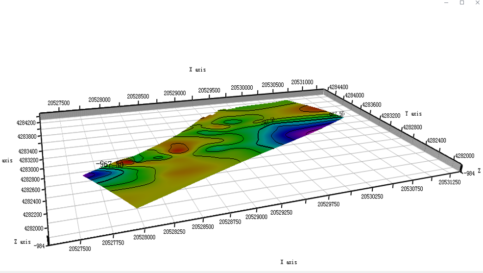

名称 geometry类型 material类型 （颜色、深度、透明度、可见性等等） 模型加载来源(shape、obj、off、txt) 变量及数据类型（json object数组/json objdect）  坐标系及其转换（前台转换后台转换）

```

```

2. 

js变量（三维定义，类型），

三维模型（geometry类型，material类型，坐标转换）

 threejs 的 语法 和 函数

三维地质模型的本地原始数据

# threejs函数

## wgl_init（）

初始化 渲染器 dom 节点   、相机、控制器、光照等等
巷道模型  射线追踪的初始化

坐标轴模型初始化


### 加载模型数据

#### wgl_load_3D_layers

这个函数 `loadStratumLayer` 是用来加载地层层面的数据，并将其添加到 `Three.js` 场景中。具体来说，它使用给定的地层数据（`wgl_layers`），为每个地层创建几何体、材质和网格，并将这些网格对象添加到场景中。

#### loadFaults(wgl_faults);

这个函数 `loadFaults` 的作用是加载断层（`faults`）数据并将其添加到 `Three.js` 场景中。函数的逻辑类似于之前的 `loadStratumLayer` 函数，但这里专注于断层数据的处


####  getdrillsVertices()

获取钻孔数据


地层 、贴图地表

钻孔等等

## zbz（）

textChinese（）

chidu（）

zuobiaozhou（）


# transform

缩放

平移

旋转

坐标转换


西安2000坐标系 经纬度

 西安80


epsg


**坐标系**


后端

- 模型数据生成和坐标转换

- 发送数据 提供接口


前端

- 请求数据

- 数据读入（坐标转换）
- 模型加载（纹理贴图 ）
- 交互功能（透明度 颜色 显/隐等 ）
-   模型层间距 求切面等 漫游 

后端数据（会统一到一个坐标系）到web三维场景的转换。

x -> z

y -> x

z -> y

```js
import ThreeManager from '../threeObject/ThreeManager';
import RaycasterModule from '../threeObject/RaycasterModule';
import LayerManager from '../threeObject/LayerManager';
```


偏移量

模型缩放比例

模型几何中心放置原点


功能上：

- 漫游和正常模式的切换

请求模型类型：

- 断层 
- 钻孔
- 巷道（2/3d）
-  注浆钻孔
-  微震（点集） 
- 采空区（面）
- 勘探线 （面+贴图）
-  指北针（体）
- 坐标轴
-  图例 


- 性能优化（渲染 和 数据缓存 缓存机制等）

## 模型数据

后端统一一套坐标系


从文件数据 转为 标准坐标

标准坐标 统一 转成threejs可视化坐标（以某个模型为主计算偏移量，提供x y z参数）


## 模型渲染管理

```JS
 // 添加示例点数据
        // sceneManager.addData({
        //          type: 'points',
        //          data: [
        //            -4, -1, 0,
        //            -2, -1, 0,
        //            -3, 1, 0,
        //          ],
        //          layer: 'pointsLayer',
        //          options: { color: 0xff0000, size: 0.2 },
        // });

        //地层渲染尝试
            fetch("/layer.txt")
            .then(response => {
              if (!response.ok) {
                throw new Error('Network response was not ok');
              }
              return response.text();
            })
            .then(text => {
            //   console.log('Loaded text:', text);
              const processedData = processData(text);
              console.log(processedData);
              processedData.forEach((layer,index)=>{
                sceneManager.addData({
                  type: 'triangleMesh',
                  data: {
                    vertices: layer.vertices,
                    indices:layer.indices, 
                  },
                  layer: 'indexedLayer',
                  options: { color:getcolorbylayer(index) },
                });
              })
              
              // loadLayers(processedData,scene)
          
            })
            .catch(error => {
              console.error('Error loading the text file:', error);
            });

        // 添加网格例子
        // sceneManager.addData({
        //   type: 'indices',
        //   data: {
        //     vertices: [
        //       -1, -1, -10,
        //       1, -1, -10,
        //       0, 1, -10,
        //     ],
        //     indices: [0, 1, 2], 
        //   },
        //   layer: 'indexedLayer',
        //   options: { color: 0x0000ff },
        // });
         // 添加三角面数据
        //  sceneManager.addData({
        //   type: 'triangleMesh',
        //   data: {
        //     vertices: [
        //       3, -1, 0, // 顶点 0
        //       5, -1, 0,  // 顶点 1
        //       4, 1, 0,   // 顶点 2
        //     ],
        //     indices: [0, 1, 2], // 定义一个三角面
        //   },
        //   layer: 'triangleLayer',
        //   options: { color: "#5cf5d0" },
        // });


        // sceneManager.addData({
        //   type: 'model',
        //   data: '/path/to/model.glb',
        //   layer: 'modelLayer',
        //   options: { scale: 2 },
        // });

        // sceneManager.addData({
        //   type: 'custom',
        //   data: null,
        //   layer: 'customLayer',
        //   options: {
        //     renderFunction: (data, THREE) => {
        //       const geometry = new THREE.TorusGeometry(1, 0.4, 16, 100);
        //       const material = new THREE.MeshBasicMaterial({ color:"#a375f5" });
        //       return new THREE.Mesh(geometry, material);
        //     },
        //   },
        // });
```


## 请求数据

```javascript
import request from '@/utils/request'

// 查询断层模型数据
export function getFaultModel(data) {
  return request({
    url: '/postgresql/get_fault_model', // 修改为实际的接口路径
    method: 'post',
    params: data // 如果需要传递查询参数
  })
}

// 查询钻孔数据
export function getBoreholeData(data) {
  return request({
    url: '/postgresql/get_borehole_data', // 修改为实际的接口路径
    method: 'post',
    params: data
  })
}

// 查询巷道（2D/3D）数据
export function getTunnelModel(data, is3D = false) {
  return request({
    url: is3D 
      ? '/postgresql/get_tunnel_model_3d' 
      : '/postgresql/get_tunnel_model_2d', // 修改为实际的接口路径
    method: 'post',
    params: data
  })
}

// 查询注浆钻孔数据
export function getGroutingBorehole(data) {
  return request({
    url: '/postgresql/get_grouting_borehole', // 修改为实际的接口路径
    method: 'post',
    params: data
  })
}

// 查询微震数据（点集）
export function getMicroSeismicPoints(data) {
  return request({
    url: '/postgresql/get_micro_seismic_points', // 修改为实际的接口路径
    method: 'post',
    params: data
  })
}

// 查询采空区数据（面）
export function getGoafModel(data) {
  return request({
    url: '/postgresql/get_goaf_model', // 修改为实际的接口路径
    method: 'post',
    params: data
  })
}

// 查询勘探线数据（面 + 贴图）
export function getExplorationLines(data) {
  return request({
    url: '/postgresql/get_exploration_lines', // 修改为实际的接口路径
    method: 'post',
    params: data
  })
}
```

------

### **方法描述**

1. **getFaultModel**：
   - 获取断层模型数据。
   - 请求方式：`POST`。
   - 参数：`data`（断层模型查询的条件，例如坐标范围、时间段等）。
2. **getBoreholeData**：
   - 获取钻孔相关数据。
   - 请求方式：`POST`。
   - 参数：`data`（钻孔的具体条件或筛选参数）。
3. **getTunnelModel**：
   - 获取巷道模型数据。
   - 可选 `2D` 或 `3D`，通过 `is3D` 参数控制。
   - 请求方式：`POST`。
   - 参数：`data`（巷道的查询条件）。
4. **getGroutingBorehole**：
   - 获取注浆钻孔数据。
   - 请求方式：`POST`。
   - 参数：`data`（如钻孔编号、区域范围等）。
5. **getMicroSeismicPoints**：
   - 获取微震点集数据。
   - 请求方式：`POST`。
   - 参数：`data`（如时间范围、震源位置等）。
6. **getGoafModel**：
   - 获取采空区模型数据（面数据）。
   - 请求方式：`POST`。
   - 参数：`data`（如区域坐标、数据精度等）。
7. **getExplorationLines**：
   - 获取勘探线数据（面 + 贴图）。
   - 请求方式：`POST`。
   - 参数：`data`（如勘探线范围、贴图需求等）。

------

### **如何使用**

#### 调用方法示例

假设你需要查询某区域的巷道模型（3D）：

```javascript
import { getTunnelModel } from '@/api/modelAPI';

const params = {
  region: 'north-zone', 
  startTime: '2023-01-01', 
  endTime: '2023-12-31'
};

getTunnelModel(params, true)
  .then(response => {
    console.log('3D Tunnel Model Data:', response.data);
  })
  .catch(error => {
    console.error('Error fetching tunnel model:', error);
  });
```

------

### **灵活性与扩展性**

- 如果未来需要新增其他模型请求方法，只需复制其中一个模板，替换 `url` 和 `方法名`。
- 可以根据实际需要调整 `GET` 和 `POST` 请求方式，以及参数传递方式（`params` 或 `data`）。


# 后端


9305

bootstrap.yaml


# 邢台

各个三维地质体模型的显隐

- 地层 

- 地质孔

- 剖面

## 交互

### 1.视角切换（漫游/鼠标控制）重置视角√

### 2.层间距计算


### 3.选定地层调节透明度

### 



