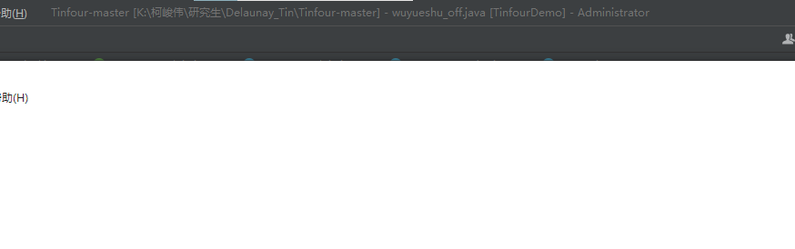
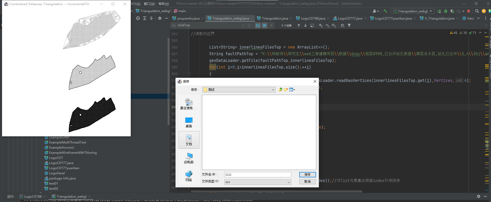
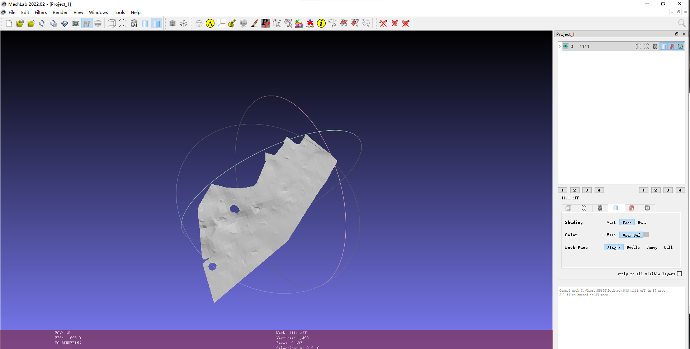

# 成功的实例

```java
/* --------------------------------------------------------------------
 * Copyright 2016 Gary W. Lucas.
 *
 * Licensed under the Apache License, Version 2.0 (the "License");
 * you may not use this file except in compliance with the License.
 * You may obtain a copy of the License at
 *
 *      http://www.apache.org/licenses/LICENSE-2.0
 *
 * Unless required by applicable law or agreed to in writing, software
 * distributed under the License is distributed on an "AS IS" BASIS,
 * WITHOUT WARRANTIES OR CONDITIONS OF ANY KIND, either express or implied.
 * See the License for the specific language governing permissions and
 * limitations under the License.
 * ---------------------------------------------------------------------
 */

/*
 * -----------------------------------------------------------------------
 *
 * Revision History:
 * Date     Name         Description
 * ------   ---------    -------------------------------------------------
 * 11/2016  G. Lucas     Created
 *
 * Notes:
 *
 * -----------------------------------------------------------------------
 */
package org.tinfour.demo.examples.txt;

import org.tinfour.common.*;
import org.tinfour.demo.examples.LogoPanel;
import org.tinfour.demo.utils.GeoDataLoader_webgl;
import org.tinfour.standard.IncrementalTin;

import javax.swing.*;
import javax.swing.filechooser.FileNameExtensionFilter;
import java.io.BufferedWriter;
import java.io.File;
import java.io.FileWriter;
import java.io.IOException;
import java.math.BigDecimal;
import java.util.ArrayList;
import java.util.Comparator;
import java.util.HashMap;
import java.util.List;

/**
 * 读取离散点，里外边界，形成点，三角形文件
 * CDT
 * Constrained Delaunay Triangulation.
 */

final public class Triangulation_webgl {

    public static List<Vertex> Vertices = new ArrayList<>();
    public static List<String> edgeFlag = new ArrayList<>();

    private Triangulation_webgl() {

    }

    
    public static Boolean addInnerBounds(List<Vertex> innerVertices, List<IConstraint> pList){

        PolygonConstraint poly = new PolygonConstraint(); // NOPMD
        //poly.setApplicationData(clx);
        //int n = vList.size();

        for(int i=0;i<innerVertices.size();++i)
        {
            poly.add(innerVertices.get(i));
        }
        poly.complete();
        pList.add(poly);

        return true;
    }

    public static Boolean addOutBounds(List<Vertex> innerVertices, List<IConstraint> pList){

        PolygonConstraint poly = new PolygonConstraint(); // NOPMD
        //poly.setApplicationData(clx);
        //int n = vList.size();

        for(int i=innerVertices.size()-1;i>0;--i)
        {
            poly.add(innerVertices.get(i));
        }
        poly.complete();
        pList.add(poly);

        return true;
    }


    public static Boolean writePointLine(String pPath,String lPath,IIncrementalTin tin) throws IOException {

        Iterable<Vertex> itv=tin.vertices();

        BufferedWriter out = new BufferedWriter(new FileWriter(pPath));
        for(Vertex v :itv)
        {
            out.write(v.getIndex()+" "+v.x+" "+v.y+" "+v.getZ()+"\n");
        }
        out.close();
        Iterable<SimpleTriangle> it=tin.triangles();


        BufferedWriter out2 = new BufferedWriter(new FileWriter(lPath));
        for(SimpleTriangle s: it){
//            System.out.println(s);
//            s.getEdgeA().isConstrained();
//            s.isGhost();
            if(s.getContainingRegion()!=null){
                if(notHaveEdge(s.getEdgeA().getA().getIndex(),s.getEdgeA().getB().getIndex()))
                {
                    out2.write(s.getEdgeA().getA().getIndex()+" "+s.getEdgeA().getB().getIndex()+"\n");
                }

                if(notHaveEdge(s.getEdgeB().getA().getIndex(),s.getEdgeB().getB().getIndex()))
                {
                    out2.write(s.getEdgeB().getA().getIndex()+" "+s.getEdgeB().getB().getIndex()+"\n");
                    // System.out.println(s.getEdgeB().getA().getIndex()+" "+s.getEdgeB().getB().getIndex());
                }

                if(notHaveEdge(s.getEdgeC().getA().getIndex(),s.getEdgeC().getB().getIndex()))
                {
                    out2.write(s.getEdgeC().getA().getIndex()+" "+s.getEdgeC().getB().getIndex()+"\n");
                    System.out.println();
                }

            }
        }
        out2.close();
        return true;
    }
    static double computeDistance3d(Vertex p1, Vertex p2){

        return  Math.sqrt((p1.x - p2.x)*(p1.x - p2.x) + (p1.y - p2.y)*(p1.y - p2.y) + (p1.z - p2.z)*(p1.z - p2.z));

    }
    static double computeDistance2d(Vertex p1, Vertex p2){

        return  Math.sqrt((p1.x - p2.x)*(p1.x - p2.x) + (p1.y - p2.y)*(p1.y - p2.y)) ;

    }
    static List<Vertex> insertValue(Vertex v, Vertex w, int insert_times)
    {
        List<Vertex> vec = new ArrayList<>();
        for (int i = 0; i< insert_times; ++i)
        {

            double x,y,z;
            x = v.x + (w.x - v.x) / (insert_times + 1)* (i + 1);
            y = v.y + (w.y - v.y) / (insert_times + 1)* (i + 1);
            z = v.z + (w.z - v.z) / (insert_times + 1)* (i + 1);
            Vertex tv = new Vertex(x,y,z,Vertices.size());
            Vertices.add(tv);
            vec.add(tv);
        }
        return vec;

    }
    public  static   List<Vertex> insertBoundry(List<Vertex> vertices,double delta)
    {
        List<Vertex> newBoundry = new ArrayList();
        for(int i=0;i<vertices.size()-1;++i)
        {
            newBoundry.add(vertices.get(i));
            double d = computeDistance3d(vertices.get(i),vertices.get(i+1));
            int insertTimes = (int) ( d/delta);
            List<Vertex> vec = insertValue(vertices.get(i),vertices.get(i+1),insertTimes);
            for(int j=0;j<vec.size();++j)
            {
                newBoundry.add(vec.get(j));
            }
            if(i==vertices.size()-2)
                newBoundry.add(vertices.get(i+1));
        }

        return newBoundry;
    }
    public static  List<Vertex> reSortBoundry(Vertex vbegin ,List<Vertex> vertices)
    {
        double min = Double.MAX_VALUE;
        int minIndex = 0;
        for(int j=0;j<vertices.size();++j)
        {
            double d = computeDistance2d(vbegin,vertices.get(j));
            if(d<min)
            {
                min = d;
                minIndex = j;
            }

        }
        List<Vertex> tmpL = new ArrayList<>();
        for(int i = minIndex;i<vertices.size();++i)
        {
            tmpL.add(vertices.get(i));
        }
        for(int i=0;i<minIndex;++i)
        {
            tmpL.add(vertices.get(i));
        }

        return tmpL;
    }

    public static List<Vertex> generateStraightLineVertices(List<Vertex> vertices,double delta)
    {

        List<Vertex> StraightLineVertices = new ArrayList<>();
        if(vertices.isEmpty())
            return StraightLineVertices;

        Vertex v0 = new Vertex(0,delta,0,vertices.get(0).getIndex());
        StraightLineVertices.add(v0);

        for(int i=1;i<vertices.size();++i)
        {
            double dis = computeDistance2d(vertices.get(i-1),vertices.get(i));
            Vertex v = new Vertex(dis,delta,0,vertices.get(i).getIndex());
            StraightLineVertices.add(v);
        }
        return StraightLineVertices;
    }
    public static IIncrementalTin  generateBoundry(List<Vertex> outlineTopVertex)
    {
        IIncrementalTin tin = new IncrementalTin();

        List<Vertex> tmpTopVertices = new ArrayList<>();


        tmpTopVertices = generateStraightLineVertices(outlineTopVertex,0);


        for(int i=0;i<tmpTopVertices.size();++i)
        {
            tin.add(tmpTopVertices.get(i));
        }
        List<IConstraint> cListTop = new ArrayList<>();
        tin.addConstraints(cListTop, true);
//        LogoPanel.plot(tin, "title");

        return  tin;
    }
    public static Boolean sewTriangleAndWrite(List<Vertex> outlineTopVertex,List<Vertex> outlineBottonVertex,String  offPath)
    {

        int vsize=0;
        HashMap<Integer,Integer> vmap = new HashMap<>();
        for(Vertex v :outlineTopVertex)
        {
            vmap.put(v.getIndex(),vsize);
            vsize++;
        }
        for(Vertex v :outlineBottonVertex)
        {
            vmap.put(v.getIndex(),vsize);
            vsize++;
        }

        List<List<Integer>> triangles = new ArrayList<>();
        for(int i=0;i<outlineTopVertex.size()-2;++i)
        {
            List<Integer> triangle1 = new ArrayList<>();
            List<Integer> triangle2 = new ArrayList<>();
            triangle1.add(outlineTopVertex.get(i).getIndex());
            triangle1.add(outlineTopVertex.get(i+1).getIndex());
            triangle1.add(outlineBottonVertex.get(i).getIndex());

            triangle2.add(outlineTopVertex.get(i+1).getIndex());
            triangle2.add(outlineBottonVertex.get(i).getIndex());
            triangle2.add(outlineBottonVertex.get(i+1).getIndex());

            triangles.add(triangle1);
            triangles.add(triangle2);
        }


        int tsize=triangles.size();

        try {
            BufferedWriter out2 = new BufferedWriter(new FileWriter(offPath));

            out2.write("OFF\n");
            out2.write(vsize+" "+tsize+" "+0+ "\n");
            for(Vertex v :outlineTopVertex)
            {

                out2.write(v.x+" "+v.y+" "+v.z+"\n");
            }
            for(Vertex v :outlineBottonVertex)
            {

                out2.write(v.x+" "+v.y+" "+v.z+"\n");
            }
            for(int i=0;i<triangles.size();++i) {
                out2.write(3+" "+vmap.get(triangles.get(i).get(0))+" "+vmap.get(triangles.get(i).get(1))+" "+vmap.get(triangles.get(i).get(2))+"\n");
            }
            out2.close();

        } catch (IOException e) {
            e.printStackTrace();
        }
        return true;
    }

    public static Boolean writeTopOFF(String offPath,IIncrementalTin tin) throws IOException {

        Iterable<Vertex> itv=tin.vertices();
        Iterable<SimpleTriangle> it=tin.triangles();
        BufferedWriter out = new BufferedWriter(new FileWriter(offPath));

        int vsize=0;
        int tsize=0;
        HashMap<Integer,Integer> vmap = new HashMap<>();

        for(Vertex v :itv)
        {
            vmap.put(v.getIndex(),vsize);
            vsize++;
        }


        for(SimpleTriangle s: it){

            if(s.getContainingRegion()!=null){
                tsize++;
            }
        }

        out.write("OFF\n");
        out.write(vsize+" "+tsize+" "+0+ "\n");
        itv=tin.vertices();
        it=tin.triangles();

        for(Vertex v :itv)
        {
            double z = v.getZ();
            out.write(v.x+" "+v.y+" "+z+"\n");
        }
        for(SimpleTriangle s: it){
//            System.out.println(s);
//            s.getEdgeA().isConstrained();
//            s.isGhost();
            if(s.getContainingRegion()!=null){

                out.write(3+" "+vmap.get(s.getVertexA().getIndex())+" "+vmap.get(s.getVertexB().getIndex())+" "+vmap.get(s.getVertexC().getIndex())+"\n");

            }
        }
        out.close();
        return true;
    }

    public static Boolean writeLayerOFF(IIncrementalTin tinTop,String offPath) throws IOException {

        BufferedWriter out = new BufferedWriter(new FileWriter(offPath));
        Iterable<Vertex> itvTop=tinTop.vertices();
        Iterable<SimpleTriangle> itTop=tinTop.triangles();
        int vsize=0;
        int tsize=0;
        HashMap<Integer,Integer> vmap = new HashMap<>();
       // HashMap<Integer,Integer> vmapBottom = new HashMap<>();
        for(Vertex v :itvTop)
        {

            vmap.put(v.getIndex(),vsize);
            vsize++;
        }

        for(SimpleTriangle s: itTop){

            if(s.getContainingRegion()!=null){
                tsize++;
            }
        }

       // out.write("*\n");
        //out.write(vsize+" "+tsize+" "+0+ "\n");

        out.write("OFF\n");
        out.write(vsize+" "+tsize+" "+0+ "\n");
        itvTop=tinTop.vertices();

        int i=0;
        for(Vertex v :itvTop)
        {

                double z = v.getZ();
//                out.write(i + " " + v.x + " " + v.y + " " + z + "\n");
            out.write(v.x + " " + v.y + " " + z + "\n");
            i++;

        }


        itTop=tinTop.triangles();

//        out.write("^\n");
        for(SimpleTriangle s: itTop){

            if(s.getContainingRegion()!=null){

                out.write(3+" "+vmap.get(s.getVertexA().getIndex())+" "+vmap.get(s.getVertexB().getIndex())+" "+vmap.get(s.getVertexC().getIndex())+"\n");

            }
        }

        out.close();
        return true;
    }


    public static Boolean writeLayerOFF(IIncrementalTin tinTop,IIncrementalTin tinBottom,IIncrementalTin tinBoundry,List<Vertex> outlineTopVertex,List<Vertex> outlineBottonVertex,String offPath) throws IOException {

        BufferedWriter out = new BufferedWriter(new FileWriter(offPath));
        Iterable<Vertex> itvTop=tinTop.vertices();
        Iterable<SimpleTriangle> itTop=tinTop.triangles();
        Iterable<Vertex> itvBottom=tinBottom.vertices();
        Iterable<SimpleTriangle> itBottom=tinBottom.triangles();

        Iterable<Vertex> itvBoundry=tinTop.vertices();
        Iterable<SimpleTriangle> itBoundry=tinTop.triangles();
        int vsize=0;
        int tsize=0;
        HashMap<Integer,Integer> vmap = new HashMap<>();
        HashMap<Integer,Integer> vmapBottom = new HashMap<>();
        for(Vertex v :itvTop)
        {
            vmap.put(v.getIndex(),vsize);
            vsize++;
        }
        for(Vertex v :itvBottom)
        {
            vmapBottom.put(v.getIndex(),vsize);
            vsize++;
        }
        for(Vertex v :itvBoundry)
        {
            System.out.println(v.getIndex());
        }
//
        for(SimpleTriangle s: itTop){

            if(s.getContainingRegion()!=null){
                tsize++;
            }
        }
        for(SimpleTriangle s: itBottom){

            if(s.getContainingRegion()!=null){
                tsize++;
            }
        }

        for(SimpleTriangle s: itBoundry){

            tsize++;
        }

        List<List<Integer>> triangles = new ArrayList<>();


        out.write("OFF\n");
      //  out.write(vsize+" "+tsize+" "+0+ "\n");

        itvTop=tinTop.vertices();
        itvBottom=tinBottom.vertices();

        for(Vertex v :itvTop)
        {
            double z = v.getZ();
            out.write(v.x+" "+v.y+" "+z+"\n");
        }

        for(Vertex v :itvBottom)
        {
            double z = v.getZ();
            out.write(v.x+" "+v.y+" "+z+"\n");
        }

        itTop=tinTop.triangles();
        itBottom=tinBottom.triangles();

        for(SimpleTriangle s: itTop){

            if(s.getContainingRegion()!=null){

                out.write(3+" "+vmap.get(s.getVertexA().getIndex())+" "+vmap.get(s.getVertexB().getIndex())+" "+vmap.get(s.getVertexC().getIndex())+"\n");

            }
        }
        for(SimpleTriangle s: itBottom){

            if(s.getContainingRegion()!=null){

                out.write(3+" "+vmapBottom.get(s.getVertexA().getIndex())+" "+vmapBottom.get(s.getVertexB().getIndex())+" "+vmapBottom.get(s.getVertexC().getIndex())+"\n");

            }
        }

        for(int i=0;i<triangles.size();++i) {
            out.write(3+" "+triangles.get(i).get(0)+" "+triangles.get(i).get(1)+" "+triangles.get(i).get(2)+"\n");
        }


        out.close();
        return true;
    }


    public static void main(String[] args) throws IOException {
       // TestOptions options = new TestOptions();
        //boolean[] optionsMatched = options.argumentScan(args);

     //   Class<?> tinClass = options.getTinClass();//获取tin类
        String title = "Constrained Delaunay Triangulation -- ";//
               // + tinClass.getSimpleName();  //返回名字

        IIncrementalTin tin = new IncrementalTin();
        GeoDataLoader_webgl geoDataLoader = new GeoDataLoader_webgl();
        //GeoDataLoader geoDataLoader = new GeoDataLoader();


        String drillPathTop = "K:\\柯峻伟\\研究生\\web三维建模项目\\数据\\duqu\\地层0908_已合并钻孔数据\\煤层含水层_钻孔已合并\\3_4\\3bj\\离散点全3.xlsx";//读离散点
       // String drillPathTop = "C:\\Users\\86195\\Desktop\\研究内容\\隔水层刨分\\12与34\\底离散点全.xlsx";//读离散点

        List<Vertex> drillVertices =  geoDataLoader.readGeoVertices(drillPathTop,Vertices);
        for(int i=0;i<drillVertices.size();++i)
        {
            tin.add(drillVertices.get(i));
        }
        System.out.println("已经读取并加入离散点");
//        String drillPathBottom = "C:\\Users\\86195\\Desktop\\研究内容\\0-23\\0-23\\lsd\\19LSD.xlsx";
//        List<Vertex> drillVerticesBottom =  geoDataLoader.readGeoVertices(drillPathBottom,Vertices);
//        for(int i=0;i<drillVerticesBottom.size();++i)
//        {
////            drillVerticesBottom.get(i).z -=5;
//            tinBottom.add(drillVerticesBottom.get(i));
//        }

        List<IConstraint> cListTop = new ArrayList<>();
//        List<IConstraint> cListBottom = new ArrayList<>();
        double delta = 0.1;
        List<String> outlinesFilesTop = new ArrayList<>();
        String outlinesPathTop ="K:\\柯峻伟\\研究生\\web三维建模项目\\数据\\duqu\\地层0908_已合并钻孔数据\\煤层含水层_钻孔已合并\\3_4\\3bj\\io";//批量读外边界文件，应是文件夹路径
        geoDataLoader.getFile(outlinesPathTop,outlinesFilesTop);
        for(int i=0;i<outlinesFilesTop.size();++i)
        {
            List<Vertex> outlinesTopVertices = geoDataLoader.readGeoVertices(outlinesFilesTop.get(i),Vertices,4);
            addOutBounds(outlinesTopVertices,cListTop);
        }
        System.out.println("已经读取外边界文件");


//读取内边界

        List<String> innerlinesFilesTop = new ArrayList<>();
        String faultPathTop = "K:\\柯峻伟\\研究生\\web三维建模项目\\数据\\duqu\\地层0908_已合并钻孔数据\\煤层含水层_钻孔已合并\\3_4\\3bj\\in";//批量读取内约束，应是文件夹路径
        geoDataLoader.getFile(faultPathTop,innerlinesFilesTop);
        for(int i=0;i<innerlinesFilesTop.size();++i)
        {
            List<Vertex> innerlinesTopVertices = geoDataLoader.readGeoVertices(innerlinesFilesTop.get(i),Vertices,4);
            addOutBounds(innerlinesTopVertices,cListTop);

        }
        System.out.println("已经读取内边界文件");
        System.out.println("已经添加内外约束");
       //加约束-------------------------------------------------
        tin.addConstraints(cListTop, true);


        LogoPanel.plot(tin, title);


// 坐标的读取
        List<Vertex> vertexs = tin.getVertices();
        vertexs.sort(Comparator.comparing(Vertex::getIndex));//对list元素集合根据index升序排序

        int vs = vertexs.size();//点总个数
        int q = tin.getSyntheticVertexCount();//合成点个数
        int tv = vs - q;//去除合成点后点总个数
        double[][] vertexcount = new double[vs][4];
        System.out.println("点总个数" + vs + "；其中合成点个数" + q + "；去除合成点后，点总个数" + tv);
        int tvcount = 0;//作为去除合成点后的数组记录数
        for (int i = 0; i < vs; i++) {

            vertexcount[i][0] = 0;
            vertexcount[i][1] = 0;
            vertexcount[i][2] = 0;
            vertexcount[i][3] = 0;
        }

        for (int m = 0; m < vs; m++) {
                vertexcount[tvcount][0] = vertexs.get(m).getIndex();
                vertexcount[tvcount][1] = vertexs.get(m).getX();
                vertexcount[tvcount][2] = vertexs.get(m).getY();
                vertexcount[tvcount][3] = vertexs.get(m).getZ();
                tvcount++;

        }


        // 边的读取
        List<IQuadEdge> eds = tin.getEdges();
        eds.sort(Comparator.comparing(IQuadEdge::getIndex));
        int es = eds.size();
        int tes = 0;
        //判断是否为约束边界内的边成员，并计数
        for (int r = 0; r < es; r++) {
            if (eds.get(r).isConstrainedRegionMember()) {
                tes++;
            }
        }
//        System.out.println("边总个数：" + es);
//        int[][] edgecount = new int[es][4];
//        for (int i = 0; i < es; i++) {
//
//            edgecount[i][0] = 0;
//            edgecount[i][1] = 0;
//            edgecount[i][2] = 0;
//            edgecount[i][3] = 0;
//        }
//        int t = 0;
//        for (int e = 0; e < es; e++) {
//            if (eds.get(e).getA() != null && eds.get(e).getB() != null) {
//                edgecount[t][0] = eds.get(e).getIndex();
//                edgecount[t][1] = eds.get(e).getA().getIndex();
//                edgecount[t][2] = eds.get(e).getB().getIndex();
//                //edgecount[t][3]= eds.get(e).isConstrained();
//                //判断边是否为约束线
//                if (eds.get(e).isConstrained()) {
//                    edgecount[t][3] = 1;
//                } else {
//                    edgecount[t][3] = 0;
//                }
//            } else {
//                edgecount[t][0] = 0;
//                edgecount[t][1] = 0;
//                edgecount[t][2] = 0;
//                edgecount[t][3] = 0;
//            }
//            t++;
//        }

        Iterable<SimpleTriangle> it=tin.triangles();
        int ctriangle=tin.countTriangles().getCount();

        System.out.println("三角形个数："+ctriangle);
        int[][] trianglecount = new int[ctriangle][4];
        for (int is = 0; is < ctriangle; is++) {

            trianglecount[is][0] = 0;
            trianglecount[is][1] = 0;
            trianglecount[is][2] = 0;
            trianglecount[is][3] = 0;
        }
        int trcount=0;
//        for(SimpleTriangle s: it){
//
//
//                trianglecount[trcount][0] = s.getIndex();
//                trianglecount[trcount][1] = s.getEdgeA().getA().getIndex();
//                trianglecount[trcount][2] = s.getEdgeB().getA().getIndex();
//                trianglecount[trcount][3] = s.getEdgeC().getA().getIndex();
//                trcount++;
//
//
//
//        }


        for(SimpleTriangle s: it){
            // System.out.println(s);
//            if(s.getContainingRegion()!=null)
            if(s.getContainingRegion()!=null)
            {
//Gets the polygon-based constraint that contains this triangle, if any.
// 获取包含此三角形（如果有）的基于多边形的约束。

                trianglecount[trcount][0] = s.getIndex();
                trianglecount[trcount][1] = s.getEdgeA().getBaseIndex();
                trianglecount[trcount][2] = s.getEdgeB().getBaseIndex();
                trianglecount[trcount][3] = s.getEdgeC().getBaseIndex();
                trcount++;

            } else {
//若不在约束内，则赋-1，在输出时剔除
                trianglecount[trcount][0] = -1;
                trianglecount[trcount][1] = -1;
                trianglecount[trcount][2] = -1;
                trianglecount[trcount][3] = -1;
                trcount++;
            }

        }


        System.out.println("设置文件保存位置");


        JFileChooser chooser = new JFileChooser();
        FileNameExtensionFilter supported1 = new FileNameExtensionFilter("txt","txt");
        chooser.setFileFilter(supported1);
        //下面的方法将阻塞，直到【用户按下保存按钮且“文件名”文本框不为空】或【用户按下取消按钮】
        int option = chooser.showSaveDialog(null);
        if(option==JFileChooser.APPROVE_OPTION){	//假如用户选择了保存
            File file = chooser.getSelectedFile();
            String F=file.getPath()+".txt";
//            WriteTxt(F, vertexcount, edgecount,trianglecount);
            //WriteTxt(F, vertexcount, trianglecount);
            writeLayerOFF(tin,F);
            System.out.println("文件已保存");

        }

    }

    public static Boolean notHaveEdge(int a, int b)
    {
        String s1 = String.valueOf(a)+String.valueOf(b);
        String s2 =  String.valueOf(b)+String.valueOf(a);
        if(!edgeFlag.contains(s1)&&!edgeFlag.contains(s2))
        {
            edgeFlag.add(s1);
            edgeFlag.add(s2);
            return true;
        }else
            return false;

    }
    public static void WriteTxt(String txtPath,double[][] p,int[][]r){
//写txt
        FileWriter fileWriter = null;
        try {

            fileWriter = new FileWriter(txtPath);//创建文本文件
            fileWriter.write("点的数据：\r\n");
            BigDecimal bigd=null;


            for(int i=0;i<p.length;i++)//输出记录点的数组
            {

                if(i == p.length -1)
                    fileWriter.write((int) p[i][0]+" "+p[i][1]+" "+String.format("%.2f",p[i][2])+" "+String.format("%.3f",p[i][3])+"\r\n");
                else fileWriter.write((int) p[i][0]+" "+p[i][1]+" "+String.format("%.2f",p[i][2])+" "+String.format("%.3f",p[i][3])+"\r\n");
            }

//            fileWriter.write("边的数据：\r\n");
//            if(q!=null) {
//                for (int l = 0; l < q.length; l++)//输出记录边的数组
//                {
//                    if(q[l][1]==0&&q[l][2]==0&&q[l][3]==0) {
//                        continue;
//                    }
//
//                    if (l == q.length - 1)
//                        fileWriter.write(q[l][0] + "," + q[l][1] + "," + q[l][2] + "," + q[l][3] + "\r\n");
//                    else
//                        fileWriter.write(q[l][0] + "," + q[l][1] + "," + q[l][2] + "," + q[l][3] + "\r\n");
//
//                }
//            }
            fileWriter.write("三角形数据:\r\n");
            if(r!=null) {
                for (int ln = 0; ln < r.length; ln++)//输出记录边的数组
                {
                    if(r[ln][0]!=-1){

                        if (ln == r.length - 1)
                            fileWriter.write(r[ln][0] + " " + r[ln][1] + " " + r[ln][2] + " " + r[ln][3]+ "\r\n");
                        else
                            fileWriter.write(r[ln][0] + " " + r[ln][1] + " " + r[ln][2]+ " " + r[ln][3] + "\r\n");
                    }
                }
            }

            fileWriter.flush();
            fileWriter.close();
        } catch (IOException e) {

// TODO Auto-generated catch block
            e.printStackTrace();
        }
    }


}

```

