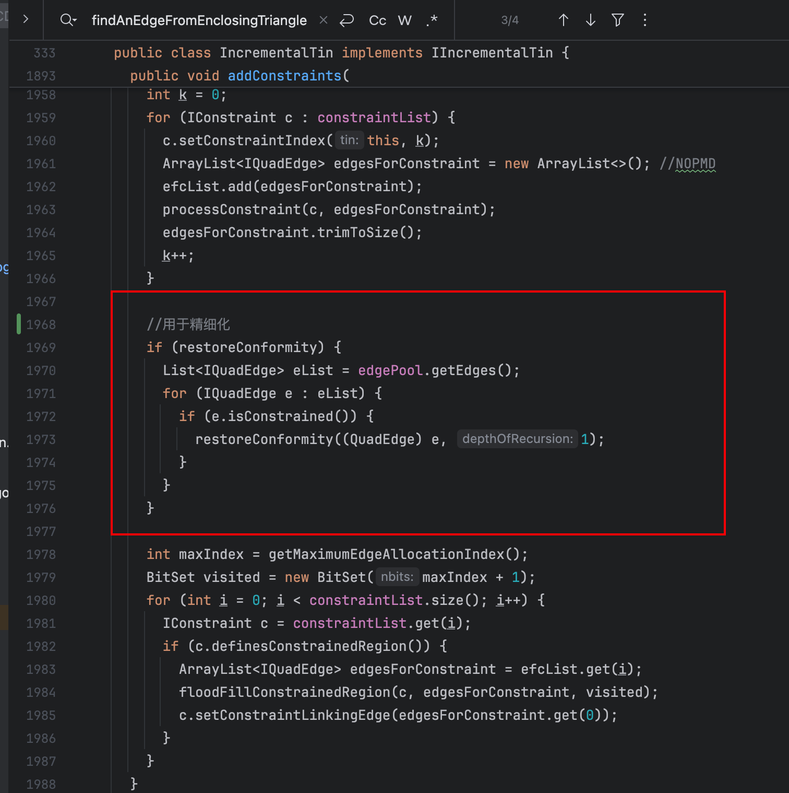

# 成功的实例

```java
/* --------------------------------------------------------------------
 * Copyright 2016 Gary W. Lucas.
 *
 * Licensed under the Apache License, Version 2.0 (the "License");
 * you may not use this file except in compliance with the License.
 * You may obtain a copy of the License at
 *
 *      http://www.apache.org/licenses/LICENSE-2.0
 *
 * Unless required by applicable law or agreed to in writing, software
 * distributed under the License is distributed on an "AS IS" BASIS,
 * WITHOUT WARRANTIES OR CONDITIONS OF ANY KIND, either express or implied.
 * See the License for the specific language governing permissions and
 * limitations under the License.
 * ---------------------------------------------------------------------
 */

/*
 * -----------------------------------------------------------------------
 *
 * Revision History:
 * Date     Name         Description
 * ------   ---------    -------------------------------------------------
 * 11/2016  G. Lucas     Created
 *
 * Notes:
 *
 * -----------------------------------------------------------------------
 */
package org.tinfour.demo.examples.txt;

import org.tinfour.common.*;
import org.tinfour.demo.examples.LogoPanel;
import org.tinfour.demo.utils.GeoDataLoader_webgl;
import org.tinfour.standard.IncrementalTin;

import javax.swing.*;
import javax.swing.filechooser.FileNameExtensionFilter;
import java.io.BufferedWriter;
import java.io.File;
import java.io.FileWriter;
import java.io.IOException;
import java.math.BigDecimal;
import java.util.ArrayList;
import java.util.Comparator;
import java.util.HashMap;
import java.util.List;

/**
 * 读取离散点，里外边界，形成点，三角形文件
 * CDT
 * Constrained Delaunay Triangulation.
 */

final public class Triangulation_webgl {

    public static List<Vertex> Vertices = new ArrayList<>();
    public static List<String> edgeFlag = new ArrayList<>();

    private Triangulation_webgl() {

    }

    
    public static Boolean addInnerBounds(List<Vertex> innerVertices, List<IConstraint> pList){

        PolygonConstraint poly = new PolygonConstraint(); // NOPMD
        //poly.setApplicationData(clx);
        //int n = vList.size();

        for(int i=0;i<innerVertices.size();++i)
        {
            poly.add(innerVertices.get(i));
        }
        poly.complete();
        pList.add(poly);

        return true;
    }

    public static Boolean addOutBounds(List<Vertex> innerVertices, List<IConstraint> pList){

        PolygonConstraint poly = new PolygonConstraint(); // NOPMD
        //poly.setApplicationData(clx);
        //int n = vList.size();

        for(int i=innerVertices.size()-1;i>0;--i)
        {
            poly.add(innerVertices.get(i));
        }
        poly.complete();
        pList.add(poly);

        return true;
    }


    public static Boolean writePointLine(String pPath,String lPath,IIncrementalTin tin) throws IOException {

        Iterable<Vertex> itv=tin.vertices();

        BufferedWriter out = new BufferedWriter(new FileWriter(pPath));
        for(Vertex v :itv)
        {
            out.write(v.getIndex()+" "+v.x+" "+v.y+" "+v.getZ()+"\n");
        }
        out.close();
        Iterable<SimpleTriangle> it=tin.triangles();


        BufferedWriter out2 = new BufferedWriter(new FileWriter(lPath));
        for(SimpleTriangle s: it){
//            System.out.println(s);
//            s.getEdgeA().isConstrained();
//            s.isGhost();
            if(s.getContainingRegion()!=null){
                if(notHaveEdge(s.getEdgeA().getA().getIndex(),s.getEdgeA().getB().getIndex()))
                {
                    out2.write(s.getEdgeA().getA().getIndex()+" "+s.getEdgeA().getB().getIndex()+"\n");
                }

                if(notHaveEdge(s.getEdgeB().getA().getIndex(),s.getEdgeB().getB().getIndex()))
                {
                    out2.write(s.getEdgeB().getA().getIndex()+" "+s.getEdgeB().getB().getIndex()+"\n");
                    // System.out.println(s.getEdgeB().getA().getIndex()+" "+s.getEdgeB().getB().getIndex());
                }

                if(notHaveEdge(s.getEdgeC().getA().getIndex(),s.getEdgeC().getB().getIndex()))
                {
                    out2.write(s.getEdgeC().getA().getIndex()+" "+s.getEdgeC().getB().getIndex()+"\n");
                    System.out.println();
                }

            }
        }
        out2.close();
        return true;
    }
    static double computeDistance3d(Vertex p1, Vertex p2){

        return  Math.sqrt((p1.x - p2.x)*(p1.x - p2.x) + (p1.y - p2.y)*(p1.y - p2.y) + (p1.z - p2.z)*(p1.z - p2.z));

    }
    static double computeDistance2d(Vertex p1, Vertex p2){

        return  Math.sqrt((p1.x - p2.x)*(p1.x - p2.x) + (p1.y - p2.y)*(p1.y - p2.y)) ;

    }
    static List<Vertex> insertValue(Vertex v, Vertex w, int insert_times)
    {
        List<Vertex> vec = new ArrayList<>();
        for (int i = 0; i< insert_times; ++i)
        {

            double x,y,z;
            x = v.x + (w.x - v.x) / (insert_times + 1)* (i + 1);
            y = v.y + (w.y - v.y) / (insert_times + 1)* (i + 1);
            z = v.z + (w.z - v.z) / (insert_times + 1)* (i + 1);
            Vertex tv = new Vertex(x,y,z,Vertices.size());
            Vertices.add(tv);
            vec.add(tv);
        }
        return vec;

    }
    public  static   List<Vertex> insertBoundry(List<Vertex> vertices,double delta)
    {
        List<Vertex> newBoundry = new ArrayList();
        for(int i=0;i<vertices.size()-1;++i)
        {
            newBoundry.add(vertices.get(i));
            double d = computeDistance3d(vertices.get(i),vertices.get(i+1));
            int insertTimes = (int) ( d/delta);
            List<Vertex> vec = insertValue(vertices.get(i),vertices.get(i+1),insertTimes);
            for(int j=0;j<vec.size();++j)
            {
                newBoundry.add(vec.get(j));
            }
            if(i==vertices.size()-2)
                newBoundry.add(vertices.get(i+1));
        }

        return newBoundry;
    }
    public static  List<Vertex> reSortBoundry(Vertex vbegin ,List<Vertex> vertices)
    {
        double min = Double.MAX_VALUE;
        int minIndex = 0;
        for(int j=0;j<vertices.size();++j)
        {
            double d = computeDistance2d(vbegin,vertices.get(j));
            if(d<min)
            {
                min = d;
                minIndex = j;
            }

        }
        List<Vertex> tmpL = new ArrayList<>();
        for(int i = minIndex;i<vertices.size();++i)
        {
            tmpL.add(vertices.get(i));
        }
        for(int i=0;i<minIndex;++i)
        {
            tmpL.add(vertices.get(i));
        }

        return tmpL;
    }

    public static List<Vertex> generateStraightLineVertices(List<Vertex> vertices,double delta)
    {

        List<Vertex> StraightLineVertices = new ArrayList<>();
        if(vertices.isEmpty())
            return StraightLineVertices;

        Vertex v0 = new Vertex(0,delta,0,vertices.get(0).getIndex());
        StraightLineVertices.add(v0);

        for(int i=1;i<vertices.size();++i)
        {
            double dis = computeDistance2d(vertices.get(i-1),vertices.get(i));
            Vertex v = new Vertex(dis,delta,0,vertices.get(i).getIndex());
            StraightLineVertices.add(v);
        }
        return StraightLineVertices;
    }
    public static IIncrementalTin  generateBoundry(List<Vertex> outlineTopVertex)
    {
        IIncrementalTin tin = new IncrementalTin();

        List<Vertex> tmpTopVertices = new ArrayList<>();


        tmpTopVertices = generateStraightLineVertices(outlineTopVertex,0);


        for(int i=0;i<tmpTopVertices.size();++i)
        {
            tin.add(tmpTopVertices.get(i));
        }
        List<IConstraint> cListTop = new ArrayList<>();
        tin.addConstraints(cListTop, true);
//        LogoPanel.plot(tin, "title");

        return  tin;
    }
    public static Boolean sewTriangleAndWrite(List<Vertex> outlineTopVertex,List<Vertex> outlineBottonVertex,String  offPath)
    {

        int vsize=0;
        HashMap<Integer,Integer> vmap = new HashMap<>();
        for(Vertex v :outlineTopVertex)
        {
            vmap.put(v.getIndex(),vsize);
            vsize++;
        }
        for(Vertex v :outlineBottonVertex)
        {
            vmap.put(v.getIndex(),vsize);
            vsize++;
        }

        List<List<Integer>> triangles = new ArrayList<>();
        for(int i=0;i<outlineTopVertex.size()-2;++i)
        {
            List<Integer> triangle1 = new ArrayList<>();
            List<Integer> triangle2 = new ArrayList<>();
            triangle1.add(outlineTopVertex.get(i).getIndex());
            triangle1.add(outlineTopVertex.get(i+1).getIndex());
            triangle1.add(outlineBottonVertex.get(i).getIndex());

            triangle2.add(outlineTopVertex.get(i+1).getIndex());
            triangle2.add(outlineBottonVertex.get(i).getIndex());
            triangle2.add(outlineBottonVertex.get(i+1).getIndex());

            triangles.add(triangle1);
            triangles.add(triangle2);
        }


        int tsize=triangles.size();

        try {
            BufferedWriter out2 = new BufferedWriter(new FileWriter(offPath));

            out2.write("OFF\n");
            out2.write(vsize+" "+tsize+" "+0+ "\n");
            for(Vertex v :outlineTopVertex)
            {

                out2.write(v.x+" "+v.y+" "+v.z+"\n");
            }
            for(Vertex v :outlineBottonVertex)
            {

                out2.write(v.x+" "+v.y+" "+v.z+"\n");
            }
            for(int i=0;i<triangles.size();++i) {
                out2.write(3+" "+vmap.get(triangles.get(i).get(0))+" "+vmap.get(triangles.get(i).get(1))+" "+vmap.get(triangles.get(i).get(2))+"\n");
            }
            out2.close();

        } catch (IOException e) {
            e.printStackTrace();
        }
        return true;
    }

    public static Boolean writeTopOFF(String offPath,IIncrementalTin tin) throws IOException {

        Iterable<Vertex> itv=tin.vertices();
        Iterable<SimpleTriangle> it=tin.triangles();
        BufferedWriter out = new BufferedWriter(new FileWriter(offPath));

        int vsize=0;
        int tsize=0;
        HashMap<Integer,Integer> vmap = new HashMap<>();

        for(Vertex v :itv)
        {
            vmap.put(v.getIndex(),vsize);
            vsize++;
        }


        for(SimpleTriangle s: it){

            if(s.getContainingRegion()!=null){
                tsize++;
            }
        }

        out.write("OFF\n");
        out.write(vsize+" "+tsize+" "+0+ "\n");
        itv=tin.vertices();
        it=tin.triangles();

        for(Vertex v :itv)
        {
            double z = v.getZ();
            out.write(v.x+" "+v.y+" "+z+"\n");
        }
        for(SimpleTriangle s: it){
//            System.out.println(s);
//            s.getEdgeA().isConstrained();
//            s.isGhost();
            if(s.getContainingRegion()!=null){

                out.write(3+" "+vmap.get(s.getVertexA().getIndex())+" "+vmap.get(s.getVertexB().getIndex())+" "+vmap.get(s.getVertexC().getIndex())+"\n");

            }
        }
        out.close();
        return true;
    }

    public static Boolean writeLayerOFF(IIncrementalTin tinTop,String offPath) throws IOException {

        BufferedWriter out = new BufferedWriter(new FileWriter(offPath));
        Iterable<Vertex> itvTop=tinTop.vertices();
        Iterable<SimpleTriangle> itTop=tinTop.triangles();
        int vsize=0;
        int tsize=0;
        HashMap<Integer,Integer> vmap = new HashMap<>();
       // HashMap<Integer,Integer> vmapBottom = new HashMap<>();
        for(Vertex v :itvTop)
        {

            vmap.put(v.getIndex(),vsize);
            vsize++;
        }

        for(SimpleTriangle s: itTop){

            if(s.getContainingRegion()!=null){
                tsize++;
            }
        }

       // out.write("*\n");
        //out.write(vsize+" "+tsize+" "+0+ "\n");

        out.write("OFF\n");
        out.write(vsize+" "+tsize+" "+0+ "\n");
        itvTop=tinTop.vertices();

        int i=0;
        for(Vertex v :itvTop)
        {

                double z = v.getZ();
//                out.write(i + " " + v.x + " " + v.y + " " + z + "\n");
            out.write(v.x + " " + v.y + " " + z + "\n");
            i++;

        }


        itTop=tinTop.triangles();

//        out.write("^\n");
        for(SimpleTriangle s: itTop){

            if(s.getContainingRegion()!=null){

                out.write(3+" "+vmap.get(s.getVertexA().getIndex())+" "+vmap.get(s.getVertexB().getIndex())+" "+vmap.get(s.getVertexC().getIndex())+"\n");

            }
        }

        out.close();
        return true;
    }


    public static Boolean writeLayerOFF(IIncrementalTin tinTop,IIncrementalTin tinBottom,IIncrementalTin tinBoundry,List<Vertex> outlineTopVertex,List<Vertex> outlineBottonVertex,String offPath) throws IOException {

        BufferedWriter out = new BufferedWriter(new FileWriter(offPath));
        Iterable<Vertex> itvTop=tinTop.vertices();
        Iterable<SimpleTriangle> itTop=tinTop.triangles();
        Iterable<Vertex> itvBottom=tinBottom.vertices();
        Iterable<SimpleTriangle> itBottom=tinBottom.triangles();

        Iterable<Vertex> itvBoundry=tinTop.vertices();
        Iterable<SimpleTriangle> itBoundry=tinTop.triangles();
        int vsize=0;
        int tsize=0;
        HashMap<Integer,Integer> vmap = new HashMap<>();
        HashMap<Integer,Integer> vmapBottom = new HashMap<>();
        for(Vertex v :itvTop)
        {
            vmap.put(v.getIndex(),vsize);
            vsize++;
        }
        for(Vertex v :itvBottom)
        {
            vmapBottom.put(v.getIndex(),vsize);
            vsize++;
        }
        for(Vertex v :itvBoundry)
        {
            System.out.println(v.getIndex());
        }
//
        for(SimpleTriangle s: itTop){

            if(s.getContainingRegion()!=null){
                tsize++;
            }
        }
        for(SimpleTriangle s: itBottom){

            if(s.getContainingRegion()!=null){
                tsize++;
            }
        }

        for(SimpleTriangle s: itBoundry){

            tsize++;
        }

        List<List<Integer>> triangles = new ArrayList<>();


        out.write("OFF\n");
      //  out.write(vsize+" "+tsize+" "+0+ "\n");

        itvTop=tinTop.vertices();
        itvBottom=tinBottom.vertices();

        for(Vertex v :itvTop)
        {
            double z = v.getZ();
            out.write(v.x+" "+v.y+" "+z+"\n");
        }

        for(Vertex v :itvBottom)
        {
            double z = v.getZ();
            out.write(v.x+" "+v.y+" "+z+"\n");
        }

        itTop=tinTop.triangles();
        itBottom=tinBottom.triangles();

        for(SimpleTriangle s: itTop){

            if(s.getContainingRegion()!=null){

                out.write(3+" "+vmap.get(s.getVertexA().getIndex())+" "+vmap.get(s.getVertexB().getIndex())+" "+vmap.get(s.getVertexC().getIndex())+"\n");

            }
        }
        for(SimpleTriangle s: itBottom){

            if(s.getContainingRegion()!=null){

                out.write(3+" "+vmapBottom.get(s.getVertexA().getIndex())+" "+vmapBottom.get(s.getVertexB().getIndex())+" "+vmapBottom.get(s.getVertexC().getIndex())+"\n");

            }
        }

        for(int i=0;i<triangles.size();++i) {
            out.write(3+" "+triangles.get(i).get(0)+" "+triangles.get(i).get(1)+" "+triangles.get(i).get(2)+"\n");
        }


        out.close();
        return true;
    }


    public static void main(String[] args) throws IOException {
       // TestOptions options = new TestOptions();
        //boolean[] optionsMatched = options.argumentScan(args);

     //   Class<?> tinClass = options.getTinClass();//获取tin类
        String title = "Constrained Delaunay Triangulation -- ";//
               // + tinClass.getSimpleName();  //返回名字

        IIncrementalTin tin = new IncrementalTin();
        GeoDataLoader_webgl geoDataLoader = new GeoDataLoader_webgl();
        //GeoDataLoader geoDataLoader = new GeoDataLoader();


        String drillPathTop = "K:\\柯峻伟\\研究生\\web三维建模项目\\数据\\duqu\\地层0908_已合并钻孔数据\\煤层含水层_钻孔已合并\\3_4\\3bj\\离散点全3.xlsx";//读离散点
       // String drillPathTop = "C:\\Users\\86195\\Desktop\\研究内容\\隔水层刨分\\12与34\\底离散点全.xlsx";//读离散点

        List<Vertex> drillVertices =  geoDataLoader.readGeoVertices(drillPathTop,Vertices);
        for(int i=0;i<drillVertices.size();++i)
        {
            tin.add(drillVertices.get(i));
        }
        System.out.println("已经读取并加入离散点");
//        String drillPathBottom = "C:\\Users\\86195\\Desktop\\研究内容\\0-23\\0-23\\lsd\\19LSD.xlsx";
//        List<Vertex> drillVerticesBottom =  geoDataLoader.readGeoVertices(drillPathBottom,Vertices);
//        for(int i=0;i<drillVerticesBottom.size();++i)
//        {
////            drillVerticesBottom.get(i).z -=5;
//            tinBottom.add(drillVerticesBottom.get(i));
//        }

        List<IConstraint> cListTop = new ArrayList<>();
//        List<IConstraint> cListBottom = new ArrayList<>();
        double delta = 0.1;
        List<String> outlinesFilesTop = new ArrayList<>();
        String outlinesPathTop ="K:\\柯峻伟\\研究生\\web三维建模项目\\数据\\duqu\\地层0908_已合并钻孔数据\\煤层含水层_钻孔已合并\\3_4\\3bj\\io";//批量读外边界文件，应是文件夹路径
        geoDataLoader.getFile(outlinesPathTop,outlinesFilesTop);
        for(int i=0;i<outlinesFilesTop.size();++i)
        {
            List<Vertex> outlinesTopVertices = geoDataLoader.readGeoVertices(outlinesFilesTop.get(i),Vertices,4);
            addOutBounds(outlinesTopVertices,cListTop);
        }
        System.out.println("已经读取外边界文件");


//读取内边界

        List<String> innerlinesFilesTop = new ArrayList<>();
        String faultPathTop = "K:\\柯峻伟\\研究生\\web三维建模项目\\数据\\duqu\\地层0908_已合并钻孔数据\\煤层含水层_钻孔已合并\\3_4\\3bj\\in";//批量读取内约束，应是文件夹路径
        geoDataLoader.getFile(faultPathTop,innerlinesFilesTop);
        for(int i=0;i<innerlinesFilesTop.size();++i)
        {
            List<Vertex> innerlinesTopVertices = geoDataLoader.readGeoVertices(innerlinesFilesTop.get(i),Vertices,4);
            addOutBounds(innerlinesTopVertices,cListTop);

        }
        System.out.println("已经读取内边界文件");
        System.out.println("已经添加内外约束");
       //加约束-------------------------------------------------
        tin.addConstraints(cListTop, true);


        LogoPanel.plot(tin, title);


// 坐标的读取
        List<Vertex> vertexs = tin.getVertices();
        vertexs.sort(Comparator.comparing(Vertex::getIndex));//对list元素集合根据index升序排序

        int vs = vertexs.size();//点总个数
        int q = tin.getSyntheticVertexCount();//合成点个数
        int tv = vs - q;//去除合成点后点总个数
        double[][] vertexcount = new double[vs][4];
        System.out.println("点总个数" + vs + "；其中合成点个数" + q + "；去除合成点后，点总个数" + tv);
        int tvcount = 0;//作为去除合成点后的数组记录数
        for (int i = 0; i < vs; i++) {

            vertexcount[i][0] = 0;
            vertexcount[i][1] = 0;
            vertexcount[i][2] = 0;
            vertexcount[i][3] = 0;
        }

        for (int m = 0; m < vs; m++) {
                vertexcount[tvcount][0] = vertexs.get(m).getIndex();
                vertexcount[tvcount][1] = vertexs.get(m).getX();
                vertexcount[tvcount][2] = vertexs.get(m).getY();
                vertexcount[tvcount][3] = vertexs.get(m).getZ();
                tvcount++;

        }


        // 边的读取
        List<IQuadEdge> eds = tin.getEdges();
        eds.sort(Comparator.comparing(IQuadEdge::getIndex));
        int es = eds.size();
        int tes = 0;
        //判断是否为约束边界内的边成员，并计数
        for (int r = 0; r < es; r++) {
            if (eds.get(r).isConstrainedRegionMember()) {
                tes++;
            }
        }
//        System.out.println("边总个数：" + es);
//        int[][] edgecount = new int[es][4];
//        for (int i = 0; i < es; i++) {
//
//            edgecount[i][0] = 0;
//            edgecount[i][1] = 0;
//            edgecount[i][2] = 0;
//            edgecount[i][3] = 0;
//        }
//        int t = 0;
//        for (int e = 0; e < es; e++) {
//            if (eds.get(e).getA() != null && eds.get(e).getB() != null) {
//                edgecount[t][0] = eds.get(e).getIndex();
//                edgecount[t][1] = eds.get(e).getA().getIndex();
//                edgecount[t][2] = eds.get(e).getB().getIndex();
//                //edgecount[t][3]= eds.get(e).isConstrained();
//                //判断边是否为约束线
//                if (eds.get(e).isConstrained()) {
//                    edgecount[t][3] = 1;
//                } else {
//                    edgecount[t][3] = 0;
//                }
//            } else {
//                edgecount[t][0] = 0;
//                edgecount[t][1] = 0;
//                edgecount[t][2] = 0;
//                edgecount[t][3] = 0;
//            }
//            t++;
//        }

        Iterable<SimpleTriangle> it=tin.triangles();
        int ctriangle=tin.countTriangles().getCount();

        System.out.println("三角形个数："+ctriangle);
        int[][] trianglecount = new int[ctriangle][4];
        for (int is = 0; is < ctriangle; is++) {

            trianglecount[is][0] = 0;
            trianglecount[is][1] = 0;
            trianglecount[is][2] = 0;
            trianglecount[is][3] = 0;
        }
        int trcount=0;
//        for(SimpleTriangle s: it){
//
//
//                trianglecount[trcount][0] = s.getIndex();
//                trianglecount[trcount][1] = s.getEdgeA().getA().getIndex();
//                trianglecount[trcount][2] = s.getEdgeB().getA().getIndex();
//                trianglecount[trcount][3] = s.getEdgeC().getA().getIndex();
//                trcount++;
//
//
//
//        }


        for(SimpleTriangle s: it){
            // System.out.println(s);
//            if(s.getContainingRegion()!=null)
            if(s.getContainingRegion()!=null)
            {
//Gets the polygon-based constraint that contains this triangle, if any.
// 获取包含此三角形（如果有）的基于多边形的约束。

                trianglecount[trcount][0] = s.getIndex();
                trianglecount[trcount][1] = s.getEdgeA().getBaseIndex();
                trianglecount[trcount][2] = s.getEdgeB().getBaseIndex();
                trianglecount[trcount][3] = s.getEdgeC().getBaseIndex();
                trcount++;

            } else {
//若不在约束内，则赋-1，在输出时剔除
                trianglecount[trcount][0] = -1;
                trianglecount[trcount][1] = -1;
                trianglecount[trcount][2] = -1;
                trianglecount[trcount][3] = -1;
                trcount++;
            }

        }


        System.out.println("设置文件保存位置");


        JFileChooser chooser = new JFileChooser();
        FileNameExtensionFilter supported1 = new FileNameExtensionFilter("txt","txt");
        chooser.setFileFilter(supported1);
        //下面的方法将阻塞，直到【用户按下保存按钮且“文件名”文本框不为空】或【用户按下取消按钮】
        int option = chooser.showSaveDialog(null);
        if(option==JFileChooser.APPROVE_OPTION){	//假如用户选择了保存
            File file = chooser.getSelectedFile();
            String F=file.getPath()+".txt";
//            WriteTxt(F, vertexcount, edgecount,trianglecount);
            //WriteTxt(F, vertexcount, trianglecount);
            writeLayerOFF(tin,F);
            System.out.println("文件已保存");

        }

    }

    public static Boolean notHaveEdge(int a, int b)
    {
        String s1 = String.valueOf(a)+String.valueOf(b);
        String s2 =  String.valueOf(b)+String.valueOf(a);
        if(!edgeFlag.contains(s1)&&!edgeFlag.contains(s2))
        {
            edgeFlag.add(s1);
            edgeFlag.add(s2);
            return true;
        }else
            return false;

    }
    public static void WriteTxt(String txtPath,double[][] p,int[][]r){
//写txt
        FileWriter fileWriter = null;
        try {

            fileWriter = new FileWriter(txtPath);//创建文本文件
            fileWriter.write("点的数据：\r\n");
            BigDecimal bigd=null;


            for(int i=0;i<p.length;i++)//输出记录点的数组
            {

                if(i == p.length -1)
                    fileWriter.write((int) p[i][0]+" "+p[i][1]+" "+String.format("%.2f",p[i][2])+" "+String.format("%.3f",p[i][3])+"\r\n");
                else fileWriter.write((int) p[i][0]+" "+p[i][1]+" "+String.format("%.2f",p[i][2])+" "+String.format("%.3f",p[i][3])+"\r\n");
            }

//            fileWriter.write("边的数据：\r\n");
//            if(q!=null) {
//                for (int l = 0; l < q.length; l++)//输出记录边的数组
//                {
//                    if(q[l][1]==0&&q[l][2]==0&&q[l][3]==0) {
//                        continue;
//                    }
//
//                    if (l == q.length - 1)
//                        fileWriter.write(q[l][0] + "," + q[l][1] + "," + q[l][2] + "," + q[l][3] + "\r\n");
//                    else
//                        fileWriter.write(q[l][0] + "," + q[l][1] + "," + q[l][2] + "," + q[l][3] + "\r\n");
//
//                }
//            }
            fileWriter.write("三角形数据:\r\n");
            if(r!=null) {
                for (int ln = 0; ln < r.length; ln++)//输出记录边的数组
                {
                    if(r[ln][0]!=-1){

                        if (ln == r.length - 1)
                            fileWriter.write(r[ln][0] + " " + r[ln][1] + " " + r[ln][2] + " " + r[ln][3]+ "\r\n");
                        else
                            fileWriter.write(r[ln][0] + " " + r[ln][1] + " " + r[ln][2]+ " " + r[ln][3] + "\r\n");
                    }
                }
            }

            fileWriter.flush();
            fileWriter.close();
        } catch (IOException e) {

// TODO Auto-generated catch block
            e.printStackTrace();
        }
    }


}

```

## main函数

此代码片段展示了一个Java应用的主方法`main`，该方法用于处理与“约束德劳内三角剖分”（Constrained Delaunay Triangulation）相关的数据，并生成相应的模型。以下是代码的逐步解读：

1. **确定基础路径**：使用自定义函数`determineBasePath`来确定程序运行时文件操作的基础路径。

2. **初始化和数据加载**：
   - 创建`IncrementalTin`实例，这是用于存储和操作三角化网络（Triangulated Irregular Network，简称TIN）的对象。
   - 通过`GeoDataLoader_webgl`类（这似乎是一个自定义类），从特定路径读取地理空间数据，并将其作为顶点列表返回。

3. **读取离散点**：
    - 构建`drillPathTop`字符串以指定离散点数据文件的路径。
    - 调用`readGeoVertices`方法来读取离散点文件，并将结果存储在`drillVertices`列表中。
    - 遍历`drillVertices`并将每个顶点添加到`tin`对象中。

4. **处理边界约束**：
    - 初始化外边界和内边界约束列表。
    - 将外边界和内边界文件的路径构造完成，并使用`getFile`方法获取这些路径下所有文件。
    - 使用`readGeoVertices`方法读取边界文件中的顶点，并调用`addOutBounds`方法将生成的顶点列表加入对应的约束列表。

5. **加入约束到TIN中**：
   - 使用`addConstraints`方法将外边界和内边界约束加入到`tin`对象中。

6. **处理和排序三角化结果**：
   - 从`tin`对象中获得所有顶点，并根据索引进行排序。
   - 过滤出合成的顶点，并打印统计信息。
   - 同样地，处理和排序边缘和三角形。

7. **保存文件**：
   - 弹出文件选择器，让用户指定保存文件的位置。
   - 如果用户确认保存，则将`tin`的内容导出到文本文件中，可能是通过`writeLayerOFF`方法。

代码中出现了一些注释掉的代码片段，且有些变量如`LogoPanel`、`IConstraint`、`Vertex`、`IQuadEdge`和`SimpleTriangle`等看起来像是程序所依赖的自定义类或接口。

此外，代码片段中存在一些错误，例如未定义的变量（如`Vertices`）、不完整的逻辑（部分for循环中的条件和操作看起来不完整）和可能的拼写错误。

请注意，这段代码没有提供所有调用的方法和自定义类的实现细节，因此无法直接运行。而且，`main`方法抛出了`IOException`异常，这表明文件操作可能会导致错误，需要在实际运行时做好异常处理。

总之，代码的目标是通过读取点数据、边界约束并使用德劳内三角剖分算法来生成一个三角网。最后，允许用户将结果保存到文件中。


### add（）

在这段代码中，`add`方法是一个德劳内三角剖分（TIN）数据结构的组成部分，用来将一个新的顶点`v`加入到TIN中。这里是详细的解释：

1. **检查锁定状态**：
   - 首先，方法检查`isLocked`布尔变量的值，判断TIN是否被锁定，以防止在特定情况下添加更多的顶点。
   - 如果`isLocked`为`true`，且`isDisposed`也为`true`，则抛出`IllegalStateException`异常，因为在调用`dispose()`方法后，不应该再向TIN添加顶点。
   - 否则，如果只是`isLocked`为`true`，但没有调用`dispose()`，则抛出另一个`IllegalStateException`异常，提示TIN已锁定。

2. **顶点计数**：
   - 增加已插入顶点数量的计数器`nVerticesInserted`。
   
3. **处理顶点添加**：
   - 如果TIN已经过初始的引导设置（`isBootstrapped`为`true`），则调用`addWithInsertOrAppend`方法来正常添加顶点。
   - 如果TIN还没有完成引导设置，则进行以下步骤：
     - 如果`vertexList`为空，创建一个新的`ArrayList`并添加顶点`v`到列表中，然后返回`false`（表示顶点尚未真正加入到TIN的数据结构中）。
     - 如果`vertexList`不为空，则继续向其中添加顶点`v`。
     - 调用`bootstrap`方法尝试用`vertexList`中的顶点来初始化TIN。
     - 如果`bootstrap`成功，TIN完成了引导设置（即创建了初始三角形结构），那么会继续遍历`vertexList`中的所有顶点，并使用`addWithInsertOrAppend`方法将它们加入到TIN中。

4. **清理**：
   - 在引导过程之后，`bootstrap`方法可能会使用掉`vertexList`中的前三个顶点，但并不会从列表中移除它们。循环中对于每一个顶点的添加操作都会忽略重复的插入行为。
   - 引导成功并且所有顶点均已处理后，清空`vertexList`，并将其设置为`null`，表示所有顶点都已加入到TIN中。

总的来说，此`add`方法负责在保证数据一致性的前提下将新的顶点添加到三角剖分中。在引导阶段之前，收集的所有顶点存储在一个列表中，等待初始化三角剖分结构。一旦TIN被正确引导，随后的顶点可直接插入到TIN中。

## addConstraints

```java
public void addConstraints(
  List<IConstraint> constraints,
  boolean restoreConformity)
  //恢复一致性
  
```



`addConstraints`方法将一组几何约束添加到已构建的三角网（TIN）中。这些约束可能是由线段、多边形或其他形式的边界定义的，并且它们会影响TIN结构，以确保它们在最终的网络表示中被遵循。以下是该方法的主要步骤：

1. **检查锁定和有效性**：
   - 首先，方法检查TIN是否被锁定（`isLocked`），如果是，则无法添加新的约束。
   - 如果TIN已经调用了`dispose()`方法或者已有约束存在，抛出`IllegalStateException`异常。
   - 如果输入的`constraints`列表为空或`null`，那么直接返回，不执行任何操作。

2. **检查约束数量限制**：
   - 方法检查传入的约束数是否超过了系统的最大限制（`QuadEdgeConstants.CONSTRAINT_INDEX_MAX`）。如果超过，抛出一个`IllegalArgumentException`异常。

3. **第一步：添加所有顶点**：
   - 遍历每个约束，并将其相关的所有顶点添加到TIN中。如果发现重复的顶点（即已存在于TIN中的顶点），则标记为冗余。

4. **处理重复顶点**：
   - 如果存在重复的顶点，则创建一个包含非重复顶点集合的新约束引用，并更新约束列表`constraintList`。

5. **第二步：构造新边并标记现有边**：
   - 锁定TIN，防止进一步修改，然后为每个约束构建新边，并将这些边与其对应的约束索引关联起来。为每个约束收集其对应的边，并存储在`efcList`中。

6. **恢复一致性**（如果需要）：
   - 如果`restoreConformity`参数为`true`，则对每个已标记为受约束的边调用`restoreConformity`方法，以确保TIN满足德劳内条件。

7. **处理边缘和填充约束区域**：
   - 使用`floodFillConstrainedRegion`方法填充由约束边界定义的受限区域，确保TIN中相应的区域得到正确标记。
   - 为每个确定了受限区域的约束设置链接边，这样可以在后期快速访问和识别这些区域的边界。

8. **最终处理**：
   - 完成添加约束后，更新了TIN的状态，确保所有新添加的约束都已正确反映在数据结构中。

总之，`addConstraints`方法负责将用户定义的几何约束合并到已经存在的TIN中，并确保最终的TIN依然符合德劳内条件以及符合约束的边界和内部结构。通过增量更新TIN和融入新的边界信息，这个方法使得TIN能够更精确地表示原始地理空间数据。

1. **processConstraint(c, edgesForConstraint)**:
   这个方法处理单个约束对象`c`。它可能会创建新的边来表示约束，并可能会调整TIN以确保这些约束边在最终结构中得到遵守。为了理解约束是如何加入的，我们需要看到此函数的实现。

2. **restoreConformity(QuadEdge e, int recursionDepth)**:

   **用于精细化。**如果`restoreConformity`参数被设置为`true`，则此方法被调用以修复插入约束边后可能破坏了德劳内条件的TIN。它可能涉及移除和重新连接边以维持德劳内性质。了解这个方法中的逻辑对于完整地理解TIN如何重新获得一致性非常重要。

3. **floodFillConstrainedRegion(c, edgesForConstraint, visited)**:
   这个方法可能用于标识受约束区域内的所有三角形，以便正确地标记那些位于约束内部的三角形。了解这个方法的工作原理将有助于理解如何处理约束定义的区域。

### processConstraint

`processConstraint`方法接收一个几何约束及其顶点集合，并将约束添加到三角网（TIN）中。该方法的执行逻辑可以分解为以下步骤：

1. **初始化**：
   - 把约束的所有顶点添加到列表`cvList`中。如果约束是多边形，则列表末尾添加起始点以闭合多边形。
   - 设置搜索的初始条件，找到包含第一个顶点的边。

2. **预处理**：
   - 根据是否匹配顶点进行搜索边的调整。
   - 如果搜索到的边的端点与约束的起始顶点是同一点或属于同一组合并的顶点，将这个点设置为约束的起点。

3. **遍历约束的每个分段**：
   - 对于约束的**每个连续顶点对（即线段）**，进行以下操作：
     - 如果找到一条直接连接两顶点的边，就标记为受约束的边，并为下一个循环迭代准备`e0`边。
     - 否则，进行“pinwheel”操作来查找穿过约束线段的边`h`。这涉及检查每个扇区，确定是否包含完整的约束线段。

4. **挖掘空腔**：
   - 找到跨越约束线段的边后，开始**左右挖掘空腔**，直到找到位于约束线段上的顶点`c`。
   - 如果在挖掘过程中发现顶点在约束线段上，此顶点会被插入到约束的顶点列表中。

5. **插入约束边**：
   - 分配一条新的边`n`，连接顶点`v0`和`c`，并将其标记为受约束的边。
   - 调整新边和它的对偶边，以确保TIN结构正确。

6. **填充空腔**：
   - 使用`fillCavity`方法填补由于加入约束而在网络结构中产生的空洞。

7. **更新搜索边**：
   - 方法结束时，将最后处理的边`e0`设置为下一次搜索的起点。

这种方法有效地处理了约束边界与现有TIN结构之间的交互，通过创建新边、重新连接边缘和填补空洞来整合约束。整个过程涉及复杂的计算和几何操作，确保在不破坏TIN其他部分的前提下，准确地添加约束。

接着，`floodFillConstrainedRegion`方法使用队列来实现洪水填充算法，它基于已标记为受约束区域边界的边集`edgeList`，递归遍历这些边连接的所有三角形，并将它们标记为属于受约束区域。这能够快速识别由约束边界包围的区域。`visited`位集用于跟踪哪些边已经被访问过，以避免重复处理。

```java
  private void processConstraint(
    IConstraint constraint,
    ArrayList<IQuadEdge> edgesForConstraint) {
    List<Vertex> cvList = new ArrayList<>();
    cvList.addAll(constraint.getVertices());
    //
    if (constraint.isPolygon()) {
      // close the loop
      cvList.add(cvList.get(0));
    }
    int nSegments = cvList.size() - 1;

    double vTolerence = thresholds.getVertexTolerance();
    Vertex v0 = cvList.get(0);
    double x0 = v0.getX();
    double y0 = v0.getY();

    if (searchEdge == null) {
      searchEdge = edgePool.getStartingEdge();
    }
    searchEdge = walker.findAnEdgeFromEnclosingTriangle(searchEdge, x0, y0);
    QuadEdge e0 = null;
    if (isMatchingVertex(v0, searchEdge.getA())) {
      e0 = searchEdge;
    } else if (isMatchingVertex(v0, searchEdge.getB())) {
      e0 = searchEdge.getDual();
    } else { //if (isMatchingVertex(v0, searchEdge.getReverse().getA())) {
      e0 = searchEdge.getReverse();
    }
    Vertex a = e0.getA();
    if (a != v0 && a instanceof VertexMergerGroup) {
      VertexMergerGroup g = (VertexMergerGroup) a;
      if (g.contains(v0)) {
        cvList.set(0, a);
      }
    }

    // because this method may change the TIN, we cannot assume
    // that the current search edge will remain valid.
    searchEdge = null;

    double x1, y1, ux, uy, u, px, py;
    double ax, ay, ah, bx, by, bh;
    Vertex v1, b;
    segmentLoop:
    for (int iSegment = 0; iSegment < nSegments; iSegment++) {
      // e0 is now an edge which has v0 as it's initial vertex.
      // the special case where one of the edges connecting to e0
      // is the edge (v0,v1) benefits from special handling to avoid
      // potential numerical issues... especially in the case where
      // the constraint includes 3 nearly colinear edges in a row.
      // So the code below performs a pinwheel operation to test for that case.
      //   The code also checks to see if the pinwheel will move out
      // of the boundaries of the TIN (when e.getB() returns a null).
      // In that case, one of the edges in the pinwheel is the re-entry edge.
      // we assign e0 to be the re-entry edge.  This only happens when the
      // constraint edge(v0,v1) is not located within the boundary of the TIN,
      // so often the variable reEntry will stay set to null.
      v0 = cvList.get(iSegment);
      v1 = cvList.get(iSegment + 1);
      QuadEdge e = e0;
      {
        boolean priorNull = false;
        QuadEdge reEntry = null;
        do {
          b = e.getB();
          if (b == null) {
            // ghost vertex
            priorNull = true;
          } else {
            if (b == v1) {
              setConstrained(e, constraint, edgesForConstraint);
              e0 = e.getDual(); // set up e0 for next iteration of iSegment
              continue segmentLoop;
            } else if (b instanceof VertexMergerGroup) {
              VertexMergerGroup g = (VertexMergerGroup) b;
              if (g.contains(v1)) {
                cvList.set(iSegment + 1, g);
                setConstrained(e, constraint, edgesForConstraint);
                e0 = e.getDual(); // set up e0 for next iteration of iSegment
                continue segmentLoop;
              }
            }
            if (priorNull) {
              reEntry = e;
            }
            priorNull = false;
          }
          e = e.getDualFromReverse();
        } while (!e.equals(e0));

        if (reEntry != null) {
          e0 = reEntry;
        }
        // if reEntry is null and priorNull is true, then
        // the last edge we tested the B value for was null.
        // this would have been the edge right before e0, which
        // means that e0 is the reEntry edge.
      }

      // pinwheel to find the right-side edge of a triangle
      // which overlaps the constraint segment.  The segment may be entirely
      // contained in this triangle, or may intersect the edge opposite v0.
      x0 = v0.getX();
      y0 = v0.getY();
      x1 = v1.getX();
      y1 = v1.getY();
      ux = x1 - x0;
      uy = y1 - y0;
      u = Math.sqrt(ux * ux + uy * uy);
      // TO DO: test for vector too small
      ux /= u; // unit vector
      uy /= u;
      px = -uy;  // perpendicular
      py = ux;

      // The search should now be positioned on v0.  We've already verified
      // that v0 does not connect directly to v1, so we need to find
      // the next vertex affected by the constraint.
      //    There is also the case where the one of the connecting edges is colinear
      // (or nearly colinear) with the constraint segment. If we find a
      // vertext that is sufficiently close to the constraint segment,
      // we insert the vertex into the constraint (making a new segment)
      // and continue on to the newly formed segment.
      QuadEdge h = null;
      QuadEdge right0 = null;
      QuadEdge left0 = null;
      QuadEdge right1 = null;
      QuadEdge left1 = null;

      // begin the pre-loop initialization.  The search below performs a pinwheel
      // through the edge that start with v0, looking for a case where the
      // edge opposite v0 straddles the constraint segment.  We call the
      // candidate edges n where n=edge(a,b).  As we loop, the b from one
      // test is the same as the a for the next test. So we copy values
      // from b into a at the beginning of the loop.  To support that, we
      // pre-initialize b before enterring the loop.  This pre-initialization
      // must also include the side-of-edge calculation, bh, which is the
      // coordinate of (bx,by) in the direction of the perpendicular.
      //    The pre-test must also test for the case where the first edge
      // in the pinwheel lies on or very close to the ray(v0, v1).
      // The logic is similar to that inside the loop, except that a
      // simple dot product is sufficient to determine if the vertex is
      // in front of, or behind, the ray (see the comments in the loop for
      // more explanation.
      b = e0.getB();
      bx = b.getX() - x0;
      by = b.getY() - y0;
      bh = bx * px + by * py;
      if (Math.abs(bh) <= vTolerence && bx * ux + by * uy > 0) {
        // edge e0 is either colinear or nearly colinear with
        // ray(v0,v1). insert it into the constraint, set up e0 for the
        // next segment, and advance to the next segment in the constraint.
        cvList.add(iSegment + 1, b);
        nSegments++;
        setConstrained(e0, constraint, edgesForConstraint);
        e0 = e0.getDual(); // set up e0 for next iteration of iSegment
        continue; // continue segmentLoop;
      }

      // perform a pinwheel, testing each sector to see if
      // it contains the constraint segment.
      e = e0;
      do {
        // copy calculated values from b to a.
        ax = bx;
        ay = by;
        ah = bh;
        QuadEdge n = e.getForward(); //the edge opposite v0

        // TO DO: the following code is commented out because it should
        // no longer be necessary.  The test for the reEntry edge above
        // should have positioned e0 so that the pinwheel will find the
        // straddle point before it reaches the ghost edge.  The only case
        // where this code would fail (and b would be null) would be when
        // something we haven't anticipated happens and the straddle isn't found.
        //   // be wary of the ghost vertex case
        //   b = n.getB();
        //   if (b == null) {
        //      // TO DO: does this actually happen anymore now that
        //      // the reEntry logic was added above?
        //      bh = Double.NaN;
        //      e = e.getDualFromReverse();
        //      continue;
        //   }
        b = n.getB();
        bx = b.getX() - x0;
        by = b.getY() - y0;
        bh = bx * px + by * py;
        if (Math.abs(bh) <= vTolerence) {
          // the edge e is either colinear or nearly colinear with the
          // line through vertices v0 and v1.  We need to see if the
          // straddle point lies on or near the ray(v0,v1).
          // this is complicated slightly by the fact that some points
          // on the edge n could be in front of v0 (a positive direction
          // on the ray) while others could be behind it.  So there's
          // no way around it, we have to compute the intersection.
          // Of course, we don't need to compute the actual points (x,y)
          // of the intersection, just the parameter t from the parametric
          // equation of a line. If t is negative, the intersection is
          // behind the ray. If t is positive, the intersection is in front
          // of the ray.  If t is zero, the TIN insertion algorithm failed and
          // we have an implementation problem elsewhere in the code.
          double dx = bx - ax;
          double dy = by - ay;
          double t = (ax * dy - ay * dx) / (ux * dy - uy * dx);
          if (t > 0) {
            // edge e is either colinear or nearly colinear with
            // ray(v0,v1). insert it into the constraint, set up e0 for
            // the next loop, and then advance to the next constraint segment.
            cvList.add(iSegment + 1, b);
            nSegments++;
            e0 = e.getReverse(); // will be (b, v0), set up for next iSegment
            setConstrained(e0.getDual(), constraint, edgesForConstraint);
            continue segmentLoop;
          }
        }

        // test to see if the segment (a,b) crosses the line (v0,v1).
        // if it does, the intersection will either be behind the
        // segment (v0,v1) or on it.  The t variable is from the
        // parametric form of the line equation for the intersection
        // point (x,y) such that
        //   (x,y) = t*(ux, uy) + (v0.x, v0.y)
        double hab = ah * bh;
        if (hab <= 0) {
          double dx = bx - ax;
          double dy = by - ay;
          double t = (ax * dy - ay * dx) / (ux * dy - uy * dx);
          if (t > 0) {
            right0 = e;
            left0 = e.getReverse();
            h = n.getDual();
            break;
          }
        }
        e = e.getDualFromReverse();
      } while (!e.equals(e0));

      // step 2 ------------------------------------------
      // h should now be non-null and straddles the
      // constraint, vertex a is to its right
      // and vertex b is to its left.  we have already
      // tested for the cases where either a or b lies on (v0,v1)
      // begin digging the cavities to the left and right of h.
      if (h == null) {
        throw new IllegalStateException("Internal failure, constraint not added");
      }
      Vertex c = null;
      while (true) {
        right1 = h.getForward();
        left1 = h.getReverse();
        c = right1.getB();
        if (c == null) {
          throw new IllegalStateException("Internal failure, constraint not added");
        }
        removeEdge(h);
        double cx = c.getX() - x0;
        double cy = c.getY() - y0;
        double ch = cx * px + cy * py;
        if (Math.abs(ch) < vTolerence && cx * ux + cy * uy > 0) {
          // Vertex c is on the edge.  We will break the loop and
          // then construct a new segment from v0 to c.
          //   We need to ensure that c shows up in the constraint
          // vertex list.  But it is possible that c is actually a
          // vertex merger group that contains v1 (this could happen
          // if there were sample points in the original tin that
          // we coincident with v1 and also some that appeared between
          // v0 and v1, so that the above tests didn't catch an edge.

          if (!c.equals(v1)) {
            if (c instanceof VertexMergerGroup && ((VertexMergerGroup) c).contains(v1)) {
              cvList.set(iSegment + 1, c);
            } else {
              cvList.add(iSegment + 1, c);
              nSegments++;
            }
          }

          break;
        }

        double hac = ah * ch;
        double hbc = bh * ch;
        if (hac == 0 || hbc == 0) {
          throw new IllegalStateException("Internal failure, constraint not added");
        }

        if (hac < 0) {
          // branch right
          h = right1.getDual();
          bx = cx;
          by = cy;
          bh = bx * px + by * py;
        } else {
          // branch left (could hbc be zero?)
          h = left1.getDual();
          ax = cx;
          ay = cy;
          ah = ax * px + ay * py;
        }
      }

      // insert the constraint edge
      QuadEdge n = edgePool.allocateEdge(v0, c);
      setConstrained(n, constraint, edgesForConstraint);
      QuadEdge d = n.getDual();
      n.setForward(left1);
      n.setReverse(left0);
      d.setForward(right0);
      d.setReverse(right1);
      e0 = d;

      fillCavity(n);
      fillCavity(d);
    }

    searchEdge = e0;
  }
```

# pinwheel 

pinwheel 操作是用来处理约束边与三角形网格之间的交互，通过遍历以某个顶点为起点的三角形边来查找约束边与网格相交的情况。

在代码中，pinwheel 的作用是通过旋转遍历与当前顶点相连的边，**寻找哪个三角形的边与约束边（constraint segment）相交或者几乎共线**。

​	1.**初始化**：以当前顶点 v0 开始，计算与它相连的边及这些边上的顶点坐标。然后对这些顶点进行一些初步测试，看看是否有顶点和约束边共线，或者接近共线。

​	2.**遍历边（pinwheel 操作）**：从 v0 出发，旋转遍历与 v0 相连的边，计算这些边的终点 b 相对于约束边的位置。

​	•**对每条边，判断其是否与约束边共线或者相交**。

​	•如果找到某条边与约束边相交，则认为该边是与约束相关的，准备下一步处理。

​	3.**判断相交情况**：遍历边时，会计算出边的终点 b 在约束边相对于 v0 的射线上的位置，判断它是否在约束边上或接近它。

​	•如果找到几乎共线的边，则插入这个顶点作为新的约束顶点，创建新的约束边。

​	•如果某条边与约束边相交（穿过约束边），则需要处理这个交点，并将其作为新的约束边的一部分。

​	4.**继续处理下一段约束边**：当找到一个相交边或共线边后，处理约束边到此顶点为止的部分，然后继续处理剩余的约束边段。


**旋转遍历的操作步骤**

​	1.**初始位置**：从一个已知的边或顶点开始，通常是根据某些条件确定的。

​	2.**循环遍历相邻边**：以该顶点为中心，沿着相邻的边逐一检查相邻的三角形，寻找是否存在与约束相交或符合其他条件的边。

​	3.**处理相交的边**：一旦找到符合条件的边，进行必要的操作，比如插入约束、更新网格、调整三角形等。

​	4.**继续遍历**：遍历继续，直到找到符合所有条件的边或顶点，或者确定约束的终止点。


**应用场景**

​	•**约束插入**：在三角剖分或多边形网格中，插入一个约束（如线段）时，可以使用旋转遍历逐步查找约束线段与网格相交的部分，确保插入的约束不会破坏现有的网格结构。

​	•**碰撞检测**：用于查找一条线段或边是否与某个区域的边界相交，广泛应用于几何计算、图形处理等领域。

## bottom


