# 一、逆断层的概念

逆断层（thrust fault）是一种断层形式，其特征是在断层面上，断层上盘相对于下盘向上移动。逆断层通常与挤压应力有关，即地壳受到水平压力作用而压缩，从而导致岩层沿断层面逆向滑动。

## 特征

1. **断层面倾角小**: 逆断层的断层面通常具有较小的倾角（小于45度），使得断层运动时更容易将上盘推过下盘。
2. **地层重复**: 由于上盘沿断层面向上移动，地表可以出现地层的重复，即某些地层在地表上重复出现。
3. **与挤压应力相关**: 逆断层主要由水平挤压应力引起，常见于造山带和大陆碰撞区域。

## 形成机制

逆断层的形成主要与区域性的地壳构造运动有关。以下是形成机制的简要概述：

1. **挤压应力**: 在地壳受到水平挤压应力时，岩层会受到压缩作用，导致岩层变形。
2. **断层面产生**: 当应力超过岩石的断裂强度时，会沿着最小阻力方向形成断层面。
3. **断层运动**: 在断层面上，岩层上盘沿断层面向上滑动，产生逆断层。

## 逆断层的地质意义

逆断层在地质构造研究中具有重要意义，主要包括以下几个方面：

1. **造山运动**: 逆断层是造山带中常见的构造形式，是地壳变形和山脉形成的重要机制之一。
2. **地震活动**: 逆断层运动可以引发地震，尤其是在构造活动强烈的地区。
3. **资源勘探**: 逆断层对油气藏、矿藏的形成和分布有重要影响，在资源勘探中需要重点考虑。

## 逆断层示意图

为了更好地理解逆断层，下面是一个简单的逆断层示意图：

```

     地表
     ________
    /       /
   /   上盘  /
  /________/
 /       /
/   下盘  /
_________
```

在这个示意图中，断层面倾斜，上盘相对于下盘沿断层面向上移动。

## 实际案例

逆断层在世界各地的造山带中广泛存在，例如：

- **喜马拉雅山脉**: 喜马拉雅山脉是由印度板块与欧亚板块碰撞挤压形成的，区域内有大量逆断层。
- **阿尔卑斯山脉**: 阿尔卑斯山脉的形成也与板块挤压有关，存在许多逆断层。


# 二、剖分步骤（设计中）

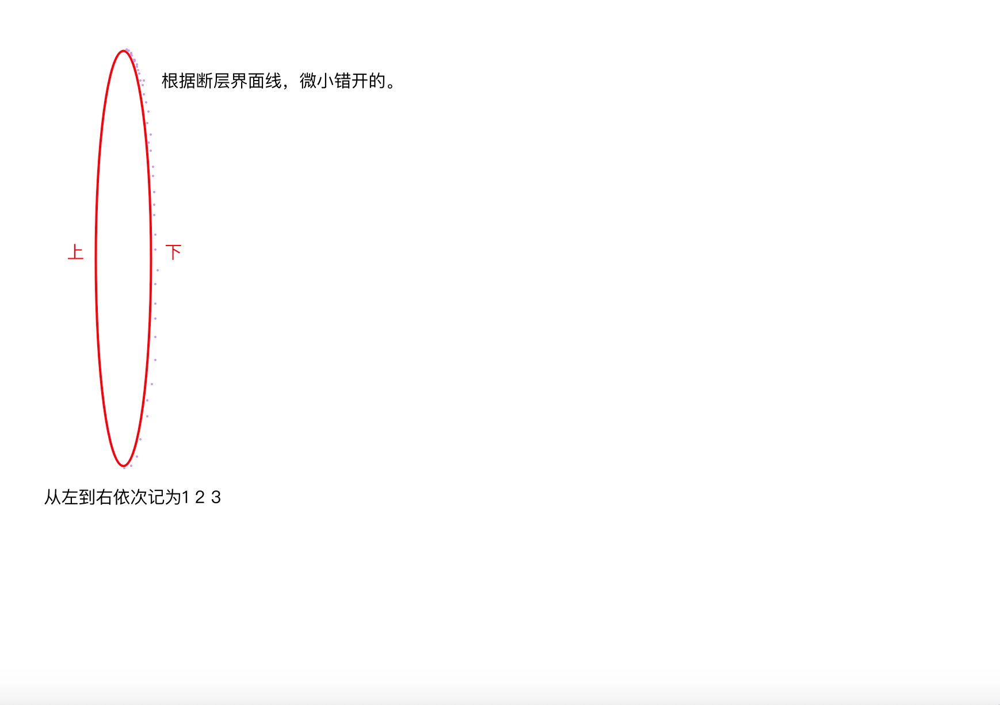

错开的边界3和边界2，形成微小内边界进行第一次剖分。

然后边界1和边界3进行单独外边界剖分成一部分网格。

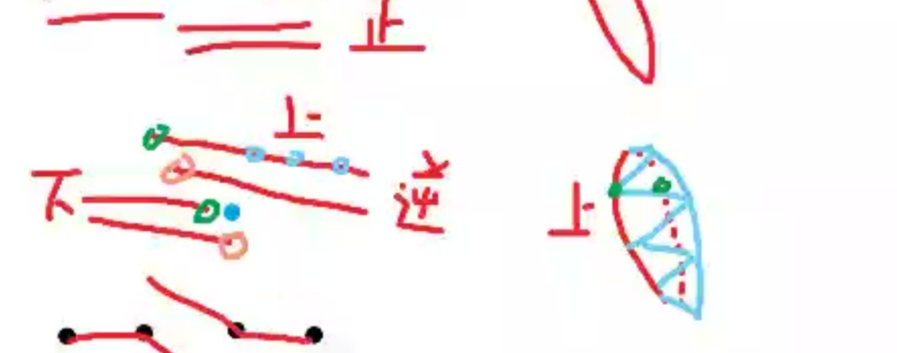

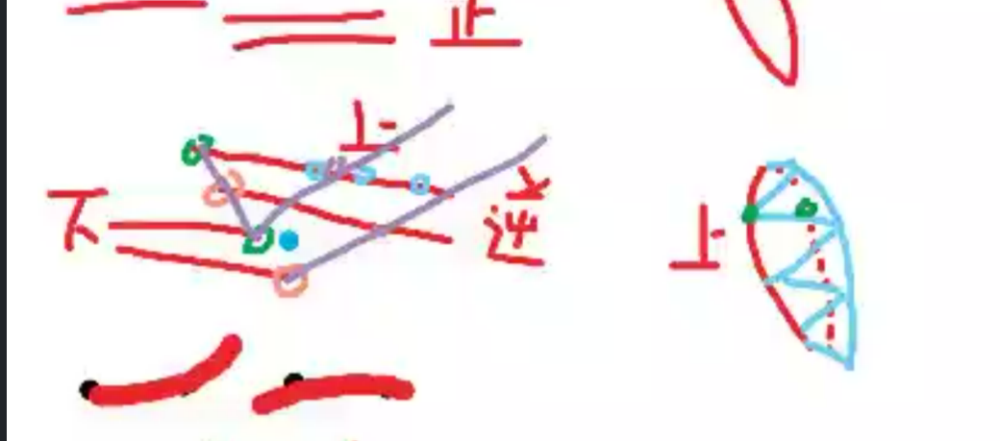

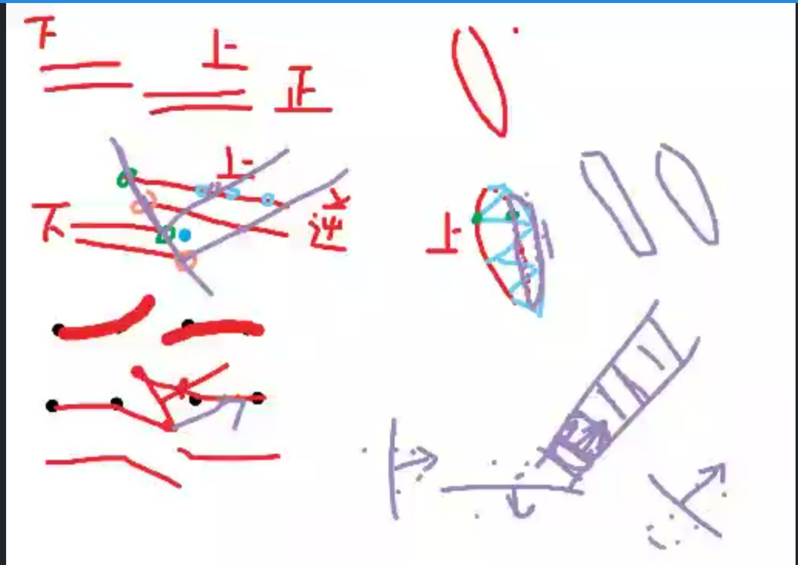

## 思路梳理

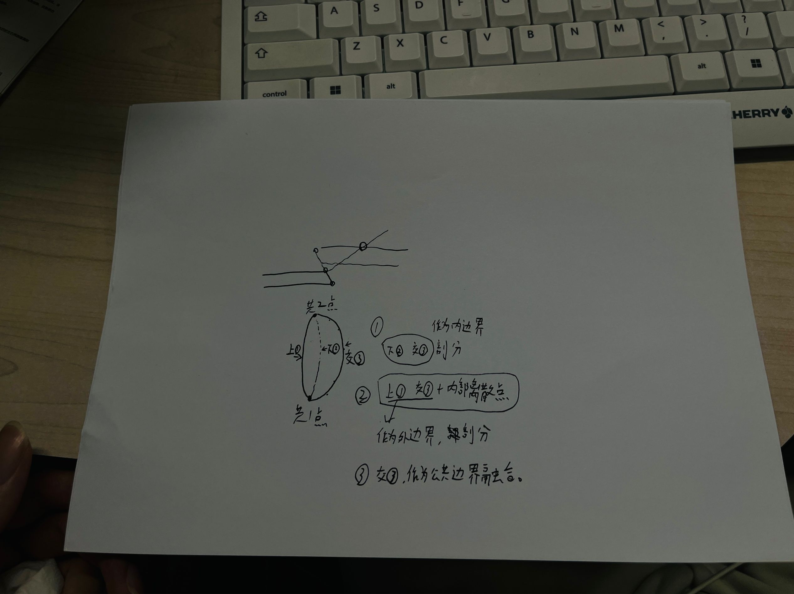

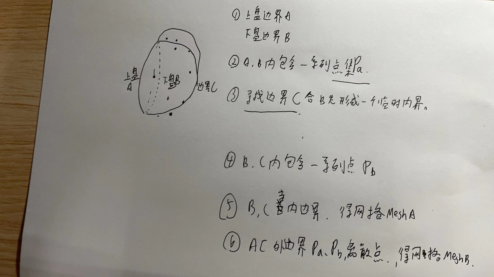


### 具体步骤

1. 取得逆断层处上盘边界（Eu）和下盘（Ed）边界
2. Eu和Ed形成的圈内，大多数情况是存在一系列离散点的，记为点集（Pa）。
3. 寻找Ed相对于Eu方向 相反方向的另一个边界Ec(**可以和Ed形成临时内边界进行网格剖分**).
4. Ed和Ec形成的圈内大多数情况下也包含一系列离散点，记为点集（Pb）
5. 此时，第一个网格剖分不关心（忽略）Pa Pb两个离散点集合以及Eu，Ed和Ec形成了临时内边界进行第一次网格剖分，得到网格MeshA。
6. 第二次网格剖分由Eu、Ec组成外边界（逆时针），离散点由Pa、Pb点集组成，形成第二个网格MeshB。

### 问题

1、在上下盘边界形成的内部，上下盘的离散点都有 混在一起？

2、如何确定边界c 取点的方向？（上盘两点一个向量，下盘两点一个向量，叉积得到垂直于断层面的方向，再进一步确定下盘边界端点连线的哪一侧筛选期望顶点。  ）

3、确定方向以后怎么取？取点、排序。需要得出的有Ec、Pa、Pb。

4、后续合并的问题....


边界内范围内筛选点：射线法（任取一个方向，无交点或为偶数个则不在范围内，暂时不考虑特殊情况）


筛选完了以后，取边界和确定Pb的问题。

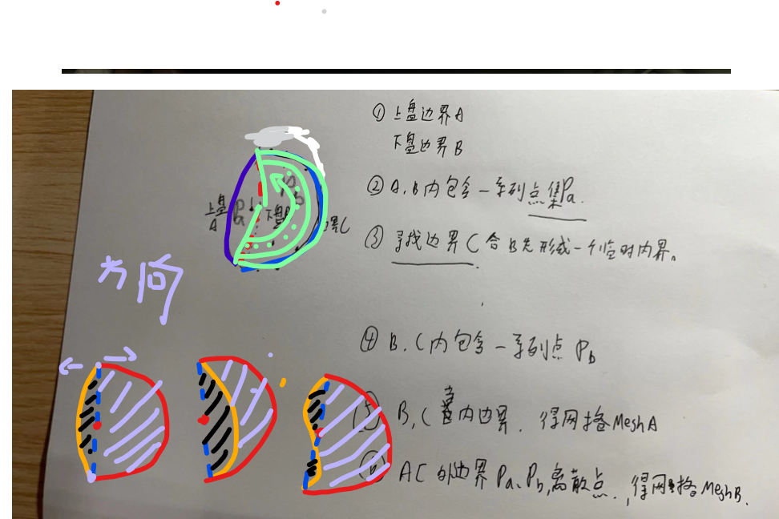

------


# 三、算法流程

## 计算方向**

如果你想知道从二维俯视图（忽略Z轴）的视角下斜面的朝向，那么你只需关注斜面上边界和下边界在X-Y平面上的投影。在这种情况下，由于不考虑Z轴，可以通过计算任意两个不共线点在X-Y平面上形成的向量来确定斜面的朝向。

例如，仍然使用之前的点A和B作为示例：

1. A(a1, a2, a3)
2. B(b1, b2, b3)

我们可以简化这些点，只关注它们在X-Y平面上的坐标：

1. A'(a1, a2)
2. B'(b1, b2)

现在，斜面在X-Y平面的二维朝向可以由向量 **A'B'** 表示，即：

[ \mathbf{AB'} = \left(b1 - a1, b2 - a2\right) ]

这个向量给出了斜面在二维空间中的一个方向。可以视为从A到B的方向，或者说是斜面的“前进”方向。请注意，实际斜面可能还会有一个在Y-Z平面或X-Z平面的倾斜，但是如果只关注二维俯视图，则不需要考虑这个倾斜。

## 半圆内离散点

问题：

在二维坐标下，现在已知两点可以连成一个线段，和一个方向向量，指定一个半R

方向向量决定了在线段的哪一侧划定半圆（半径为指定的R），

现在有一系列二维点集，求在刚刚划定范围内的点有哪些。

思路：

首先需要确定哪一侧的半圆将被绘制。可以通过计算线段和方向向量的叉积来确定，叉积的符号可以知道方向向量是在线段的左边还是右边。

**版本一：**

1. 确定半圆的中心点，即线段的中点。
2. 用叉积判断方向向量相对于线段的位置，从而确定半圆的位置。
3. 对于每个点集中的点，判断它是否在半圆内部

```java
import java.awt.geom.Point2D;
import java.util.ArrayList;
import java.util.List;

public class HalfCirclePoints {

    // 判断点是否在指定的半圆内
    public static boolean isPointInHalfCircle(Point2D point, Point2D lineStart, Point2D lineEnd, Point2D direction, double radius) {
        // 计算线段中点，即半圆的圆心
        Point2D center = new Point2D.Double((lineStart.getX() + lineEnd.getX()) / 2, (lineStart.getY() + lineEnd.getY()) / 2);

        // 确定点到圆心的距离是否小于或等于半径
        double distanceToCenter = center.distance(point);
        if (distanceToCenter > radius) {
            return false; // 距离超过半径，不在半圆内
        }

        // 计算线段向量和方向向量
        Point2D lineVector = new Point2D.Double(lineEnd.getX() - lineStart.getX(), lineEnd.getY() - lineStart.getY());
        Point2D dirVector = new Point2D.Double(direction.getX() - lineStart.getX(), direction.getY() - lineStart.getY());

        // 计算叉积以确定方向向量是在线段的左侧还是右侧
        double crossProduct = lineVector.getX() * dirVector.getY() - lineVector.getY() * dirVector.getX();

        // 计算点到线段的向量
        Point2D pointVector = new Point2D.Double(point.getX() - lineStart.getX(), point.getY() - lineStart.getY());

        // 计算点向量和线段向量的叉积
        double crossProductWithPoint = lineVector.getX() * pointVector.getY() - lineVector.getY() * pointVector.getX();

        // 根据方向向量的位置确定点是否在半圆内
        return crossProduct * crossProductWithPoint >= 0;
    }

    public static void main(String[] args) {
        // 定义线段两端点
        Point2D lineStart = new Point2D.Double(1, 1);
        Point2D lineEnd = new Point2D.Double(5, 1);

        // 定义方向向量
        Point2D direction = new Point2D.Double(3, 2); // 这个向量用于确定半圆的位置

        // 定义半径
        double radius = 2.0;

        // 点集合
        List<Point2D> points = new ArrayList<>();
        points.add(new Point2D.Double(3, 0)); // 应该在半圆内
        points.add(new Point2D.Double(4, 2)); // 应该在半圆外
        points.add(new Point2D.Double(2, 1.5)); // 边界情况需要检测
        // ... 添加更多点

        // 检查哪些点在半圆内
        for (Point2D point : points) {
            if (isPointInHalfCircle(point, lineStart, lineEnd, direction, radius)) {
                System.out.printf("点 (%.2f, %.2f) 在半圆内\n", point.getX(), point.getY());
            } else {
                System.out.printf("点 (%.2f, %.2f) 不在半圆内\n", point.getX(), point.getY());
            }
        }
    }
}

```

这段代码定义了一个方法 `isPointInHalfCircle`，它接受一个点、线段的两个端点、方向向量和半径作为参数，并返回该点是否在半圆内部。然后，在 `main` 方法中，我们创建了一个点的列表并检查了它们是否在半圆内。根据叉积的正负判断半圆的绘制方向和点的位置关系。

请注意，这段代码假设方向向量从线段的起点出发，如果你有不同的方向向量定义，可能需要相应地调整代码。此外，对于位于半圆边缘的点，是否认为其在半圆内取决于具体要求，你可能需要调整 `>=` 到 `>` 来改变边界包含逻辑。

## 3.1版本二(new)

### a .方向向量取值

方案一

   上盘任意取两相邻点 取中垂线和下盘线段相交，相交的线段分别是下盘两连续离散点连接而成，再任选其一和刚刚上盘两点任选其一，作为方向向量。（这在之前的断层相交有写过）

```java
import java.awt.geom.Line2D;
import java.awt.geom.Point2D;
import java.util.ArrayList;
import java.util.List;
import java.util.Random;

public class PerpendicularBisectorIntersection {

    public static void main(String[] args) {
        List<Point2D> pointSet1 = new ArrayList<>();
        List<Point2D> pointSet2 = new ArrayList<>();

        // Populate the point sets with example points
        // Example points for pointSet1
        pointSet1.add(new Point2D.Double(1, 1));
        pointSet1.add(new Point2D.Double(3, 4));
        pointSet1.add(new Point2D.Double(6, 1));

        // Example points for pointSet2
        pointSet2.add(new Point2D.Double(2, 2));
        pointSet2.add(new Point2D.Double(5, 3));
        pointSet2.add(new Point2D.Double(7, 5));

        // Choose random consecutive points A and B from pointSet1
        Random rand = new Random();
        int index = rand.nextInt(pointSet1.size() - 1);
        Point2D A = pointSet1.get(index);
        Point2D B = pointSet1.get(index + 1);

        System.out.println("Chosen points A: " + A + " and B: " + B);

        // Calculate the perpendicular bisector of AB
        Line2D bisector = calculatePerpendicularBisector(A, B);

        // Check for intersection with line segments in pointSet2
        for (int i = 0; i < pointSet2.size() - 1; i++) {
            Point2D C = pointSet2.get(i);
            Point2D D = pointSet2.get(i + 1);
            Line2D segment = new Line2D.Double(C, D);

            if (bisector.intersectsLine(segment)) {
                System.out.println("Intersection found with segment: " + C + " - " + D);
                // Return one of the vectors (BC, BD, AC, AD)
                System.out.println("Vector BC: " + vectorToString(B, C));
                System.out.println("Vector BD: " + vectorToString(B, D));
                System.out.println("Vector AC: " + vectorToString(A, C));
                System.out.println("Vector AD: " + vectorToString(A, D));
                return; // Exit after finding the first intersection
            }
        }

        System.out.println("No intersection found.");
    }

    private static Line2D calculatePerpendicularBisector(Point2D A, Point2D B) {
        // Midpoint of AB
        double midX = (A.getX() + B.getX()) / 2;
        double midY = (A.getY() + B.getY()) / 2;

        // Slope of AB
        double dx = B.getX() - A.getX();
        double dy = B.getY() - A.getY();

        // Perpendicular slope
        double perpendicularSlope = -dx / dy;

        // Endpoints of the bisector line (arbitrarily chosen length of 10 units in each direction)
        double length = 10;
        double endX1 = midX + length / Math.sqrt(1 + perpendicularSlope * perpendicularSlope);
        double endY1 = midY + perpendicularSlope * (endX1 - midX);
        double endX2 = midX - length / Math.sqrt(1 + perpendicularSlope * perpendicularSlope);
        double endY2 = midY + perpendicularSlope * (endX2 - midX);

        return new Line2D.Double(endX1, endY1, endX2, endY2);
    }

    private static String vectorToString(Point2D from, Point2D to) {
        return "[" + (to.getX() - from.getX()) + ", " + (to.getY() - from.getY()) + "]";
    }
}

   
```

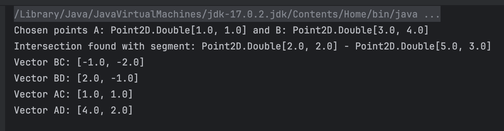

### b.计算期望的离散点集合

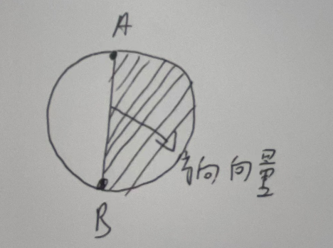

AB为直径画一整个圆，选取方向向量指向的那一侧半圆（阴影部分）内存在的点有哪些。

具体步骤如下：

1. **定义线段AB和方向向量**：

   - 线段由两个点 A(x1,y1)和 B(x2,y2) 定义。
   - 方向向量 d⃗(dx,dy)确定半圆的方向。

2. **确定圆的中心和半径**：

   - 圆的中心为线段AB的中点 C。
   - 半径 R 为线段AB的一半长度。

3. **判断点是否在指定的半圆内**：

   - 对于每个点 P(x,y)，计算它到圆心 C的距离。
   - 判断该`点是否在圆内`。
   - 使用叉积判断该点`是否在半圆的指定区域内`。

   事实上，应该先判断CA在方向向量的哪一侧（比如CA在方向向量d的顺时针方向），再分别计算CP、CA和CP、方向向量的叉积，如果CP在CA的逆时针方向 在方向向量d的顺时针方向，此时可以认为在CA 和方向向量的， 

```java
import java.awt.geom.Point2D;
import java.util.ArrayList;
import java.util.List;

public class HalfCircleCheck {

    public static void main(String[] args) {
        Point2D.Double A = new Point2D.Double(0, 0);
        Point2D.Double B = new Point2D.Double(4, 0);
        Point2D.Double directionVector = new Point2D.Double(0, 1); 
        // 方向向量 (dx, dy)待确定
        //上盘任取连续两点 做中垂线交下盘 判断是否在某两个连续下盘点之间。
        //在这四个点中，上下盘ge'qu
        
        List<Point2D.Double> points = new ArrayList<>();
        points.add(new Point2D.Double(2, 3));
        points.add(new Point2D.Double(3, -4));
        points.add(new Point2D.Double(5, 2));
        points.add(new Point2D.Double(1, 1));

        List<Point2D.Double> pointsInHalfCircle = getPointsInHalfCircle(A, B, directionVector, points);

        for (Point2D.Double point : pointsInHalfCircle) {
            System.out.println("Point in half circle: " + point);
        }
    }

public static List<Point2D.Double> getPointsInHalfCircle(Point2D.Double A, Point2D.Double B,Point2D.Double directionVector, List<Point2D.Double> points) {
  
   List<Point2D.Double> pointsInHalfCircle = new ArrayList<>();

   // 计算线段 AB 的中点
   Point2D.Double center = new Point2D.Double((A.x + B.x) / 2, (A.y + B.y) / 2);
   // 计算半径
   double radius = center.distance
   // 计算向量 CA
   Point2D.Double CA = new Point2D.Double(A.x - center.x, A.y - center.y);
   // 计算向量 CB
   Point2D.Double CB = new Point2D.Double(B.x - center.x, B.y - center
   // 计算向量 CA 和方向向量 d 的叉积
   double crossProductCA_D = CA.x * directionVector.y - CA.y * directionVecto
   //double crossProductCB_D = CB.x * directionVector.y - CB.y * directionVecto
                                          
   for (Point2D.Double point : points) {
      // 计算点 P 到圆心的距离
      double distanceToCenter = center.distance(point）
      // 判断点是否在圆内
      if (distanceToCenter <= radius) {
          // 计算向量 CP
          Point2D.Double CP = new Point2D.Double(point.x - center.x, point.y - center.y);
        
         // 计算向量 CP 和 CA 的叉积
         double crossProductCP_CA = CP.x * CA.y - CP.y * CA.x;
         // 计算向量 CP 和 CB 的叉积
         double crossProductCP_CB = CP.x * CB.y - CP.y * CB.x;
         // 计算向量 CP 和方向向量 d 的叉积
         double crossProductCP_D = CP.x * directionVector.y - CP.y * directionVector.x;

         // 判断点是否在 CA 和方向向量 d 之间
         if (crossProductCA_D > 0) {
             // CA 在方向向量 d 的顺时针方向,那么CB一定在d的逆时针方向
             if (crossProductCP_CA < 0 && crossProductCP_D > 0) {
               //如果CP在CA的逆时针方向且在方向向量D的顺时针方向，则符合要求
                 pointsInHalfCircle.add(point);
             }else if(crossProductCP_CB > 0 && crossProductCP_D < 0){
               //点不在CA向量和方向向量D之间，此时如果在CB顺时针方向且在方向向量D的逆时针方向也满足要求
               pointsInHalfCircle.add(point);
             }
         } else {
              // CA 在方向向量 d 的逆时针方向，那么CB一定在d的顺时针方向
               if (crossProductCP_CA > 0 && crossProductCP_D < 0) {
                   pointsInHalfCircle.add(point);
               }else if(crossProductCP_CB > 0 && crossProductCP_D < 0){
                 // 判断点是否在 CB 和方向向量 d 之间
                 //点不在CA向量和方向向量D之间，此时如果在CB逆时针方向且在方向向量D的顺时针方向也满足要求
                 pointsInHalfCircle.add(point);
               }
            }
          }
        }
        return pointsInHalfCircle;
    }
}

```

1. **计算圆的中心和半径**：
   - 圆心 C 的坐标为：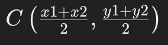
   - 半径 R 为：R=distance(A,C)
2. **判断点是否在圆内**：
   - 计算点 P 到圆心 C 的距离。
   - 如果距离小于等于半径 R，则点在圆内。
3. 计算向量：
   - CA⃗=(A.x−center.x,A.y−center.y)
   - CB⃗=(B.x−center.x,B.y−center.y)
   - CP⃗=(point.x−center.x,point.y−center.y)
   - 方向向量 d⃗

4. 计算叉积：

- CA⃗×d⃗
- CP⃗×d⃗
- CB⃗×d⃗

5. 判断点是否在方向向量指示的半圆内：

- 判断 CA⃗ 和 CP⃗ 的相对位置。
- 判断 CB⃗ 和 CP⃗ 的相对位置。

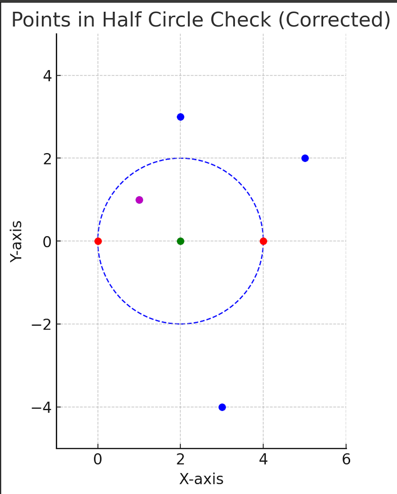

#### 二维叉积的意义

在二维平面中，两个向量的叉积（或称为外积、向量积）的符号有特定的几何意义。具体来说，给定两个向量 a 和 b，它们的叉积 a×b是一个标量，可以通过以下公式计算：


这里，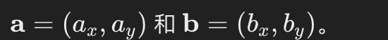

叉积的符号：

1. **正值（大于零）**：如果 a×b>0，则 a在 b 的逆时针方向，即从 a 逆时针旋转到b 所经过的角度小于 180 度。这意味着 a 在 b 的左侧。
2. **负值（小于零）**：如果 a×b<0，则 a 在 b 的顺时针方向，即从 a 顺时针旋转到 b 所经过的角度小于 180 度。这意味着 a 在 b 的右侧。
3. **零**：如果 a×b=0，则 a 和 b 共线（即平行或反平行），可能是同方向或相反方向，也可能是零向量。

## c.进一步排除在上盘下盘边界内的点

目前来看，端点连接线和下盘边界 围成的区域内的点是需要排除的。

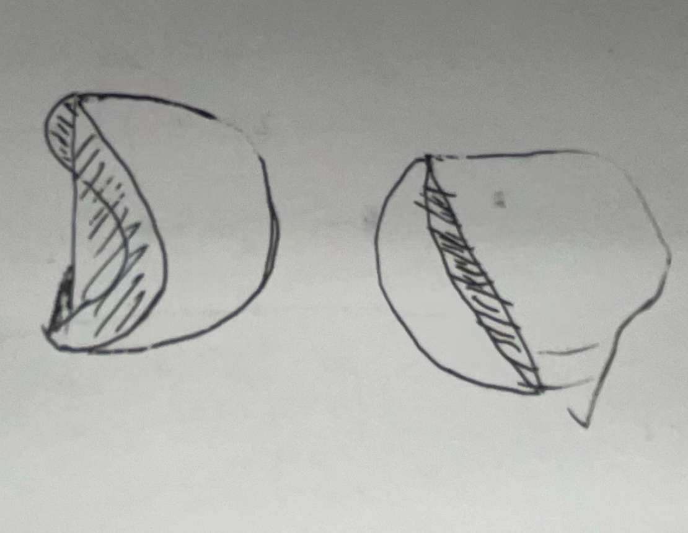

在上一步所得的点集，再此继续计算，在下盘边界和半圆直径围成范围内的点。

利用射线交叉法（奇偶规则）

```java
	import java.awt.geom.Path2D;
import java.awt.geom.Point2D;
import java.util.ArrayList;
import java.util.List;

public class PointInPolygon {

    // 检查点是否在多边形内
    public static boolean isPointInPolygon(Point2D point, List<Point2D> polygonPoints) {
        Path2D polygon = new Path2D.Double();
        if (polygonPoints.size() > 0) {
            Point2D firstPoint = polygonPoints.get(0);
            polygon.moveTo(firstPoint.getX(), firstPoint.getY());
            for (int i = 1; i < polygonPoints.size(); i++) {
                Point2D nextPoint = polygonPoints.get(i);
                polygon.lineTo(nextPoint.getX(), nextPoint.getY());
            }
            polygon.closePath(); // Closes the path back to the first point
        }
        return polygon.contains(point.getX(), point.getY());
    }

    // 获取闭环内的所有点集 D 中的点
    public static List<Point2D> getPointsInsideBoundary(List<Point2D> boundaryPoints, List<Point2D> pointsToCheck) {
        List<Point2D> pointsInside = new ArrayList<>();
        for (Point2D point : pointsToCheck) {
            if (isPointInPolygon(point, boundaryPoints)) {
                pointsInside.add(point);
            }
        }
        return pointsInside;
    }

    public static void main(String[] args) {
        // 构造闭环边界：点 A、B 和点集 C 的连线构成
        List<Point2D> boundaryPoints = new ArrayList<>();
        boundaryPoints.add(new Point2D.Double(1, 1)); // 点 A
        boundaryPoints.add(new Point2D.Double(5, 1)); // 点 B
        // 添加点集 C 的顺序点
        boundaryPoints.add(new Point2D.Double(4, 3));
        boundaryPoints.add(new Point2D.Double(6, 5));
        boundaryPoints.add(new Point2D.Double(3, 6));
        boundaryPoints.add(new Point2D.Double(1, 4));

        // 已知的点集 D，包括在多边形外部和边缘上的点
        List<Point2D> pointsToCheck = new ArrayList<>();
        pointsToCheck.add(new Point2D.Double(3, 2)); // 在多边形内
        pointsToCheck.add(new Point2D.Double(2, 2)); // 在多边形内
        pointsToCheck.add(new Point2D.Double(6, 2)); // 在多边形外
        pointsToCheck.add(new Point2D.Double(3, 4)); // 在多边形内
        pointsToCheck.add(new Point2D.Double(7, 3)); // 在多边形外
        pointsToCheck.add(new Point2D.Double(3, 1)); // 在多边形边缘
        pointsToCheck.add(new Point2D.Double(5, 3)); // 在多边形外

        // 从点集 D 中筛选位于闭环边界内的点
        List<Point2D> pointsInsideBoundary = getPointsInsideBoundary(boundaryPoints, pointsToCheck);

        // 输出结果
        for (Point2D point : pointsInsideBoundary) {
            System.out.println("Point inside: (" + point.getX() + ", " + point.getY() + ")");
        }
    }
}

```


-----

## ---


1. **选择固定连线的点作为初始点**。
2. **选择一定范围内的离散点**。
3. **根据指定距离选择离散点**。
4. **根据距离排序这些点**。
5. **结合固定连线的点和选择的离散点形成闭环**。

假设有固定连线的点（按顺序连接）和离散点的列表，并且希望在一定范围内选择离散点。

```java
import java.awt.geom.Point2D;
import java.util.ArrayList;
import java.util.Collections;
import java.util.Comparator;
import java.util.List;

public class ClosedLoop {
    public static void main(String[] args) {
        // 固定连线的点
        List<Point2D> fixedPoints = new ArrayList<>();
        fixedPoints.add(new Point2D.Double(1, 2));
        fixedPoints.add(new Point2D.Double(2, 3));
        fixedPoints.add(new Point2D.Double(3, 5));
        fixedPoints.add(new Point2D.Double(5, 2));
        fixedPoints.add(new Point2D.Double(4, 1));

        // 离散点
        List<Point2D> scatteredPoints = new ArrayList<>();
        scatteredPoints.add(new Point2D.Double(2, 1));
        scatteredPoints.add(new Point2D.Double(1, 1));
        scatteredPoints.add(new Point2D.Double(1.5, 1.5));
        scatteredPoints.add(new Point2D.Double(3, 3));
        scatteredPoints.add(new Point2D.Double(4.5, 3.5));
        scatteredPoints.add(new Point2D.Double(2, 4));
        scatteredPoints.add(new Point2D.Double(3.5, 4.5));
        scatteredPoints.add(new Point2D.Double(2.5, 2.5));

        double range = 2.0; // 指定的范围

        // 计算一个的中心
        Point2D center = calculateCenter(fixedPoints);

        // 筛选范围内的离散点
        List<Point2D> pointsInRange = new ArrayList<>();
        for (Point2D point : scatteredPoints) {
            if (point.distance(center) <= range) {
                pointsInRange.add(point);
            }
        }

        // 根据距离从大到小排序离散点
        Collections.sort(pointsInRange, new Comparator<Point2D>() {
            @Override
            public int compare(Point2D p1, Point2D p2) {
                return Double.compare(p2.distance(center), p1.distance(center));
            }
        });

        // 合并固定点和筛选后的离散点
        List<Point2D> allPoints = new ArrayList<>(fixedPoints);
        allPoints.addAll(pointsInRange);

        // 根据极角排序所有点
        sortPointsByAngle(allPoints, center);

        // 添加第一个点到末尾形成闭环
        allPoints.add(allPoints.get(0));

        // 输出结果
        for (Point2D point : allPoints) {
            System.out.println(point);
        }
    }

    // 计算点集的中心
    private static Point2D calculateCenter(List<Point2D> points) {
        double sumX = 0;
        double sumY = 0;
        for (Point2D point : points) {
            sumX += point.getX();
            sumY += point.getY();
        }
        return new Point2D.Double(sumX / points.size(), sumY / points.size());
    }

    // 根据极角排序点
    private static void sortPointsByAngle(List<Point2D> points, Point2D center) {
        Collections.sort(points, new Comparator<Point2D>() {
            @Override
            public int compare(Point2D p1, Point2D p2) {
                double angle1 = Math.atan2(p1.getY() - center.getY(), p1.getX() - center.getX());
                double angle2 = Math.atan2(p2.getY() - center.getY(), p2.getX() - center.getX());
                return Double.compare(angle1, angle2);
            }
        });
    }
}
```

代码说明

1. **固定连线的点**：定义了一组固定点，这些点已经连成一条线。
2. **离散点**：定义了一组离散点。
3. **指定范围**：定义一个范围变量`range`。
4. **计算中心点**：`calculateCenter`方法计算固定点的中心点。
5. **筛选离散点**：根据距离中心点的距离筛选离散点，保留在指定范围内的点。
6. **排序离散点**：根据离中心点的距离从大到小排序离散点。
7. **合并点**：将固定点和筛选后的离散点合并到一个列表中。
8. **按极角排序**：使用`sortPointsByAngle`方法根据相对于中心点的极角对所有点进行排序。
9. **形成闭环**：将第一个点添加到列表的末尾以形成闭环。
10. **输出结果**：打印排序后的点列表。

通过这种方法，可以确保所有点按照顺时针或逆时针顺序排列，最终形成一个闭合的路径，并且这个路径包含在指定范围内选择的最远点。

# 文献

https://dds.sciengine.com/cfs/files/pdfs/view/1001-1986/8F783A9CBE344ECFAAE84B39D6EA23A4.pdf


