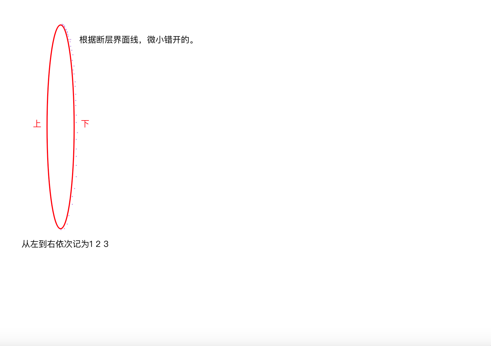
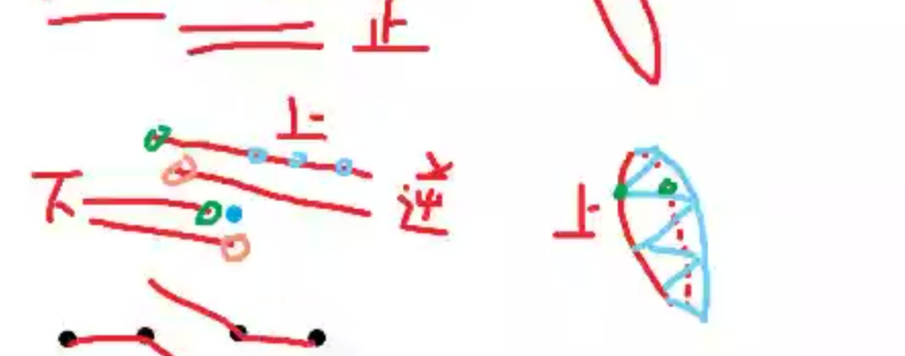
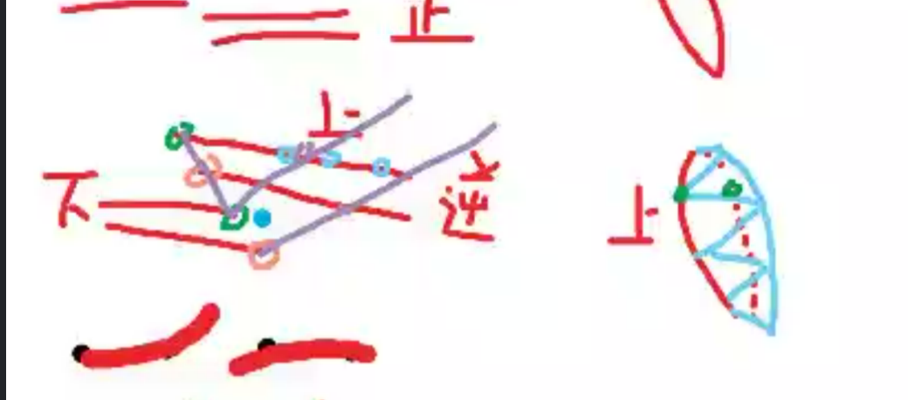
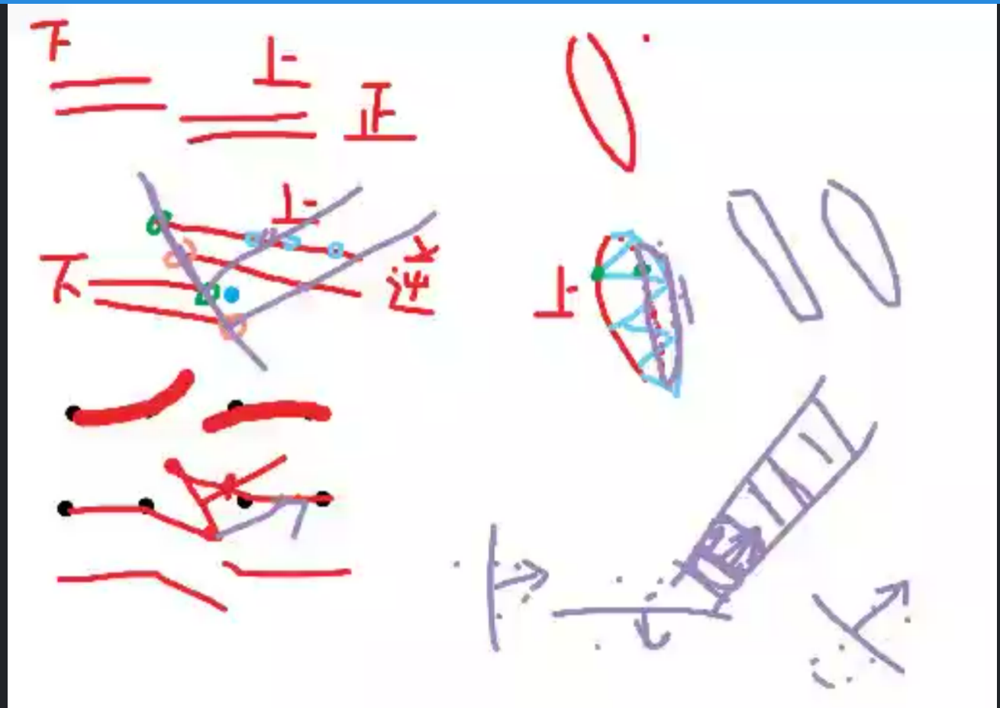
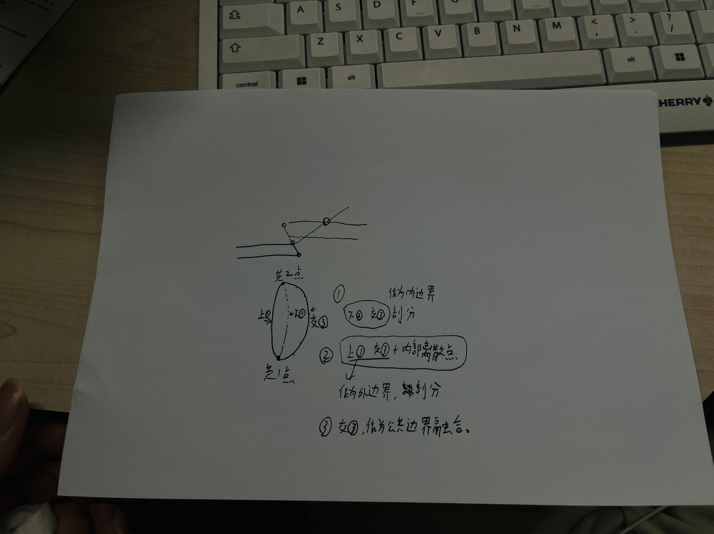

# 一、逆断层的概念

逆断层（thrust fault）是一种断层形式，其特征是在断层面上，断层上盘相对于下盘向上移动。逆断层通常与挤压应力有关，即地壳受到水平压力作用而压缩，从而导致岩层沿断层面逆向滑动。

## 特征

1. **断层面倾角小**: 逆断层的断层面通常具有较小的倾角（小于45度），使得断层运动时更容易将上盘推过下盘。
2. **地层重复**: 由于上盘沿断层面向上移动，地表可以出现地层的重复，即某些地层在地表上重复出现。
3. **与挤压应力相关**: 逆断层主要由水平挤压应力引起，常见于造山带和大陆碰撞区域。

## 形成机制

逆断层的形成主要与区域性的地壳构造运动有关。以下是形成机制的简要概述：

1. **挤压应力**: 在地壳受到水平挤压应力时，岩层会受到压缩作用，导致岩层变形。
2. **断层面产生**: 当应力超过岩石的断裂强度时，会沿着最小阻力方向形成断层面。
3. **断层运动**: 在断层面上，岩层上盘沿断层面向上滑动，产生逆断层。

## 逆断层的地质意义

逆断层在地质构造研究中具有重要意义，主要包括以下几个方面：

1. **造山运动**: 逆断层是造山带中常见的构造形式，是地壳变形和山脉形成的重要机制之一。
2. **地震活动**: 逆断层运动可以引发地震，尤其是在构造活动强烈的地区。
3. **资源勘探**: 逆断层对油气藏、矿藏的形成和分布有重要影响，在资源勘探中需要重点考虑。

## 逆断层示意图

为了更好地理解逆断层，下面是一个简单的逆断层示意图：

```

     地表
     ________
    /       /
   /   上盘  /
  /________/
 /       /
/   下盘  /
_________
```

在这个示意图中，断层面倾斜，上盘相对于下盘沿断层面向上移动。

## 实际案例

逆断层在世界各地的造山带中广泛存在，例如：

- **喜马拉雅山脉**: 喜马拉雅山脉是由印度板块与欧亚板块碰撞挤压形成的，区域内有大量逆断层。
- **阿尔卑斯山脉**: 阿尔卑斯山脉的形成也与板块挤压有关，存在许多逆断层。


# 二、剖分步骤（设计中）



错开的边界3和边界2，形成微小内边界进行第一次剖分。

然后边界1和边界3进行单独外边界剖分成一部分网格。







## 思路梳理




### 具体步骤

1. 取得逆断层处上盘边界（Eu）和下盘（Ed）边界
2. Eu和Ed形成的圈内，大多数情况是存在一系列离散点的，记为点集（Pa）。
3. 寻找Ed相对于Eu方向 相反方向的另一个边界Ec(**可以和Ed形成临时内边界进行网格剖分**).
4. Ed和Ec形成的圈内大多数情况下也包含一系列离散点，记为点集（Pb）
5. 此时，第一个网格剖分不关心（忽略）Pa Pb两个离散点集合以及Eu，Ed和Ec形成了临时内边界进行第一次网格剖分，得到网格MeshA。
6. 第二次网格剖分由Eu、Ec组成外边界（逆时针），离散点由Pa、Pb点集组成，形成第二个网格MeshB。


### 问题

1、在上下盘边界形成的内部，上下盘的离散点都有 混在一起？

2、如何确定边界c 取点的方向？

3、确定方向以后怎么取？取点、排序。需要得出的有Ec、Pa、Pb。

4、后续合并的问题....


------


为了在固定连线的基础上选择一定范围内的指定距离内最远的一系列点形成闭环，我们需要：

1. **选择固定连线的点作为初始点**。
2. **选择一定范围内的离散点**。
3. **根据指定距离选择离散点**。
4. **根据距离排序这些点**。
5. **结合固定连线的点和选择的离散点形成闭环**。

### Java实现方案

假设我们有固定连线的点（按顺序连接）和离散点的列表，并且希望在一定范围内选择离散点。

#### Java代码示例

```java
import java.awt.geom.Point2D;
import java.util.ArrayList;
import java.util.Collections;
import java.util.Comparator;
import java.util.List;

public class ClosedLoop {
    public static void main(String[] args) {
        // 固定连线的点
        List<Point2D> fixedPoints = new ArrayList<>();
        fixedPoints.add(new Point2D.Double(1, 2));
        fixedPoints.add(new Point2D.Double(2, 3));
        fixedPoints.add(new Point2D.Double(3, 5));
        fixedPoints.add(new Point2D.Double(5, 2));
        fixedPoints.add(new Point2D.Double(4, 1));

        // 离散点
        List<Point2D> scatteredPoints = new ArrayList<>();
        scatteredPoints.add(new Point2D.Double(2, 1));
        scatteredPoints.add(new Point2D.Double(1, 1));
        scatteredPoints.add(new Point2D.Double(1.5, 1.5));
        scatteredPoints.add(new Point2D.Double(3, 3));
        scatteredPoints.add(new Point2D.Double(4.5, 3.5));
        scatteredPoints.add(new Point2D.Double(2, 4));
        scatteredPoints.add(new Point2D.Double(3.5, 4.5));
        scatteredPoints.add(new Point2D.Double(2.5, 2.5));

        double range = 2.0; // 指定的范围

        // 计算固定点的中心
        Point2D center = calcula	teCenter(fixedPoints);

        // 筛选范围内的离散点
        List<Point2D> pointsInRange = new ArrayList<>();
        for (Point2D point : scatteredPoints) {
            if (point.distance(center) <= range) {
                pointsInRange.add(point);
            }
        }

        // 根据距离从大到小排序离散点
        Collections.sort(pointsInRange, new Comparator<Point2D>() {
            @Override
            public int compare(Point2D p1, Point2D p2) {
                return Double.compare(p2.distance(center), p1.distance(center));
            }
        });

        // 合并固定点和筛选后的离散点
        List<Point2D> allPoints = new ArrayList<>(fixedPoints);
        allPoints.addAll(pointsInRange);

        // 根据极角排序所有点
        sortPointsByAngle(allPoints, center);

        // 添加第一个点到末尾形成闭环
        allPoints.add(allPoints.get(0));

        // 输出结果
        for (Point2D point : allPoints) {
            System.out.println(point);
        }
    }

    // 计算点集的中心
    private static Point2D calculateCenter(List<Point2D> points) {
        double sumX = 0;
        double sumY = 0;
        for (Point2D point : points) {
            sumX += point.getX();
            sumY += point.getY();
        }
        return new Point2D.Double(sumX / points.size(), sumY / points.size());
    }

    // 根据极角排序点
    private static void sortPointsByAngle(List<Point2D> points, Point2D center) {
        Collections.sort(points, new Comparator<Point2D>() {
            @Override
            public int compare(Point2D p1, Point2D p2) {
                double angle1 = Math.atan2(p1.getY() - center.getY(), p1.getX() - center.getX());
                double angle2 = Math.atan2(p2.getY() - center.getY(), p2.getX() - center.getX());
                return Double.compare(angle1, angle2);
            }
        });
    }
}
```

### 代码说明

1. **固定连线的点**：定义了一组固定点，这些点已经连成一条线。
2. **离散点**：定义了一组离散点。
3. **指定范围**：定义一个范围变量`range`。
4. **计算中心点**：`calculateCenter`方法计算固定点的中心点。
5. **筛选离散点**：根据距离中心点的距离筛选离散点，保留在指定范围内的点。
6. **排序离散点**：根据离中心点的距离从大到小排序离散点。
7. **合并点**：将固定点和筛选后的离散点合并到一个列表中。
8. **按极角排序**：使用`sortPointsByAngle`方法根据相对于中心点的极角对所有点进行排序。
9. **形成闭环**：将第一个点添加到列表的末尾以形成闭环。
10. **输出结果**：打印排序后的点列表。

通过这种方法，可以确保所有点按照顺时针或逆时针顺序排列，最终形成一个闭合的路径，并且这个路径包含在指定范围内选择的最远点。

# 文献

https://dds.sciengine.com/cfs/files/pdfs/view/1001-1986/8F783A9CBE344ECFAAE84B39D6EA23A4.pdf


